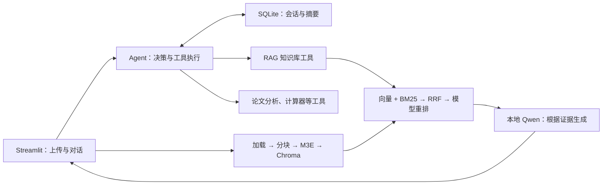

# 智能科研助理：RAG + Agent 论文知识库问答系统

**当前状态（2026年10月9日）**：正文任务误完成与共享重排分词器并发冲突已集中修复；业务补丁2c0353c、部署提交c3b0fda。本地／Windows各853项回归通过，分别59.191秒／315.808秒。rag-v20的60题两组120条重新检索与生成及助手初评完成，核验57页原文；default正确性／完整性／引用准确性均分1.88／1.55／1.22，no_rules为1.88／1.53／1.15，用户审核0/120。完整120条冻结于补丁前，不作为后续补丁成绩。详情见[最终质量收尾](reports/5_5_3%20Bad%20Case分析与优化/最终质量收尾_20261009/README.md)。科研质量尚未达标；Word/PPT待质量审核与结论确定后重建。

面向本科课程实践的本地科研助理。上传 PDF、Word、TXT 或 Markdown 文献后，由 Agent 根据问题选择知识库问答、论文分析或计算等工具，在网页中展示回答、来源、工具执行过程和运行指标。

项目采用“Agent 负责决策，RAG 作为核心知识工具”的架构。参考 [dsy1018/ai-chatbot 固定版本](https://github.com/dsy1018/ai-chatbot/tree/6979d7173ed0f92910a8571dd4ca1b4a171a2c49)，保留本项目的模块目录；手写 ReAct 和 RRF，使用 LangChain 基础组件、Chroma、SQLite 和单个 Streamlit 应用。

## 当前进度

截至2026-10-09，模块一至四业务链路已接通，独立审计修复、本科精简和PDF选型补测已归档。课程核心能力、全部实验与交付要求保留；自动回归、功能验收、语义质量及用户审核分别记录。

| 模块 | 已实现内容 | 待完成或验证 |
| --- | --- | --- |
| 一：文档处理与检索 | PyMuPDF/python-docx/纯文本加载，批量进度与失败重试；固定/递归/句段分块；M3E、Chroma 增量索引；向量、BM25、手写 RRF、BGE 模型重排；五组分块/K实验 | 复杂 PDF 解析仍有边界；中文查询英文论文排名按用户要求暂缓 |
| 二：RAG 生成 | rag-v20、上下文与完整请求预算、文档名/位置引用、流式正文、语义缓存、三类降级；数量/引用核对失败或有警告的结果不缓存 | 对象、条件、机制及引用语义仍需人工核对；未被校验识别的错答仍可能进入缓存 |
| 三：Agent 决策 | 有上限的 ReAct、八个本地工具、路由/并行/有界恢复、窗口/摘要记忆；两篇独立调用须覆盖两个目标ID，明确标题与来源任务避免重复调用 | 多步科研任务仍有比较不完整、条件遗漏与错误解释 |
| 四：系统与前端 | 文档/知识库管理、历史恢复、正文流式、原文物理页、公开执行表与指标；侧栏分开显示连接/读取和本页实际业务时间 | 宿主物理断网与低配置/多请求容量尚未完整验证 |
| 五：评测与交付 | 12篇／60题；历史Windows300检索、120Agent、144路由、12串并行；新轮120条真实问答与初评完成，实际HTTP和失败保留 | 新轮用户审核0/120；参考答案独立复核、成员资料和Word/PPT定稿待完成 |

各阶段功能、联调及真实页面记录保留在[完整性报告](docs/QA/完整性验证.md)；功能通过不等于科研语义质量或全部课程验收通过。

| 最新验证（2026-10-09） | 结果与范围 |
| --- | --- |
| 本地／Windows自动回归 | 各853项，失败/错误/跳过均0；分别59.191秒／315.808秒，模型响应隔离边界见测试说明 |
| 补丁后部署与网页 | c3b0fda已重启、健康200；实际计算及Markdown向量检索通过，刷新状态保留独立业务时间，重载恢复同值计量；原索引及原有会话行核验通过，新增行另计 |
| 补丁后故障与定向验证 | 56次真实并发0异常；7条历史轨迹回放阻止误完成；8条定向问答中3条控制答案及引用正确、1条正确但无引用，4条失败题仍未答对且保持未完成 |
| 前批部署与网页 | 119项文件指纹一致、7项网页行为通过，保留原阶段，不冒充最新853项的附加检查 |
| 前批Windows真实样例 | 两篇标题/来源各调用一次，第1轮结束；两次计算、Markdown标记/行号通过助手核对；ViT数量换算正确但引用错页，仍记未完成 |
| 前批13条冻结证据局部复评 | rag-v17实际生成，5条助手局部初评通过，8条部分改善/未完成/未通过；没有重新检索，不代替正式120条重评或用户审核 |

[逐题局部初评](reports/5_5_3%20Bad%20Case分析与优化/侧栏与答案集中修复_20261009/助手局部复评.json)和[侧栏实测截图](reports/5_5_3%20Bad%20Case分析与优化/侧栏与答案集中修复_20261009/sidebar-restored-final.png)可复核。前批继续使用既有模型与生产知识库，核验时6份文档／276块及原文指纹未变。最新真实复测及残留问题见[定向人工核对](reports/5_5_3%20Bad%20Case分析与优化/最终质量收尾_20261009/Windows补丁复测/定向复测人工核对.md)。

本地及Windows最新回归和历史验证见[测试说明](tests/README.md)。正式Windows Agent对固定RAG的Token用量增加531.55%，没有节省；双知识库并行耗时下降18.76%，时间／关键词组合增加2.50%，每组只有3对。历史Mac优化的Token下降10.69%、响应增加7.76%属于另一组开发实验；完整差异与残留见[系统评测报告](reports/系统评测报告.md)和[Bad Case分析](reports/Bad_Case分析报告.md)。

## 系统如何工作



八个默认本地工具如下；可选联网搜索默认关闭，不计入八个工具。

| 工具 | 用途 |
| --- | --- |
| `knowledge_base_search` | 混合检索、重排和带来源的 RAG 回答 |
| `paper_metadata` | 提取标题、作者、年份、摘要、DOI及原文证据 |
| `paper_compare` | 对比两篇已上传论文的方法、数据集和实验结果 |
| `keyword_extract` | 从问题或指定文档提取关键词 |
| `paper_summary` | 生成背景、方法、结果、结论四部分摘要 |
| `current_time` | 读取系统当前时间 |
| `calculator` | 计算数学表达式 |
| `paper_list` | 列出已上传文献及索引状态 |

## 本地启动

### 1. Python 环境

在项目根目录执行。项目使用 **Python 3.10.10**，依赖版本固定在 [requirements.txt](requirements.txt)。已有 `.venv` 时直接激活，无需重新创建。

```bash
python3.10 --version  # 确认版本为 3.10.10。
python3.10 -m venv .venv
source .venv/bin/activate
python -m pip install -r requirements.txt
python -m pip check
```

Windows 的虚拟环境激活方式见 [用户使用手册](docs/用户使用手册.md)。

### 2. 准备本地模型

模型文件不随 Git 提交。首次准备需要联网；准备后，默认业务读取本地权重并连接本机 Ollama，失败会明确提示，不静默转云端。

| 组件 | 当前选择与路径 | 准备说明 |
| --- | --- | --- |
| Embedding | `moka-ai/m3e-base`；`data/models/m3e-base/` | [用户手册](docs/用户使用手册.md)，版本读取 YAML |
| 重排 | `BAAI/bge-reranker-base`；`data/models/bge-reranker-base/` | [重排 QA](docs/QA/5.1.4%20混合检索与重排序.md)，版本读取 YAML |
| 生成 | Ollama + `qwen2.5:7b`；本机地址 `http://localhost:11434` | [用户手册](docs/用户使用手册.md) |
| 历史 Token 计数 | Qwen 官方 `tokenizer.json`；`data/models/qwen2.5-tokenizer/tokenizer.json` | [词表准备与校验](docs/QA/5.3.4%20多轮对话记忆管理.md) |

页面启动不加载模型。新文献向量化需要 M3E；混合重排问答需要 M3E、BGE 和 Ollama；Agent 的历史预算还需要本地 Qwen 词表。Embedding 和重排默认使用 CPU。

本机已准备项目内 Ollama 运行包和模型时，在一个终端启动服务：

```bash
OLLAMA_MODELS="$PWD/data/models/ollama/models" OLLAMA_HOST=127.0.0.1:11434 OLLAMA_NO_CLOUD=1 OLLAMA_NUM_PARALLEL=1 data/models/ollama/runtime/ollama serve
```

这是项目内运行包的路径；换机器时按手册准备相应平台的 Ollama。若 11434 已有服务，先核对模型及地址，再使用该服务。

### 3. 启动页面

在另一个终端激活虚拟环境后执行：

```bash
source .venv/bin/activate
python -m streamlit run src/frontend/app.py
```

打开 [本地页面](http://localhost:8501)，按以下顺序使用：

1. 左侧选择文档，点击“开始导入”，查看加载、分块、向量化状态。默认单份上限为20 MiB；重试只处理失败项。
2. “科研对话”由Agent选择工具并使用当前会话记忆；消息框内点击“发送”，输入随即清空，等待时显示转圈，答案逐步输出。消息区内部滚动，每轮回答附Token和耗时，输入框下方展示该轮执行表，“状态统计”累计当前会话数据。“文档检索”提供Top-K检索；“知识库”选择文件并查看完整原文、删除或恢复。
3. 查看回答、引用原文和阶段执行表。空库、低相关性或模型失败会显示提示；执行表只展示公开阶段与指标，不展示模型私有推理。
4. 左侧可管理文档和会话。文档删除影响共享知识库；原文可回收恢复。保存带访客/会话标识的当前地址，可在刷新后恢复历史。
5. 左侧“系统状态”分别显示连接／读取检查和本页最近实际推理／向量检索时间；点击“刷新状态”重查连接。业务成功不代表科研答案正确。

随机访客标识用于本机演示隔离，不是登录认证。RAG 答案逐步输出并补齐引用；Agent Observation的公开answer字段也实时增量显示，完成后校验最终正文。知识库工具仍先完成内部RAG再进入Observation。PDF引用可打开真实物理页并下载原文件，Agent历史重放保留来源入口。

## 配置与数据

运行配置统一由 [config.yaml](config.yaml)读取。

| 配置 | 当前默认值 |
| --- | --- |
| 分块 | 递归，512字符，重叠64字符；固定策略实验比较256/512/1024，句段策略使用默认参数 |
| 检索 | 两路候选各20，RRF常数60，重排后返回Top-5；Chroma `search_ef=100` |
| 生成 | Temperature=0.1、Top-p=0.9、Top-k=40、总窗口16384 Token、输出上限1024 Token；证据9000字符、完整Prompt18000字符 |
| Agent | 最多8轮、同轮最多2个独立工具、有界超时/重试/重复调用终止 |
| 记忆 | 摘要＋历史窗口2000 Token；10轮触发摘要，保留最近4轮 |
| 存储 | 原文 `data/raw/`；索引 `data/index/`；会话 `data/sessions/memory.sqlite3`；日志 `logs/` |

总窗口16384包含输入与输出，预留1024后完整输入预算15360 Token，包含系统规范、工具、来源与当前问题；摘要＋历史共用2000 Token。16K在Windows RTX4060 Laptop 8GB显存单请求实测，未证明4GB显存或多请求并发容量。低容量机器可改回8192，真实资源与单次长请求限制见[预算调优记录](reports/5_4_4%20端到端联调与测试/Windows精简部署与预算调优_20261009/README.md)。字符大小与模型 Token 数不同。检索、生成的 `top_k` 含义也不同。模型或索引参数改变后，要按手册核对旧库兼容性，不能直接混用。

文献、模型、索引、会话和业务日志默认不提交。课程原始资料在 `docs/`，不会自动作为知识库论文导入。

## 测试与实验

无需启动 Ollama即可运行自动化回归；各用例的模型HTTP/向量隔离边界见 [测试说明](tests/README.md)。

```bash
.venv/bin/python -m unittest discover -s tests -p 'test_*.py' -v
# 只运行一个小节（目录名含空格，需加引号）。
.venv/bin/python -m unittest discover -s 'tests/5_1_1 文档加载与批量导入' -p 'test_*.py' -v
# 模块四专项：输出使用新路径，避免覆盖历史结果。
.venv/bin/python reports/模块完整性验证/verify_completeness_tests.py --scope module4 --output reports/模块完整性验证/模块四专项_新时间.json
```

准备模型并启动 Ollama后，可复测真实四模块链路；测试数据目录和报告路径必须不存在：

```bash
.venv/bin/python reports/模块完整性验证/verify_modules_one_to_four.py --root /private/tmp/rag-modules-新时间 --output reports/模块完整性验证/四模块联调_新时间.json
```

已有三档检索实验使用6篇AI论文、821块、48个意图的96条中英配对查询，结果如下。这是开发集，尚未经独立人工复核，不能替代模块五正式评测。

| 检索方式 | Hit@5 | MRR@5 |
| --- | ---: | ---: |
| 纯向量 | 34.38% | 0.2188 |
| 混合检索 | 35.42% | 0.2597 |
| 混合＋模型重排 | 45.83% | 0.3788 |

原始结果、计时、图表和局限见 [检索质量 QA](docs/QA/5.1.4%20混合检索与重排序.md)。八组生成参数实验保存了160条真实回答；参数选型不等于引用质量已达标。

所有实验与验证按“编号 中文小节名”归档，入口为 [reports 目录索引](reports/README.md)。历史失败、修正和复测均保留。[评测集](reports/评测集.json)为12篇视觉Transformer论文、60题，四类各15题，中英文各30题；原文及证据定位已核验，参考答案独立人工复核待完成。构建范围见 [5.5.1说明](reports/5_5_1%20评测集构建/README.md)。

2026-10-03的[历史Mac系统性能评估](reports/5_5_2%20系统性能评估/README.md)使用该12篇／60题集：默认混合＋重排候选20的Hit@5为66.67%、MRR@5为0.3536、页级Recall@5为42.97%；默认Agent工具选择准确率81.67%、平均1.5833轮、44.264秒、14506.40实际Token。五组检索和两组Agent的原始结果、公式性能表及三图齐备，300条排名、120条请求和626次用量复核通过。这些是当时冻结配置的结果，不作为当前Windows耗时或rag-v20质量成绩。

2026-10-07的[Windows正式性能评测](reports/5_5_2%20系统性能评估/Windows正式性能评测_20261007/README.md)完成300条检索、120条Agent、144条路由、12条串并行及实际用量/资源核验。[120条助手初评](reports/5_5_2%20系统性能评估/Windows正式性能评测_20261007/Windows答案助手初评报告.md)核对85页去重原文；default正确性／完整性／引用准确性均分2.65／1.98／2.80，no_rules为2.60／1.95／2.62，用户审核0/120。该轮使用修复前冻结源码与配置，未因16K调优和本轮局部复测重算成绩。

当前优先使用[10月9日120条审核工作簿](outputs/quality-review-final-20261009/Windows答案助手初评与用户审核_120条.xlsx)；这轮内容质量初评较低，语言一致性因入口未显式传入language而未验收。历史[Windows120条工作簿](outputs/quality-review-20261007/Windows答案助手初评与用户审核_120条.xlsx)，填写用户审核分数、理由、评阅人和日期；[历史Mac180条工作簿](outputs/quality-review-20261006/历史答案助手初评与用户审核_180条.xlsx)保存基线120＋优化60条的助手初评，用户审核0/180，[原空白评分表](reports/5_5_2%20系统性能评估/答案质量人工评分表_180条.xlsx)保留。三项均按0～4整数评分，0为有效评分、空白为未评，保存副本后汇总。

助手参与了参考答案建设，以上初评不属于独立盲评；全部原文英文、ViT来源与开发集重叠，不能称完全独立来源。模型自报完成不等于答案正确，页级指标不与旧开发集块级口径直接比较。[旧开发性能表](reports/性能评测数据.xlsx)、[历史Mac性能表](reports/5_5_2%20系统性能评估/系统性能评测数据.xlsx)和[Windows性能表](outputs/performance-20261007/系统性能评测数据.xlsx)分别保留。目录含空格，运行脚本须给路径加引号。

## 项目结构

```text
RAG+Agent/
├── AGENTS.md / README.md / requirements.txt / config.yaml
├── src/
│   ├── data_loader/     文档加载
│   ├── chunking/        三种分块
│   ├── retrieval/       向量、BM25、RRF、重排
│   ├── generation/      Prompt、RAG、流式、缓存
│   ├── agent/           ReAct、工具、路由、记忆
│   ├── frontend/        Streamlit应用、页面与组件
│   └── utils/           配置、健康检查与日志
├── tests/               按5.1.1～5.4.4小节划分的自动化用例与共用样例
├── docs/                课程原始资料、技术设计、使用手册、QA
├── reports/             课程交付文件、小节实验与完整性验证
├── data/                本地文献、模型、索引与会话
├── logs/                运行日志
└── docker/              Dockerfile与Compose文件
```

Docker现已编排Streamlit与本地Ollama，配置和数据挂载、服务健康检查、仅127.0.0.1页面端口及内部网络均已配置。首次镜像构建与依赖检查通过，完整运行验证见[项目交付记录](reports/5_5_4%20项目交付/README.md)；启动步骤见[用户使用手册](docs/用户使用手册.md)。

## 项目文档

- [技术设计与验收](docs/技术设计文档.md)：架构、接口、源码映射、五模块需求和实施记录。
- [用户使用手册](docs/用户使用手册.md)：模型准备、具体操作、配置与故障处理。
- [Windows部署教程](docs/Windows部署教程.md)：Windows原生启动、模型准备与迁移；实际验收与性能见本轮交付记录。
- [课程实践方案](docs/南京农业大学课程实践.docx)与 [项目交付模板](docs/项目交付模板.docx)：课程依据及报告格式。
- [报告与证据索引](reports/README.md)、[系统评测报告](reports/系统评测报告.md)、[Bad Case分析](reports/Bad_Case分析报告.md)：实验和真实失败记录。
