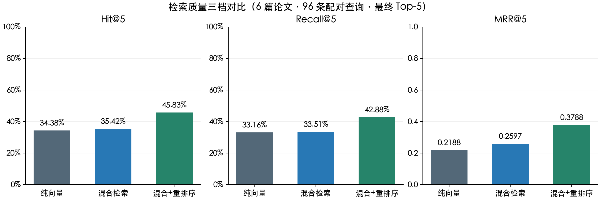
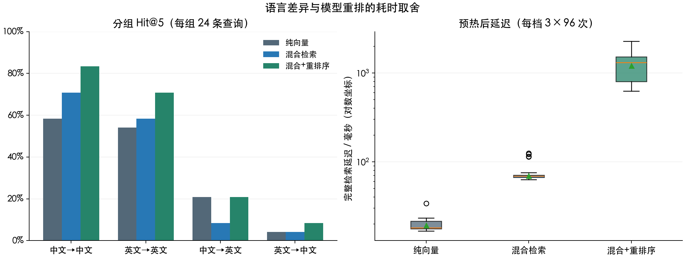

# 5.1.4 检索质量评估实验

## 1 实验目标与结论

2026 年 9 月 29 日，在同一份中英文人工智能论文开发集上，真实运行“纯向量 → 混合检索 → 混合+重排序”，比较最终 Top-5 的命中、召回与排序质量，并记录完整检索接口的耗时。使用当前选定的 M3E-base、Chroma 与 bge-reranker-base，不重新选模型或按结果调整问题。

| 检索方式 | 命中查询数 / 96 | Hit@5 | Recall@5 | MRR@5 | 平均检索延迟（ms） |
| --- | ---: | ---: | ---: | ---: | ---: |
| 纯向量 | 33 | 34.38% | 33.16% | 0.2188 | 19.35 |
| 混合检索 | 34 | 35.42% | 33.51% | 0.2597 | 69.53 |
| 混合+重排序 | 44 | 45.83% | 42.88% | 0.3788 | 1207.54 |

本次重排序相对混合检索，Hit@5 提高 **10.42 个百分点**，MRR@5 增加 **0.1191**，代价是 CPU 检索平均耗时从约 70 ms 增至约 1.21 秒。混合检索相对纯向量只净增 1 条命中查询，不能据此宣称大幅提升。三轮排名一致，延迟按三轮原始测量汇总；质量题数仍为 96。

这组数据没有达到课程背景中的“85%以上”。同语言查询的重排 Hit@5 为 37/48=77.08%，跨语言查询为 7/48=14.58%，跨语言仍是当前短板。报告保留全部分组与失败情况，不用同语言子集代替总体结果。



## 2 数据集与标注

复用此前 Embedding 对比的 [锁定标注清单](../../reports/Embedding论文双语评测集.json)，包含以下 6 篇论文，全部块放入同一个库。

| 论文 ID | 原文语言 | 论文 | 分块数 |
| --- | --- | --- | ---: |
| attention | 英文 | Attention Is All You Need | 94 |
| bert | 英文 | BERT: Pre-training of Deep Bidirectional Transformers for Language Understanding | 154 |
| vit | 英文 | An Image is Worth 16x16 Words: Transformers for Image Recognition at Scale | 167 |
| cnn_survey | 中文 | 卷积神经网络研究综述 | 156 |
| compression | 中文 | 深度网络模型压缩综述 | 83 |
| vision_survey | 中文 | 视觉Transformer研究的关键问题：现状及展望（作者修正版） | 167 |

共 **821 个块、48 个问题意图**。每个意图各有中文与英文表述，得到 **96 条配对查询**；中文→中文、英文→英文、中文→英文、英文→中文各 24 条。这里的箭头表示“查询语言→目标论文语言”。检索时不按目标论文或语言预先过滤。

标注按具体相关 **块 ID** 匹配，不仅按论文或页码匹配；同一问题可能标注多个块。命中其它论文中相似的方法介绍，不能替代问题所指定的来源。问题和标注由 Codex 根据 PDF 原文编写并核对，部分页面曾对照原图，**尚未经独立人工复核**，可能遗漏其它同样相关的块。这种严格、未穷尽的标注会影响绝对指标，应先复核再扩充正式测试集。

本轮输入哈希保持不变：

```text
sample.json SHA-256
63c22eddcf08f05b809dd888b4794993ea0364edf7d43d0c442e16ae76342707

Embedding论文双语评测集.json SHA-256
7a3cd90f5700601448feb2e42cfaeea296164fd9674e4962d66ba6bd84af218f
```

这是已用于 Embedding 选择的开发集，不能视作独立测试集；96 条翻译配对查询也不能算作 96 个独立意图。课程最终要求的 10–20 篇论文、50+ 独立且覆盖事实/对比/归纳/推理的问题仍待构建，`reports/评测集.json` 的空数组没有用本轮数据冒充填充。

## 3 三档方法与控制变量

| 方法 | 真实调用 | 最终排序依据 |
| --- | --- | --- |
| 纯向量 | `VectorStore.search(query, k=5)` | M3E 编码问题，Chroma 余弦相似度 Top-5 |
| 混合检索 | `HybridRetriever.search(query, k=5)` | 向量与 BM25 各取 Top-20，手写 RRF 融合，取前 5 |
| 混合+重排序 | `HybridRetriever.search(query, k=5, rerank=True)` | 相同 RRF Top-20 候选，经真实 BGE 成对评分后取前 5 |

- 使用同一临时 Chroma 库，821 个块重新进行真实 M3E 批量编码，索引不写入业务 `data/index/`。
- 分块为默认递归策略：512 字符、重叠 64 字符，表格按现有保护规则整块保留。本轮没有比较五组分块设置。
- M3E revision：`764b537a0e50e5c7d64db883f2d2e051cbe3c64c`；BGE revision：`2cfc18c9415c912f9d8155881c133215df768a70`。均从本地权重加载，开启 Hugging Face/Transformers 离线模式。
- Chroma `search_ef=100`、索引线程 4；RRF 常数 60；最终 K=5、候选 K=20。重排批次 8、CPU/FP32，问题与候选合计最长 512 Token；超长输入会被截断。512 字符分块与 512 Token 模型上限是不同单位。
- 每种方法先预热，再运行 3 轮。各轮使用 `20260929 + 轮次索引` 的种子打乱查询顺序；方法调用顺序轮换，避免某方法始终处于同一位置。
- 各方法独立运行完整业务接口；没有共用查询结果后估算时延。额外记录首轮 RRF Top-20 作为候选诊断，诊断调用不计入三档延迟。
- 使用同一检索器与重排模型实例，不每题重新加载模型；未调用 LLM、生成层或 Agent。

流程沿用 [上游固定版本的 RAG 实现](https://github.com/dsy1018/ai-chatbot/blob/6979d7173ed0f92910a8571dd4ca1b4a171a2c49/app/core/rag.py) 中的混合检索与交叉编码重排。已阅读对应源码、测试，以及 [metrics.py](https://github.com/dsy1018/ai-chatbot/blob/6979d7173ed0f92910a8571dd4ca1b4a171a2c49/app/core/metrics.py)：上游记录调用、返回块数与耗时，未按相关标注计算本轮质量指标。本实验是课程补充，以脚本实现，没有新增服务或评测框架。

## 4 指标定义

对于问题 q，令标注相关块集合为 R(q)，返回的前五项为 S5(q)：

- **Hit@5**：如果 R(q) 与 S5(q) 有交集，则该题为 1，否则为 0；对所有查询取平均。
- **Recall@5**：该题命中的不同相关块数 / 该题全部标注相关块数，再逐题取平均，不用所有块混在一起计算。
- **MRR@5**：前五项中第一个相关结果排名为 r 时取 1/r；前五项未命中时取 0，再逐题取平均。第六名不计入。
- **分组与宏平均**：每个语言组单独计算；四组等权取宏平均，同时保留最差组 Hit@5。由于每组都是 24 题，本轮宏平均与总体平均相同。
- **延迟**：从调用检索接口到完整结果返回，包含问题编码、向量/BM25/RRF、以及重排档的模型评分。每档 3×96=288 次实际测量，记录均值、中位数和 P95（NumPy 默认线性分位数）。

此前 Embedding 对比的排序指标是 MRR@10，本轮是 **MRR@5**，不能将两轮数值直接相减。返回块数也不等于命中率。

## 5 分组与延迟结果

| 查询→原文 | 方式 | Hit@5 | Recall@5 | MRR@5 |
| --- | --- | ---: | ---: | ---: |
| 中文→中文 | 纯向量 | 58.33% | 56.25% | 0.4056 |
| 中文→中文 | 混合检索 | 70.83% | 66.67% | 0.4660 |
| 中文→中文 | 混合+重排序 | 83.33% | 81.25% | 0.6958 |
| 英文→英文 | 纯向量 | 54.17% | 51.39% | 0.3292 |
| 英文→英文 | 混合检索 | 58.33% | 54.86% | 0.5000 |
| 英文→英文 | 混合+重排序 | 70.83% | 63.19% | 0.5694 |
| 中文→英文 | 纯向量 | 20.83% | 20.83% | 0.0986 |
| 中文→英文 | 混合检索 | 8.33% | 8.33% | 0.0521 |
| 中文→英文 | 混合+重排序 | 20.83% | 20.83% | 0.1875 |
| 英文→中文 | 纯向量 | 4.17% | 4.17% | 0.0417 |
| 英文→中文 | 混合检索 | 4.17% | 4.17% | 0.0208 |
| 英文→中文 | 混合+重排序 | 8.33% | 6.25% | 0.0625 |

| 方式 | 平均（ms） | 中位数（ms） | P95（ms） | 第 1/2/3 轮均值（ms） |
| --- | ---: | ---: | ---: | --- |
| 纯向量 | 19.35 | 18.03 | 22.13 | 19.49 / 19.29 / 19.27 |
| 混合检索 | 69.53 | 69.02 | 73.55 | 69.43 / 69.61 / 69.56 |
| 混合+重排序 | 1207.54 | 1312.78 | 1756.67 | 1221.49 / 1200.73 / 1200.40 |

运行环境为 macOS-27.0-arm64，Python 3.10.10，Torch 2.5.1，sentence-transformers 3.3.1，Transformers 4.46.3，Chroma 0.5.23，rank-bm25 0.2.2；Torch 线程数为 4。M3E 编码与索引构建共 70.18 秒，三档首次加载/预热共 2.43 秒，均单列且不并入查询延迟。

这是本次开发环境的预热后单进程时延，不是 GPU、并发压力或完整问答响应测试。初期曾同时运行约 10 秒回归测试，未做到严格进程隔离，不能把微小耗时差异解释为普遍性能优势。



## 6 候选诊断与具体观察

| 比较 | 新增命中 | 丢失命中 | 两档都命中 | 两档都未命中 |
| --- | ---: | ---: | ---: | ---: |
| 纯向量 → 混合检索 | 5 | 4 | 29 | 58 |
| 混合检索 → 混合+重排序 | 13 | 3 | 31 | 49 |

RRF Top-20 在 **49/96=51.04%** 的查询中包含标注相关块；另外 47 条查询没有相关候选，因此仅靠当前候选重排，Hit@5 的上限是 51.04%。重排实际命中 44 条，仍有 5 条虽有相关候选但未进入最终 Top-5。

可以从原始排名逐题复核以下例子：

| 问题 ID | 现象 | 可以确认的结论 |
| --- | --- | --- |
| attention-01-zh | “原始Transformer编码器堆叠了多少层？”的标注块在纯向量第 3、RRF 第 6，重排后第 1 | 重排能把已有候选提升至最终 Top-5 |
| bert-02-en | BERT 的 token 表示与词表大小问题，标注块在 RRF 第 1，重排后不在前五 | 重排并非每题都改善；标注、截断和模型评分需进一步检查，不能只看总体 |
| cnn_survey-01-zh | CNN 卷积层减少可训练参数的问题，标注块不在 RRF Top-20 | 本题首先存在候选召回不足，重排无法恢复库外候选 |

这些是排名事实，不将可能原因当作已证实根因。下一轮可先人工复核相关块，再检查跨语言候选召回和重排截断；本轮没有调参、改标注或实施优化，不宣称已经完成“至少一轮 Bad Case 优化”。

## 7 复现与交付物

先按 [用户使用手册](../用户使用手册.md) 准备本地 M3E、BGE 权重与依赖。已有 PDF 时生成样本不需要网络；新环境可以显式下载清单中缺失的论文：

```bash
# 项目根目录；已有 PDF 时去掉 --download 即可完全离线准备。
.venv/bin/python reports/prepare_paper_benchmark.py --download
.venv/bin/python reports/compare_retrieval.py --runs 3

# 绘图是独立实验依赖，不加入业务 requirements.txt。
.venv/bin/python -m pip install matplotlib==3.9.4
.venv/bin/python reports/plot_retrieval.py

.venv/bin/python -m unittest discover -s tests -p 'test_*.py' -q
```

运行检索实验会覆盖同名结果 JSON；若要保留本次记录，可通过 `--output` 指定另一结果路径。绘图脚本默认读取本次固定报告文件。PDF 哈希、分块数、块定位或标注版本不符会停止，需先核对输入，不应为通过检查静默修改基准。

交付文件：

- [实验脚本](../../reports/compare_retrieval.py)：真实本地模型与生产检索接口，保留每题排名、模型/配置/数据版本和三轮时延。
- [原始结果](../../reports/检索三档对比结果.json)：完整块 ID、相关标注、分数、页码、语言组、候选 Top-20 与每轮汇总。
- [独立数值复核](../../reports/检索三档数值复核.json)：从原始排名与集合运算重算逐题/总体/分组/宏平均、来源与时延，全部一致；未复用实验计分函数。
- [性能评测数据](../../reports/性能评测数据.xlsx)：汇总、语言分组与 288 条逐题方法记录。每条记录保留三轮时延，质量指标和均值用公式计算；P95 为原始测量快照。完整块 ID 见 JSON，表中显示前 12 位及来源。
- [绘图脚本](../../reports/plot_retrieval.py) 与两幅 PNG：总体三指标、分组 Hit@5 和真实延迟分布。

新增 5 个指标/样本校验测试，覆盖第五名/第六名、无命中、多相关块、空标注/重复 ID、语言宏平均、重复轮次与时延分位数。完整 **165 个测试通过**，`pip check` 通过。表格公式重算、改变输入后恢复、错误扫描与导出后缓存值核验通过；两幅图及表格预览均已视觉核验。

本轮完成 M1-06 的三档检索实验；分块策略召回比较、独立人工复核数据集、生成/Agent/人工答案质量与完整系统评测仍按原计划推进。
