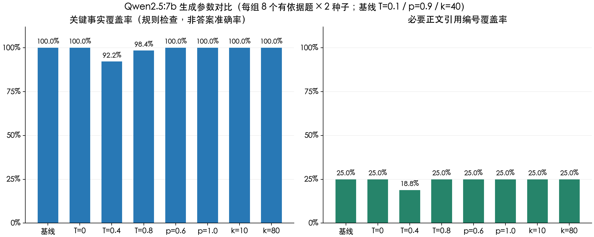

# 5.2.1 生成参数对比与选择

2026 年 9 月 29 日使用本地 Ollama + Qwen2.5:7b，对 Temperature、Top-p、Top-k 做逐项控制实验。正文引用和格式问题保留在结果中；参数实验不代表完整 RAG 问答界面、流式、缓存、降级或正式系统评测已完成。

## 1. 参考依据与最小适配

实现前读取固定版本 `6979d7173ed0f92910a8571dd4ca1b4a171a2c49` 的 [app/core/llm.py](https://github.com/dsy1018/ai-chatbot/blob/6979d7173ed0f92910a8571dd4ca1b4a171a2c49/app/core/llm.py)、[tests/test_integration.py](https://github.com/dsy1018/ai-chatbot/blob/6979d7173ed0f92910a8571dd4ca1b4a171a2c49/tests/test_integration.py) 和 [tests/conftest.py](https://github.com/dsy1018/ai-chatbot/blob/6979d7173ed0f92910a8571dd4ca1b4a171a2c49/tests/conftest.py)。上游 `ChatOpenAI` 普通/流式实例硬编码 `temperature=0.7`；测试将真实模型集成与 mock 隔离。上游没有 Temperature/Top-p/Top-k 对照实验，也没有单独的 `test_llm.py`。

本项目保留简单消息与 Context 字典，在既有 [rag_pipeline.py](../../src/generation/rag_pipeline.py) 添加 `generate_answer()`：现有 System/Human 消息转换为 Ollama 原生消息，按 YAML 传参，非流式生成后用同轮 Context 解析引用。使用 Python 标准库，不新增框架或业务服务。只允许本机 Ollama HTTP 地址；服务或模型失败明确报错，不转云端。`length` 终止保留并提示答案可能不完整。接口直接返回原始答案、补全文献来源的答案、引用证据、提示和服务实际 Token/耗时信息，供实验复核与后续集成。

[Ollama Modelfile 官方说明](https://docs.ollama.com/modelfile)给出这些参数的含义：Temperature 控制随机性，Top-k 控制候选词范围，Top-p 控制累计概率阈值；seed 用于控制采样。低温时概率分布集中，Top-p/Top-k 的影响可能较弱，这是待实验观察的解释，不是必然收益。参数通过 [原生 Chat API](https://docs.ollama.com/api/chat) 的 `options` 传入；生成 `llm.top_k` 与检索 `retrieval.top_k=5` 分别控制词元候选数和文档块数。

## 2. 数据与控制变量

- 模型：`qwen2.5:7b`，7.6B 参数、GGUF/Q4_K_M；完整 digest `845dbda0ea48ed749caafd9e6037047aa19acfcfd82e704d7ca97d631a0b697e`。固定 Ollama 0.34.0，官方 Darwin 运行包 SHA-256 为 `dd12b00bcce2d6551178e67ada90d5af9f75bdb54a118b96655250fa3e8ef734`；[官方模型标签](https://ollama.com/library/qwen2.5/tags)、[官方运行包版本](https://github.com/ollama/ollama/releases/tag/v0.34.0)。本机首次在沙箱内调用 Metal 失败，在获准的本地运行环境中正常加载。
- 机器：Apple M4，16 GiB 统一内存，macOS 27.0 ARM64，Python 3.10.10；Ollama 启动日志确认 Metal、29/29 层 GPU 加载，`/api/ps` 确认实际窗口 8192。
- 基准：[生成参数评测集](../../reports/生成参数评测集.json)，取既有六篇中英 AI 论文的真实标注块，保存原文、文件名、物理页码、文档/块 SHA 和原始位置；没有手写伪文档。10 个固定问题含 8 个事实/概括/对比题（其中 2 题要求英文回答）、1 个有文档但缺所问信息的拒答题、1 个空库拒答题。中文与英文论文并存，来源覆盖六篇论文。
- 提供标注相关片段，部分题加入另一论文的真实片段作干扰；不重复运行检索。这是隔离检索变化的生成实验，不能据此计算或宣称 Hit@5、端到端准确率。比较题固定提供两份来源。
- Prompt 固定为 `rag-v2`；每题保存实际消息 SHA-256。固定 `num_ctx=8192`、`num_predict=512`、`repeat_penalty=1.0`，两种子为 17/29。运行时采样日志确认 `min_p=0`、`mirostat=0`；不随组改变。seed 不能保证跨版本、硬件、内核完全逐字复现。
- 八组 × 10 题 × 两种子 = 160 条真实生成。基线为 `T=0.1 / p=0.9 / k=40`；温度对照 0/0.4/0.8，Top-p 对照 0.6/1.0，Top-k 对照 10/80，均只改一个参数。未做三参数全组合或验证交互最优点。
- 使用固定顺序种子 20260929 打乱 160 项执行顺序，避免某组总先运行。模型加载/预热另存，不计入均值；单请求顺序调用，不并行生成。均值包含服务处理、预填充与输出，并可能受前缀缓存和系统负载影响，不是严格吞吐基准。

## 3. 评价办法

自动规则事先按原文标注关键项，分别记录：关键事实出现比例、所需正文引用编号是否覆盖、固定两个标题是否保留、是否自然结束。拒答两题单独检查无依据提示，避免混入八个事实题的事实覆盖率。`## 参考来源` 或英文来源区的末尾编号不能替代正文引用。全规则通过要求这些检查同时通过。

关键项覆盖只检查数字/术语出现，不证明数字与模型字段对应正确，也不能发现所有幻觉。Codex 另外核对实际答案与保存原文，记录遗漏、引用、格式和措辞问题；这是开发审阅，尚未独立人工复核，不称为人工答案质量评分。每个种子在每组只有 10 题，变化 1 条就是 10 个百分点；两个种子不是 20 个独立意图，没有统计显著性或普适最优结论。

执行期间测试发现规则应使用 ASCII 数字词边界，避免把“6层/64维”漏算；无相关文档提示应计为拒答；英文来源标题需排除末尾编号。最终全部原始答案统一用 `facts-and-body-citations-v2` 重算，输入、Prompt、上下文和原始回答未修改，不因某组结果低而改题。复算操作保存在结果的 `rescored_at` 和 `scoring_note`。

## 4. 真实结果

每组 20 条回答，关键事实和正文编号两列只统计 8 个有依据题 × 两种子。正文编号覆盖仅表示所需来源编号在正文出现，**不是引用语义准确率**；第 149 条虽然有编号，但原文不能支持其错误拒答。格式和全规则列统计全部 20 条回答。

| 参数组（T / p / k） | 关键事实覆盖 | 正文编号覆盖 | 格式达标 | 全规则通过 | 平均输出 Token | 平均耗时 / 秒 |
| --- | ---: | ---: | ---: | ---: | ---: | ---: |
| 0.1 / 0.9 / 40（基线/选定） | 100.00% | 25.00% | 70% | 6/20 | 78.45 | 4.436 |
| 0 / 0.9 / 40 | 100.00% | 25.00% | 70% | 6/20 | 75.80 | 4.330 |
| 0.4 / 0.9 / 40 | 92.19% | 18.75% | 70% | 4/20 | 82.75 | 4.750 |
| 0.8 / 0.9 / 40 | 98.44% | 25.00% | 70% | 6/20 | 84.85 | 4.700 |
| 0.1 / 0.6 / 40 | 100.00% | 25.00% | 70% | 6/20 | 77.30 | 4.387 |
| 0.1 / 1 / 40 | 100.00% | 25.00% | 70% | 6/20 | 78.45 | 4.532 |
| 0.1 / 0.9 / 10 | 100.00% | 25.00% | 70% | 6/20 | 78.45 | 4.356 |
| 0.1 / 0.9 / 80 | 100.00% | 25.00% | 70% | 6/20 | 78.85 | 4.412 |

两类无依据题均给出拒答/无文档提示，提示覆盖为 100%，但有片段的题统一写“未找到相关文档”，措辞尚不精确。全部 160 条自然结束，没有输出上限截断；实际 Prompt 为 396–779 Token，输出为 15–198 Token，均落在本实验 8192 窗口内。该核验只覆盖本开发集，不能证明所有 12000 字符 Prompt 都不会超出窗口。



可核查资料：[全部原始答案/用量/逐题规则及摘要](../../reports/生成参数对比结果.json)、[输入和标注片段](../../reports/生成参数评测集.json)、[Codex 开发审阅](../../reports/生成参数答案审阅.json)、[实验脚本](../../reports/compare_generation.py)、[绘图脚本](../../reports/plot_generation.py)。原始回答的 SHA-256 在审阅记录中逐条保存；评分复算未改写回答。权重和运行包不提交到仓库。

## 5. 参数选择

默认选择 **Temperature=0.1、Top-p=0.9、Top-k=40**，写入 [config.yaml](../../config.yaml)，业务 `generate_answer()` 和实验都使用原生 Ollama 参数，不只是文档建议。

- Temperature：0.1 在两种子上没有本轮确认的关键事实遗漏、错误拒答或未标注的额外推导；0.4 出现有明确依据却拒答，0.4/0.8 都出现“二维”遗漏。0 也是可用候选，指标与基线相同、输出略短；本实验不足以证明 0.1 显著优于 0，保留原来的低温起点。
- Top-p：固定 T=0.1/k=40 时，0.6、0.9、1.0 的关键事实、编号、格式和全规则指标相同，未发现更改阈值的稳定收益，保留 0.9。
- Top-k：固定 T=0.1/p=0.9 时，10、40、80 的这些质量指标也相同，保留 40。耗时差异较小且受缓存/负载影响，不据此宣称某候选数一定更快。
- 固定工程上限为 `num_ctx=8192`、`num_predict=512`，`repeat_penalty=1.0` 用于保持对照条件一致；它们没有单独选型。实验 seed 17/29 不写成业务硬编码默认，生产回答允许措辞变化。

上述选择适合当前事实型科研 RAG 起点，是有限开发集上的工程决定，不是全局最优。仅比较过八个实际组合，没有把各参数单独的“最佳值”拼成未经实测的组合。

## 6. 答案质量问题与保留样例

Codex 已逐条核对 160 条回答和保存的原文，没有独立人工打分：

1. **明确有依据却拒答**：第 149 条（T=0.4、seed=17、heads）认为原文未给出头数/维度，第一块实际明确 h=8、d_k=d_v=64。同题基线第 8/133 条正确回答 8 和 64。这是实际内容错误，不能被“引用编号存在”掩盖。
2. **信息遗漏**：第 11 条（T=0.8、seed=29）和第 127 条（T=0.4、seed=29）的 ViT 回答写插值但未明确二维；基线第 15/116 条明确写 2D interpolation。它们没有完全选错方法，不能把这个遗漏夸大为整题全部错误。
3. **未标注推导**：第 51 条（T=0.4、seed=29）补入 d_model=512，可由 8×64 推导，但未按 Prompt 标注推断，正文也没有严格编号。
4. **正文引用缺失**：基线 16 条有依据回答中，仅 4 条满足所需正文编号覆盖，12 条只在末尾列来源或用自然语言提来源；基线全规则只有 6/20。编号覆盖不能作为每条结论获得原文支持的证明。
5. **固定标题与来源解析**：32 条英文回答将两个约定标题译成 Answer/References 等；16 条空库回答省略两个标题。当前业务来源解析只识别约定的中文标题，因此英文来源区的编号还可能被误计为正文引用；实验评分已排除这些末尾编号，未把它们算作正文达标。该解析边界保留为后续问题，不宣称已修复。
6. **拒答措辞**：有文档但缺训练硬件信息的 16 条回答均拒答且没有编造训练数字，但“片段未说明 GPU/耗时”比“未找到相关文档”准确；空库 16 条没有编造 DOI。提示覆盖不等于降级流程已完成。

参数选择没有解决正文引用、固定标题或拒答措辞问题。后续应优化 Prompt/来源解析并重新运行对照；正式 10–20 篇、50+ 问答及独立人工正确性/完整性/引用评分继续保留，不能用本开发集替代。

## 7. 接口与测试

新增非流式 `generate_answer(question, context, *, options=None)`。默认读取 YAML，`options` 只供本次实验覆盖采样和 seed，不改写配置或同轮 Context。校验有限数值/范围、正整数上限、本机服务；生成失败、未完成/空响应明确报错。保留自然结束或 `length` 原因、真实服务用量，`length` 增加提示；引用映射仍使用既有函数，不在此次参数任务中修改模板或引用协议。

选型后又不传实验覆盖参数，实际读取 YAML 完成一次默认生成/正文引用验证，记录在结果的 `default_call_verification`，不计入八组160条统计。

新增 14 个接口/规则测试，生成模块 55 个、完整回归 **220 个通过（9.981 秒）**；从 `src/` 直接运行生成测试也通过，`pip check` 通过。mock 测试只核对请求参数和失败边界，160 条模型答案来自另行运行的真实 Ollama。图片已实际打开检查，中文标题、标签、数值显示完整。服务监听本机且关闭云端，本轮没有用整机断网验证完整应用离线。

M2-01 的 Prompt、上下文拼接和生成参数实验完成；M2-02 已接通实际非流式生成的引用接口，仍有上文质量问题，前端问答/正式引用语义人工评分未完成。流式、缓存、三类降级和运行日志保持后续任务状态。

## 8. 复现

本机运行包与权重位于 `data/models/ollama/`，启动方法见 [使用手册](../用户使用手册.md)。确认模型完整 digest、服务版本和关闭云端设置后，从项目根目录运行：

```bash
# 新测量指定新文件，避免覆盖当前真实结果。
.venv/bin/python reports/compare_generation.py --output /private/tmp/生成参数复测.json
# 仅按当前规则复算默认结果，不调用 LLM。
.venv/bin/python reports/compare_generation.py --rescore
# 从默认完成结果绘图，不重新生成答案。
.venv/bin/python reports/plot_generation.py
.venv/bin/python tests/test_generation.py -q
```

输入 JSON 包含本轮实际送入模型的 Context 与消息哈希，复测无需重做检索或另行加载 Embedding。Prompt、模型、采样器或论文输入改变后应记录新版本，保存新结果，不覆盖旧答案或声称逐字复现。
