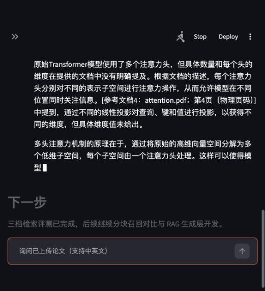
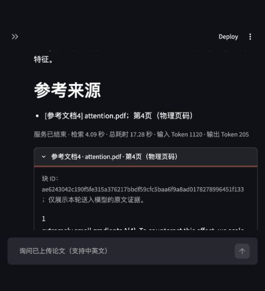

# 5.2.2 流式输出与动态引用

本次完成 Streamlit 打字机效果，以及正文引用在生成期间补全文档名和真实位置。采用一个 Streamlit 页面直接调用本地 Ollama，沿用既有混合检索、重排和 Context；没有新增依赖。Agent、语义缓存、完整降级、持久会话及运行日志仍按后续任务实现。

## 1 参考依据与实现选择

固定参考版本为 `6979d7173ed0f92910a8571dd4ca1b4a171a2c49`，本次阅读以下源码和测试：

| 上游代码 | 实际能力 | 本项目适配 |
| --- | --- | --- |
| [app/core/llm.py](https://github.com/dsy1018/ai-chatbot/blob/6979d7173ed0f92910a8571dd4ca1b4a171a2c49/app/core/llm.py) | `astream()` 逐片段返回内容 | `streaming.py` 按行读取本地 Ollama NDJSON |
| [app/api/chat.py](https://github.com/dsy1018/ai-chatbot/blob/6979d7173ed0f92910a8571dd4ca1b4a171a2c49/app/api/chat.py) | SSE 的 token/done/error 事件，结束时附来源 | 保留简单事件字典，直接在 Python 模块间传递 |
| [frontend/app.py](https://github.com/dsy1018/ai-chatbot/blob/6979d7173ed0f92910a8571dd4ca1b4a171a2c49/frontend/app.py) | 聊天组件、累积文本、占位区更新和打字光标 | 保留占位区更新；引用需替换原位置，因此使用已映射的正文快照 |
| tests/test_api.py、tests/test_integration.py | mock SSE 事件、真实模型流式非空检查 | 补充按行迭代、拆分引用、中断、关闭连接、最终统计和 AppTest 聊天操作 |

课程的“SSE / Streamlit”采用 Streamlit 方案，符合既定单进程结构。Ollama 原生 `/api/chat` 设置 `stream=true` 返回逐行 JSON，格式为 NDJSON；这与 SSE 的 `data:` 行不同。[Ollama 流式文档](https://docs.ollama.com/api/streaming)

前端采用 `st.chat_input()`、`st.chat_message()` 和 `st.empty().markdown()`。`st.empty()` 可替换同一位置的内容，适合将编号替换成完整引用；没有等全文完成后再用 sleep 模拟打字。[Streamlit 占位区](https://docs.streamlit.io/develop/api-reference/layout/st.empty)、[聊天组件](https://docs.streamlit.io/develop/api-reference/chat/st.chat_message)

## 2 后端事件与引用流程

`src/generation/streaming.py` 的 `stream_answer(question, context, options=None)` 返回生成器：

| 事件 | 字段与用途 |
| --- | --- |
| `token` | `content` 为模型原始增量；`answer` 为当前可显示正文；`citations` 为已闭合的有效引用证据 |
| `done` | 最终正文和来源清单、原始回答、引用校验、模型/采样参数、终止原因、实际用量 |
| `error` | 错误消息、已收到的原始文本和可显示正文/引用；没有完成标记和完整用量 |

调用前，流式和非流式共用 `rag_pipeline.py` 的请求构造、YAML 参数验证和本机地址约束。HTTP 响应按行读取，避免把网络包边界误当成 JSON 或 UTF-8 边界；只有 `message.content` 用于展示。服务最终包的 `prompt_eval_count`、`eval_count` 和耗时字段直接保留，耗时单位为纳秒；片段数量不等同于 Token 数。[Ollama Chat API](https://docs.ollama.com/api/chat)

引用按同一轮 `references` 快照解析。例如模型依次返回：

| 原始累计文本 | 当时展示 |
| --- | --- |
| `编码器有6层。` | `编码器有6层。` |
| `编码器有6层。[参` | `编码器有6层。` |
| `编码器有6层。[参考文档1` | `编码器有6层。` |
| `编码器有6层。[参考文档1]` | `编码器有6层。[参考文档1：attention.pdf；第3页（物理页码）]` |

这是人工构造的拆包功能样例。普通正文立即展示，仅暂存末尾可能成为引用的未完成标记；编号闭合后在原位置补齐，不等整段回答结束。常见代码围栏、转义和行内代码示例不当作真实引用；未闭合行内代码暂存到闭合，防止其中的示例编号被短暂误判。模型附加的普通引用链接不会成为可信来源链接。

引用中 PDF 使用加载器的物理页码（续表保留页码范围）；Word 使用段落/表格，TXT/Markdown 使用行范围。未知编号显示无效引用，证据仅包含实际送入上下文的正文。模型末尾的中文或英文来源区由系统重建，不能用末尾编号替代正文引用。本轮修复了英文 `References`、`Reference Sources`、`Sources` 未被识别的问题：修改前英文末尾编号会被误算为正文引用，已复现并加入回归用例；既有参数实验原始记录不改写。

收到服务 `done` 后统一补来源清单。`done_reason=length` 仍提示内容可能不完整；末尾未闭合引用等片段保留在 `raw_answer`，不作为有效引用展示，并提示。无 `done` 的 EOF、网络错误、错误包或非法 JSON 产生 `error`，保留部分文本、去掉打字光标，页面明确显示“回答未完成”。不自动重试或转云端。消费者关闭生成器时关闭 HTTP 连接。

## 3 页面操作与边界

启动本地 Ollama，再运行 `.venv/bin/python -m streamlit run src/frontend/app.py`，具体权重和命令见[用户使用手册](../用户使用手册.md)。

1. 上传文献并构建索引；在“RAG 流式问答”中提交问题。
2. 页面默认走向量＋BM25＋手写 RRF，将 Top-20 候选交给 BGE 重排，再用最终 Top-5 拼接上下文；首次加载模型可能较慢。
3. 答案持续增长，完整编号立即补全真实来源；结束后可展开原文证据、查看实际 Token 和耗时。
4. 页面重跑只重新展示当前历史，不重复生成；“清空当前对话”只清空页面问答记录。当前不把历史发给模型，不计为多轮记忆、SQLite 持久会话或完整 Agent 页面完成。

空检索结果会在调用前明确提示没有文献依据，Prompt 同样包含无文档提示；检索/模型失败显示错误。低相关性阈值、替代工具和完整三类降级验收仍未完成。引用编号正确只证明来源映射正确，仍须核对原文是否支持结论。

## 4 自动化验证

Python 3.10.10、Streamlit 1.64.0，新增 18 项用例：14 项流式/引用与 4 项真实聊天组件 AppTest，生成模块 73 项，完整 **238 项通过（9.392 秒）**；`pip check` 通过。没有新依赖。

- 首包到达即 yield，尚未读取后续包；请求使用 `stream=true` 和共用配置，完成包保留实际统计。
- 引用的每个拆分位置、逐字中文片段、代码/转义、普通链接、来源标题翻译、未知编号和生成长度终止。
- 空/未完成响应、EOF、非法 JSON、服务/网络错误、关闭消费者和输入不变。
- 页面首次启动不检索或调用模型；提交后真实流式接口接入、引用/证据与实际用量展示、重跑不重复生成、清空、空库和检索失败。

HTTP 测试使用明确构造的 NDJSON；AppTest 的最终页面检查不能独立证明浏览器动画。真实生成与浏览器验证单独保存如下，不把 mock 的文本或耗时当作模型实测。

## 5 真实本地模型与浏览器验证

2026-09-29，macOS 27 / ARM64 M4 / 16 GiB，官方 Ollama 0.34.0，Qwen2.5:7b Q4_K_M，Metal。配置保持 T=0.1/p=0.9/k=40、窗口8192/输出512，实验覆盖 seed=17。校验既有六篇论文 PDF 的 SHA-256；运行包与权重沿用前轮，服务只监听本机并关闭云端。

固定上下文复用 `reports/生成参数评测集.json` 的两题，第三题在英文原题后明确要求逐句引用，作为单独输入记录。保存[真实片段、时序及最终答案](../../reports/流式与引用验证结果.json)，由 [verify_streaming.py](../../reports/verify_streaming.py) 生成：

| 输入 | 首片段 / 首可见文本（含标题） | 首有效正文引用 | 服务结束 | 输入/输出 Token |
| --- | --- | --- | --- | --- |
| 中文 Transformer 注意力头原题 | 7.439 / 7.540 秒 | 9.727 秒 | 10.372 秒 | 779 / 55 |
| 英文 BERT 大小原题 | 0.981 / 1.037 秒 | 无 | 5.139 秒 | 578 / 81 |
| 英文 BERT，追加逐句引用要求 | 0.167 / 0.216 秒 | 0.995 秒 | 4.696 秒 | 591 / 96 |

中文实际回答给出 8 个头、键/值各64维，编号映射为 Attention 第5页。第三题正文编号映射为 BERT 第3页，均在 `done` 前出现；第二题只在英文末尾列编号，系统正确提示正文未引用。三题负载和模型缓存状态不同，首题含模型冷加载，不能用这组耗时证明吞吐性能提升。没有独立人工引用语义评分。

真实浏览器另走完整检索与生成：将公开 Attention 原文加载、递归分块，实际 M3E 向量化 94 块写入验证时的空 Chroma，页面调用 RRF＋BGE＋Qwen。生成中截图同时出现 Stop、打字光标与 `attention.pdf` 第4页的正文引用；结束后显示检索4.09秒、总耗时17.28秒、输入1120/输出205 Token，来源面板通过 Enter 展开，呈现稳定块 ID 和原文。记录见[页面验证结果](../../reports/流式页面验证结果.json)。该问题的 Top-5 未包含第5页的8头/64维事实，答案未答出数字；这是保留的检索质量局限，不算答案质量达标。临时加入的94块验证后删除，既有论文原件保留。





复测时先启动手册中的本地 Ollama，再指定新输出路径：

```bash
.venv/bin/python reports/verify_streaming.py --output /private/tmp/流式复测.json
.venv/bin/python -m unittest tests.test_retrieval tests.test_generation
```

脚本仅验证固定真实上下文的流式时序和映射；浏览器记录是本次实际操作所得，不是脚本自动产生的页面性能结果。M2-03 已完成；M2-02 的页面展示已接入，独立引用语义评分仍待完成。
