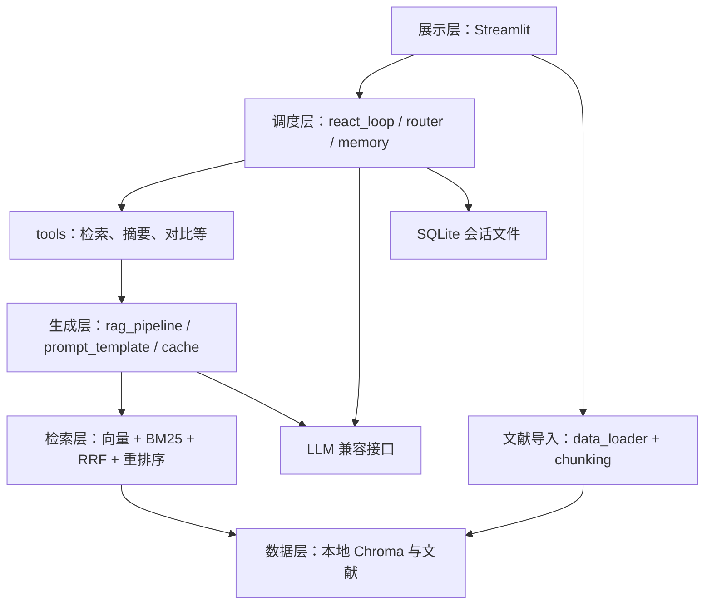

# 智能科研助理技术设计文档

本项目面向本科生课程实践，实现“上传论文 → 建立知识库 → 提问 → 检索与工具调用 → 返回带来源的回答”。参考 ai-chatbot 的代码，保持用户指定的课程目录，将已有实现映射到对应文件，避免额外服务和框架。本文统一维护技术方案、需求与验收状态。

**当前状态**：已实现 PyMuPDF 分页文本加载器，保留文件来源、稳定文档 ID 和物理页码，11 个文档加载测试通过。其他业务模块仍为占位，Streamlit 仍是初始化页。下文除 PDF 加载接口外均为待实现设计；本次选型依据和验证记录见 [5.1.1 PDF 加载器选择](QA/5.1.1%20PDF加载器选择.md)。

## 1 设计依据与范围

- [课程实践方案](南京农业大学课程实践.docx)：五个模块、实验和交付要求。
- [项目交付模板](项目交付模板.docx)：报告章节、完成情况表与排版要求。
- [参考仓库固定版本](https://github.com/dsy1018/ai-chatbot/tree/6979d7173ed0f92910a8571dd4ca1b4a171a2c49)：提交 `6979d7173ed0f92910a8571dd4ca1b4a171a2c49`，读取日期 2026 年 9 月 28 日。

本次完整读取参考版本的 41 个文件：29 个 Python 文件（含 7 个空包初始化文件），以及配置、依赖、测试、部署和说明文档。以源码实际行为为准，不把 README 或简历介绍当作验证结果。

项目结构以用户给定模板为准，参考仓库提供实现依据。采用一个 Streamlit 进程直接调用 Python 业务模块，Chroma 和 SQLite 使用本地文件。上游 FastAPI、HTTP/SSE、请求模型已阅读，其流程与校验思路映射到模块函数和流式事件，不在本项目新增接口服务或 `app/api/` 目录。

课程明示要求全部保留，分阶段补齐。按用户 2026 年 9 月 29 日的指令，PDF 三种方案通过官方资料比较，只实现选定的 PyMuPDF，不实现 PyPDF2 和 pdfplumber，也不将资料对比冒充实测。其他分块、Embedding 和数据库选型的比较放在实验脚本与报告，不将所有候选都做成运行时插件。不加入其他备选题目、账号权限、分布式部署或额外前端框架。

### 1.1 不降低的核心要求

| 维度 | 最终必须具备的能力 | 具体落点 |
| --- | --- | --- |
| 深度融合 | Agent 为统一决策中枢，RAG 为核心知识工具，自主选择检索、计算、对比或直接回答 | `react_loop.py`、`router.py`、`tools.py` |
| 检索 | 向量 + BM25 + 手写 RRF，融合后 Top-20 候选交给 bge-reranker-base/v2 类模型精排 | `retrieval/` 四个文件 |
| 决策 | 手写 Thought → Action → Observation，语义路由、独立工具并行、超时重试、异常替代、死循环终止 | `agent/`；约 200 行为教学参考，不凑行数 |
| 记忆 | 会话隔离、Token 窗口、超阈值阶段性摘要；验证数十轮长对话 | `memory.py`；仍遵守实际模型上下文预算 |
| 可观测 | 每步轨迹、分工具 Token、检索质量/延迟、工具成功率/耗时，前端实时展示 | `logger.py` 与右侧/底部轨迹区 |
| 本地隐私 | Ollama + Qwen2.5/ChatGLM、本地 Embedding、索引和会话，准备权重后断网运行 | 不依赖云端，不静默外发私有文献 |
| 教学交付 | 小模块接口、真实实验、Bad Case 优化、手册、设计、Git 历史、Docker、演示 PPT | 固定课程目录，结果可复现 |

联网搜索是额外可选模式，默认关闭，不纳入完全离线验收。无 GPU 时可验证 CPU 推理；云端替代如需使用应另行明确，不能代替默认本地方案。

课程介绍中的“Hit@5 约 65% → 85% 以上、检索失败减少约 60%、计算路由节省约 80% Token”保留为待验证对照目标，不视为本项目结果。约 0.002 元/次本地成本、约 0.1 元/次云端成本、月约 3 元及 8GB 内存/4GB 显存均为课程给出的参考值，尚无本项目实测依据；报告记录真实耗时、功耗/成本口径和资源占用，不用示例代替测量。

### 1.2 三个研究问题与教学产出

1. 学术 PDF 中哪些 chunk_size、top_k、Embedding 配置最有效：同一数据集比较分块与三档检索。
2. Agent 路由相比固定“每题都 RAG”节省多少 Token：按问题类型记录准确率、调用轮次和总 Token。
3. 科研任务常用哪些工具组合，并行比串行减少多少延迟：用相同独立任务比较结果和耗时。

按检索 → 生成 → Agent → 集成 → 评测递进，RRF/ReAct 手写，加载与数据库使用成熟库。答辩需解释算法、接口、失败根因和成本/性能取舍；交付完整代码及环境说明、技术设计、系统评测、Bad Case、使用手册、Docker 和演示 PPT。研究意义由真实文献与实验支持，不将课程背景中的“研究空白”当作已证明结论。

## 2 固定项目结构

```text
project/
├── README.md
├── requirements.txt
├── config.yaml
├── src/
│   ├── data_loader/              模块一：文档加载
│   │   ├── pdf_loader.py
│   │   ├── docx_loader.py
│   │   └── text_loader.py
│   ├── chunking/                 模块一：文本分块
│   │   ├── fixed_chunk.py
│   │   ├── recursive_chunk.py
│   │   └── semantic_chunk.py
│   ├── retrieval/                模块一：检索层
│   │   ├── vector_store.py
│   │   ├── bm25_retriever.py
│   │   ├── hybrid_retriever.py
│   │   └── reranker.py
│   ├── generation/               模块二：生成层
│   │   ├── prompt_template.py
│   │   ├── rag_pipeline.py
│   │   ├── streaming.py
│   │   └── cache.py
│   ├── agent/                    模块三：Agent 层
│   │   ├── react_loop.py
│   │   ├── tools.py
│   │   ├── router.py
│   │   └── memory.py
│   ├── frontend/                 模块四：前端
│   │   ├── app.py
│   │   ├── pages/
│   │   └── components/
│   └── utils/                    工具函数
│       ├── logger.py
│       └── config.py
├── tests/                        测试
│   ├── test_retrieval.py
│   └── test_agent.py
├── docs/                         文档
│   ├── 技术设计文档.md
│   └── 用户使用手册.md
├── reports/                      评测报告
│   ├── 评测集.json
│   ├── 性能评测数据.xlsx
│   └── Bad_Case分析报告.md
└── docker/
    ├── Dockerfile
    └── docker-compose.yml
```

保留根目录 `AGENTS.md`、已有原始资料与报告骨架；包初始化文件按 Python 导入需要保留。文献、索引、SQLite 和日志仍使用现有 `data/`、`logs/` 运行目录。上表的业务测试与性能表在有实际实现和测量数据后编写，不创建空测试或假成绩表。`pages/`、`components/` 保留目录，界面未复杂到需要拆分前先用一个 `app.py`。

## 3 参考代码到本项目的映射

| 已完整阅读的参考文件 | 参考的实际实现 | 本项目位置与采用方式 |
| --- | --- | --- |
| `app/core/rag.py` 的 `load_document()`、Loader 映射 | PDF/Word/TXT/Markdown 按扩展名加载 | `data_loader/` 三个文件；保留分发思路，补课程 Word 表格与来源 |
| 同文件的 `split_documents()` | 递归字符切分 | `chunking/recursive_chunk.py`；另外两种策略放指定文件 |
| 同文件的向量库初始化、入库与增量添加 | Chroma 持久化与批量向量写入 | `retrieval/vector_store.py`，不增加向量库服务 |
| 同文件的分词、BM25、手写 RRF 和两种重排 | 双路召回、排名融合、模型/关键词重排序 | 分别映射 `bm25_retriever.py`、`hybrid_retriever.py`、`reranker.py` |
| `app/core/embeddings.py` | 在线/本地 Embedding 包装 | 接入 `vector_store.py`，先验证一个模型，不另建管理框架 |
| `app/core/llm.py`、`rag.py` 的 `build_context()` | 兼容 LLM、工具绑定、流式生成、上下文 | `generation/rag_pipeline.py`；Prompt 和流式分别放指定文件 |
| `app/core/agent.py` | 一轮 Function Calling、注册表、ToolMessage、事件生成器 | `agent/react_loop.py`、`tools.py`、`router.py`，补课程有界循环 |
| `app/core/memory.py` | 会话隔离、内存/SQLite、Token 窗口 | `agent/memory.py`；采用 SQLite，补简单摘要 |
| `app/tools/weather.py`、`search.py` | `@tool`、HTTP 超时、结果与错误文本 | `agent/tools.py`；天气只参考写法，科研工具集中实现 |
| `app/api/chat.py`、`knowledge.py`、`tools.py`、`app/models/schemas.py` | 对话/入库/工具流程、请求校验与事件响应 | 映射模块函数和少量字典；不新增 HTTP API 或 schemas 文件 |
| `app/main.py`、`core/metrics.py`、`utils/logger.py` | 生命周期、健康状态、计数、Token 估算与日志轮转 | 初始化由前端协调；统计和日志集中在 `utils/logger.py` |
| `frontend/app.py` | 侧栏、对话区、逐步渲染、会话与开关 | `src/frontend/app.py`，用模块调用替换 HTTP 客户端 |
| `config.py`、`.env.example` | 集中配置、密钥与运行参数 | `config.yaml` + `src/utils/config.py`；密钥读环境变量，不建立第二套配置 |
| `tests/conftest.py`、五份 `test_*.py`、`pytest.ini` | mock 隔离、记忆/RAG/工具/API/集成测试 | 核心检索归入 `test_retrieval.py`，工具/循环/记忆归入 `test_agent.py`；不声称上游测试已经通过 |
| 两份 Dockerfile、`docker-compose.yml`、两份忽略文件 | 容器与本地数据挂载 | `docker/` 中只运行一个 Streamlit 服务，保留数据挂载方式 |
| 两份依赖清单、7 个空初始化文件、`README.md`、`docs/architecture.md`、`RESUME.md` | 依赖约束、包组织、使用与设计介绍 | 按实际使用依赖和本项目成果整理，不照搬宣传结论 |

实现定位：[RAG 源码](https://github.com/dsy1018/ai-chatbot/blob/6979d7173ed0f92910a8571dd4ca1b4a171a2c49/app/core/rag.py)、[Agent 源码](https://github.com/dsy1018/ai-chatbot/blob/6979d7173ed0f92910a8571dd4ca1b4a171a2c49/app/core/agent.py)、[记忆源码](https://github.com/dsy1018/ai-chatbot/blob/6979d7173ed0f92910a8571dd4ca1b4a171a2c49/app/core/memory.py)、[前端源码](https://github.com/dsy1018/ai-chatbot/blob/6979d7173ed0f92910a8571dd4ca1b4a171a2c49/frontend/app.py)。

## 4 系统架构与数据流



五层是一个应用内的职责划分，不是五个服务。沿用 LangChain Document/Message 表达文本和消息，其余结果用简单字典；不要为少量字段设计通用协议或多层抽象。

### 4.1 文献导入与检索

读取文档并保留来源 → 按策略分块 → 对新块计算 Embedding → 加入本地 Chroma → 重建小规模 BM25 语料。新增文献不重算全部旧文献向量；BM25 重建沿用上游简单做法。

PDF 已实现为 `src/data_loader/pdf_loader.py` 的 `load_pdf(file_path)`：沿用参考 `load_document()` 的 Document 列表和来源字段，按用户选择将 `PyPDFLoader` 的解析器替换为 PyMuPDF。逐页调用 `get_text("text", sort=True)`，只去除首尾空白；元数据保留绝对路径 `source`、`source_file`、`file_type`、文件内容 SHA-256 `doc_id`、从 0 开始的 `page`、从 1 开始的 `page_number` 和 `total_pages`。无文本页警告并跳过，保留原页码；全篇无文本和需要密码时明确报错，损坏文件的原生解析异常向上传递。

三种解析器的官方资料对比与选型理由见 [PDF 加载器选择](QA/5.1.1%20PDF加载器选择.md)，仅安装 PyMuPDF 和沿用上游版本的 `langchain-core`。`sort=True` 仅作位置排序基线，不承诺双栏顺序、跨页表格重建或公式结构恢复；这些场景仍待专项验证，不引入 OCR 平台。Word 按课程要求使用 `python-docx` 保留正文和表格；TXT/Markdown 用纯文本处理，均待实现。

三种分块在指定文件中实现：固定大小、递归、按句段边界。单位统一为字符，固定大小比较 256/512/1024。递归策略先参考上游的 500/50 字符设置，与当前 YAML 样例的 512/64 区分，不能同时声称两者是实际配置。

向量和 BM25 候选经手写 RRF 融合，再重排序。块保留稳定 `doc_id`、`chunk_id`、文件名、页码或段落位置，融合按块标识而非只按正文去重。删除/同名重传同步源文件、向量、BM25 和缓存。

两路取足够候选，RRF 合并后截取 Top-20 送入模型重排，再保留最终 Top-K。上游两路各 5 项仅为参考默认，不能用最多 10 项冒充 Top-20 实验。必须比较 bge-large-zh 与 m3e-base、Chroma 与 FAISS；运行时只维护选定存储，不部署两套。最终核心版本启用真实模型重排，关键词方案仅用于基线或明确标注的降级。

### 4.2 生成与引用

`rag_pipeline.py` 协调检索、上下文和参考 LLM 封装，不为模型调用新建服务。参考 `build_context()` 的 `context`、`sources`、`chunk_count`；来源补文件名与位置。Prompt 按相关性拼接并限制长度，答案正文引用编号，前端展示对应依据。

`streaming.py` 消费生成器，沿用 `tool_call`、`tool_result`、`token`、`done`、`error` 事件语义，用 Streamlit 占位区逐步刷新；不使用 HTTP/SSE。错误后终止，不再标为成功。

空结果明确提示知识库没有相关文献并区分纯模型回答；低相关性展示候选依据；模型失败给出错误与重试建议。语义缓存放 `cache.py`，用内存列表存问题向量、答案和来源，按相似度匹配，文献变更清空，不增加缓存数据库。

流式正文在引用位置输出编号，来源位置可用时同步展示，不全部拖到结束才显示引用。日志完整记录问题、Top-K 文档、答案、耗时、Token 与 Top-1 相关性分数；记录分数分布，不将 RRF 分数直接解释为概率。

### 4.3 手写循环与工具

上游 `AgentManager.run()` 只有一轮工具选择，不能直接计为课程 ReAct 完成。`react_loop.py` 参考其 `bind_tools()`、执行与 `ToolMessage`，手写“决策 → 工具执行 → 观察 → 继续或结束”有限循环，Function Calling 用于结构化 Action，不调用高层 Agent 执行器。

使用 `config.yaml` 的迭代上限（现有样例为 8），设置完成条件、超时和明确错误；失败最多重试一次。`router.py` 只对模型同轮提出且互不依赖的调用做简单并行，不建立调度图。前端显示工具名、参数、结果、耗时和必要决策说明，不要求模型披露私有思维过程。

Thought 保存简短的本步计划，Action 保存工具与参数，Observation 保存结果/错误及下一步状态。明确算式快速路由计算器，论文比较调用对比工具与 RAG，一般概念可由本地模型直接回答。超时重试或跳过，异常后在注册表选择可用替代工具，重复无效操作或达到上限时强制结束并提示。

`tools.py` 用 `@tool` 和列表/字典注册，八个本地工具复用现有模块，联网搜索为第九个可选工具，默认关闭。此选择补足“8 个可调用”与“搜索可选”的原文差异，不增加业务子系统，详见第 10 节。

| 本地工具 | 输入与真实输出 |
| --- | --- |
| 知识库检索 | 问题 → 带来源的检索/RAG 结果 |
| 论文元信息 | 论文 ID → 标题、作者、年份、摘要、DOI；缺项如实提示 |
| 论文对比 | 两篇 ID → 方法、数据集、实验结果及原文依据 |
| 关键词提取 | 问题或文献 → 核心关键词 |
| 摘要生成 | 论文 ID → 背景、方法、结果、结论 |
| 当前时间 | 无输入 → 本机当前时间 |
| 计算器 | 简单算式 → 计算结果 |
| 文献列表 | 无输入 → 入库论文 ID、文件名与索引状态，复用文献管理 |

摘要与对比复用已有生成/检索函数。八个工具须断网时真实可调用；禁用搜索不计入这八个。

参考基线的直接 RAG 流程可先用于联调；课程融合时 Agent 通过检索工具调用同一流水线，避免提前检索和工具检索重复执行。关闭 Agent 时仍支持直接 RAG。

### 4.4 会话、页面与健康状态

`memory.py` 参考 SQLite、会话 ID 和 Token 窗口，保存用户消息与最终回答；轮次或 Token 达到阈值后，自动将旧历史压缩成阶段性摘要并保留最近对话，不扩展复杂执行图存储。工具中间消息只用于当前执行与日志。

`frontend/app.py` 保持侧栏文献/会话/开关、主区对话、折叠区工具过程。批量导入依次处理并显示进度，失败可重试；切换/清空会话同时操作真实历史，不只清空界面列表。页面较复杂后才使用已有 `pages/`、`components/`。

右侧或底部按循环步骤和工具子项展示简单轨迹树，包含 Thought、Action、Observation，不引入额外可视化框架。低相关性结果提示用户并展示依据供确认；引用、工具成功率和耗时随实际事件更新。

健康检查是内部 Python 函数接口，检查模型服务和本地索引的实际可用性，并在侧栏展示，不新增 HTTP 端点。日志记录问题、来源、答案、检索/工具/总耗时、模型调用与 Token；估算值标明“估算”。返回块数不是 Hit@5，质量指标只由标注评测计算。

## 5 模块接口与配置

### 5.1 最小函数约定

以下是实现时的接口起点；PDF 的 `load_pdf(file_path: str | Path) -> list[Document]` 已存在，其他接口待实现。优先用普通参数和字典，实际命名在编码时核验。

| 文件 | 输入 | 输出或职责 |
| --- | --- | --- |
| `data_loader/*.py` | 文件路径 | Document 列表及来源位置 |
| `chunking/*.py` | Document、大小/重叠 | 继承来源的文档块 |
| `retrieval/vector_store.py` | 文档块或问题 | 增量索引、候选文档与分数 |
| `bm25_retriever.py`、`hybrid_retriever.py`、`reranker.py` | 问题与候选 | 关键词排序、RRF 融合与精排 |
| `generation/rag_pipeline.py` | 问题与历史 | 生成事件；来源、完整答案和统计 |
| `agent/react_loop.py`、`tools.py`、`router.py` | 问题、历史、工具描述 | 决策/调用/结果/答案事件 |
| `agent/memory.py` | 会话 ID 与消息 | 会话历史、窗口裁剪、摘要和 SQLite 保存 |
| `utils/config.py`、`logger.py` | 配置/环境变量、请求事件 | 读取设置、记录日志和简单统计 |

### 5.2 唯一运行配置

保留根目录 `config.yaml`，由 `src/utils/config.py` 读取，路径相对项目根目录。密钥通过环境变量读取，不新增根目录 `config.py` 或 `.env` 配置体系。

| 当前配置组 | 本项目用途 | 参考关系与注意事项 |
| --- | --- | --- |
| `app` | 页面名称、描述 | 当前说明页已读取 |
| `llm` | 本地服务、模型、Temperature | 适配上游兼容接口调用；服务地址须使用实际兼容端点 |
| `embedding` | 一个实际使用的向量模型 | bge-large-zh 与 m3e-base 比较必做；上游 bge-small 只作硬件受限补充基线 |
| `retrieval` | Chroma、候选/返回数、Reranker | 参考 BM25+RRF 和可选重排；Hit@5 必须实际取得前 5 个候选 |
| `chunking` | 策略、字符大小和重叠 | 区分当前 512/64 样例与上游 500/50；按实验记录生效值 |
| `agent` | 迭代上限、联网开关 | 课程补充项，不声称来自上游现成配置 |
| `paths` | 文献、索引和日志 | 保留现有 `data/raw`、`data/index`、`logs`；SQLite 路径实现时补入 |

除 `app` 外，当前组都尚未接入业务。BM25 召回数、RRF 常数、Token 窗口、SQLite 路径等必要参数在实现对应功能时加入，先参考上游的 5、60、2000 等实验起点，不预建大量配置项。

依赖参考上游固定版本和真实使用范围：LangChain 基础组件、Chroma、文档库、BM25、模型库、Streamlit 等；不为仅参考 API 写法而安装 FastAPI/SSE/pydantic-settings。当前声明 Streamlit、PyYAML、PyMuPDF 1.28.2 和沿用参考版本的 langchain-core 0.3.29；后两项用于 PDF 加载，不安装另外两个解析器。依赖兼容性检查已通过，仍不等于完整系统依赖。

默认沿用现有本地推理方向。完整离线能力在模型权重已准备后实测；本地 Embedding 失败应明确报错，不照搬自动切换在线却仍声称离线。生成参数 top-k 是否支持以实际模型接口为准，不与检索 top-k 混淆。

## 6 分阶段实施与验证

| 阶段 | 工作 | 完成判据 |
| --- | --- | --- |
| A 基础闭环 | 加载、递归分块、Chroma、生成与单页界面 | 公开样本可导入、检索并得到带来源回答 |
| B 课程检索/生成 | 三种分块、模型实验、BM25/RRF/Reranker、流式、缓存与降级 | 原文可核查，三档检索和参数对比有真实记录 |
| C Agent/记忆 | 手写循环、科研工具、路由、并行、恢复、SQLite、摘要 | 工具可调用，错误可处理、循环可终止、会话隔离 |
| D 集成/交付 | 文献/会话管理、日志、健康、评测、报告、Docker | 完整演示、50+ 评测、至少一轮 Bad Case 优化、部署实测 |

先完成闭环再补课程缺项。只有联网搜索和“如适用”的多用户并发按原文可选；Reranker 等明示要求可后实现，不因上游默认关闭而删除。

参考 mock 和测试分层，用临时目录隔离索引/SQLite，导入前隔离外部依赖；检索测试集中在 `test_retrieval.py`，循环/工具/记忆集中在 `test_agent.py`，不追求上游测试数量。修复实际问题先复现，再验证。

评测用 10–20 篇同方向论文、至少 50 条四类问题，标注答案与来源；记录 Hit@5/MRR/Recall、工具准确率、平均轮次、延迟/Token、人工质量。用脚本输出数据和图表，不搭评测平台；取得真实结果后生成 `性能评测数据.xlsx`。

Docker 沿用参考的构建与本地文件挂载思路，`docker/docker-compose.yml` 只编排一个 Streamlit 服务，不移出 `docker/`。完整业务部署完成后再记录实测；当前 Compose 缺失的环境限制仍保留在使用手册。

## 7 参考实现中需要针对性补充的地方

以下为静态阅读结论，本轮未运行参考项目，不据此宣称测试失败或本项目已修复。

| 参考位置 | 实际情况 | 本项目必要处理 |
| --- | --- | --- |
| `agent.py`、`api/chat.py` | 一轮工具决策，RAG 在 Agent 前执行 | 在既定 Agent 文件补循环和检索工具，避免重复检索 |
| `rag.py` | Word 用 docx2txt，来源仅文件名，按正文融合去重 | 按指定 loader/检索文件补表格、位置与稳定块标识 |
| `api/knowledge.py` | 单文献删除只删源文件，保留索引 | 前端管理同步源文件、索引、BM25 和缓存 |
| `frontend/app.py` | 没有历史切换/文献列表，清空只改前端 | 调用现有模块操作真正历史与文献状态 |
| `main.py`、`metrics.py` | 状态未检查模型连通，返回块数不是质量指标 | 内部健康函数实测；质量用标注集计算 |
| `llm.py`、`memory.py` | 异常可作为文本输出，无摘要，清理是关闭时或显式执行 | 统一错误事件、补简单摘要，不宣称已有定时清理 |
| `tests/conftest.py`、`test_memory.py`、`test_rag.py` | 部分导入有全局初始化；测试访问不存在的 `memory._sessions`；hybrid 不使用传入 top-k | 适配实际隔离与断言，不直接声称 70 个测试通过 |

只处理与课程验收相关的问题，不借此重写框架。参考版本固定，后续变更应写明参考函数、本项目映射和必要差异。

## 8 课程需求与验收

保留原清单所有 M1–M5 编号、需求与验收方式。状态只描述本项目，参考代码不计为本项目完成；每项完成后补代码位置、验证结果与实验记录。

### 8.1 模块一 文档处理与检索层

| 编号 | 课程要求 | 验收方式 | 状态 |
| --- | --- | --- | --- |
| M1-01 | PDF、Word、TXT/Markdown 加载；批量导入、进度和失败重试 | 各格式真实样本文档，检查正文、表格、来源与导入状态 | 部分实现：PDF 分页加载和来源已验证；其他格式及批量导入待实现，见选型记录 |
| M1-02 | 比较 PyPDF2、pdfplumber、PyMuPDF；处理双栏、跨页表格和公式 | 同一论文的解析对比，记录损失、性能和限制 | 部分实现：按用户指令完成官方资料比较，仅实现 PyMuPDF；复杂排版待专项验证，未做三库同机实验 |
| M1-03 | 至少三种分块：固定、递归、语义；固定大小 256/512/1024 | 同一文献和评测问题，比较召回，提交分块实验报告 | 未实现 |
| M1-04 | 比较 bge-large-zh、m3e-base；Chroma 与 FAISS 选型 | 记录效果、速度、资源占用和选型理由 | 未实现 |
| M1-05 | 批量向量化、持久化索引、增量更新、Top-K 检索 | 重启可检索；新增文档无需全量重建 | 未实现 |
| M1-06 | BM25 + 向量检索；手写 RRF；接入 Reranker | 核验融合与重排；三档对比 Hit@5、MRR | 未实现 |

### 8.2 模块二 RAG 生成层

| 编号 | 课程要求 | 验收方式 | 状态 |
| --- | --- | --- | --- |
| M2-01 | 专用 Prompt；按相关性拼接与动态截断；比较生成参数 | 保存 Prompt 版本、Temperature/Top-p/Top-k 和实验结果 | 未实现 |
| M2-02 | 引用文档名和页码，回答可追溯 | 用真实原文逐项核验引用；无物理页码格式记录段落位置 | 未实现 |
| M2-03 | 流式答案与动态引用标记 | 界面可逐步输出，引用指向实际来源 | 未实现 |
| M2-04 | 基于 Embedding 相似度的语义缓存 | 比较重复、近似问题的命中和响应耗时 | 未实现 |
| M2-05 | 无结果、低相关性、模型调用失败三类降级 | 空库有明确提示；低相关性可查看来源；失败可重试 | 未实现 |
| M2-06 | 记录问题、Top-K 文档、答案、耗时、Token 和 Top-1 分数 | 实际请求的日志字段完整，统计基于真实数据 | 未实现 |

### 8.3 模块三 Agent 决策层

| 编号 | 课程要求 | 验收方式 | 状态 |
| --- | --- | --- | --- |
| M3-01 | 手写 ReAct 核心循环与 System Prompt | 有工具选择、执行和返回记录；任务完成或达到迭代上限时终止 | 未实现 |
| M3-02 | 开发并注册工具集；目标 8 个可调用工具 | 每个工具有输入、输出、真实调用记录；数量差异见下文 | 未实现 |
| M3-03 | 工具选择路由与独立工具并行执行 | 验证检索、对比、计算等问题的路由；比较并行耗时 | 未实现 |
| M3-04 | 超时重试/跳过、异常恢复、死循环强制终止 | 构造对应失败，核验有界恢复和用户提示 | 未实现 |
| M3-05 | 会话隔离、Token 滑动窗口、阶段性摘要 | 两个会话互不干扰；长历史可截断与压缩 | 未实现 |

### 8.4 模块四 系统集成与前端

| 编号 | 课程要求 | 验收方式 | 状态 |
| --- | --- | --- | --- |
| M4-01 | RAG 工具接入 Agent，接入记忆，统一 Message/Context 数据结构 | 上传到问答全链路使用真实数据，跨模块来源不丢失 | 未实现 |
| M4-02 | 统计 Token、检索指标/延迟、工具成功率/耗时；展示决策轨迹 | 记录可核查的工具决策与执行结果，不要求披露模型私有思维过程 | 未实现 |
| M4-03 | 健康检查模型服务与向量数据库 | 分别模拟服务可用与不可用，返回真实状态 | 未实现 |
| M4-04 | 上传、进度、文档列表/删除、向量化状态 | 批量文档操作和索引状态保持一致 | 未实现 |
| M4-05 | 流式对话、Markdown、引用、会话新建/切换/删除 | 实际会话操作、引用跳转和输出可演示 | 未实现 |
| M4-06 | 端到端联调；空库、大文档、长对话；并发如适用 | 保存测试记录；交付 3–5 张真实界面截图 | 未实现 |

当前 `src/frontend/app.py` 仅提供启动说明页，不计为业务界面完成。

### 8.5 模块五 评测与交付

| 编号 | 课程要求 | 验收方式 | 状态 |
| --- | --- | --- | --- |
| M5-01 | 选定研究方向，收集 10–20 篇论文 | 保存论文清单、版本和可定位的原文 | 未实现 |
| M5-02 | 至少 50 条问答，覆盖事实、对比、归纳、推理四类 | 每题有参考答案与依据；统计总量及四类覆盖 | 未实现 |
| M5-03 | Hit@5、MRR、Recall、工具调用准确率、平均轮次、延迟和 Token | 同一评测集跑配置对比，保留原始结果和图表 | 未实现 |
| M5-04 | 正确性、完整性、引用准确性人工评分 | 统一评分标准，逐题记录评分和理由 | 未实现 |
| M5-05 | 检索/生成/引用/Agent 四类 Bad Case；至少一轮优化 | 保存失败证据、根因、改动及优化前后对比 | 未实现 |
| M5-06 | 完整代码、环境说明、Git 历史、Docker 部署 | 在干净环境复现；检查实际运行记录 | 部分实现：已有骨架 |
| M5-07 | 评测报告、技术设计、用户手册、演示 PPT | 检查完整文档、真实截图/图表、演示与踩坑/优化记录 | 部分实现：已有 Markdown 骨架 |

## 9 交付模板约束

- 保留课程考核表与报告封面：学院、课程、学分、考核方式、题目、四位成员的班级/学号/姓名。个人信息与成绩不代填。
- 原模板为 2026–2027 学年第 1 学期，表中时间为 2026 年 12 月 30 日；该日期为模板字段，是否为实际截止日期待课程安排确认。
- 项目背景不超过 200 字。
- 团队分工包括角色、成员、职责、模块、贡献比例；四人的实际贡献比例合计 100%。
- 每个模块各有一张完成情况表，区分已实现、未实现、部分实现。
- 报告包括项目概述、团队分工、模块交付清单、技术实现记录、技术设计、总结展望、附录。
- 附录包含真实代码目录和可复现的环境配置步骤。
- 最终 Word 格式按原模板：目录黑体二号加粗；一级标题黑体三号加粗；正文按仿宋四号、1.5 倍行距处理。Markdown 骨架不能替代最终排版检查。

## 10 原文差异与处理

1. **工具数量**：模块三产出要求 8 个工具，具体工具清单只列知识库检索、论文元信息、论文对比、关键词提取、摘要生成、当前时间、联网搜索，共 7 类；联网搜索被标为可选。背景中另有计算器示例。本设计用原文六个必需工具，加背景中的计算器，再将已有文献管理的列表函数封装为第八个本地工具；联网搜索另作第九个可选工具，默认关闭。文献列表只复用现有功能，不增加业务子系统。该补足为本项目设计选择，不能误写为原文已列出的清单；八个本地工具均须实际可调用。
2. **引用精度**：交付模板写文档名，课程正文要求文档名和页码。按正文保留更完整的来源；Word/TXT 等没有可靠物理页码时使用段落或行位置，不伪造页码。
3. **模板示例状态**：原表格中的“已实现/未实现/部分实现”是填写示例，不是本项目现状。此清单按当前代码重新标注。
4. **模型下载示例**：模板的 `ollama pull bge-large-zh` 不直接作为执行依据；当前配置使用 BAAI 的 Embedding 模型标识，后续由实际选定的加载器接入并验证。
5. **报告编号**：模板的“技术实现记录”未显式带一级序号；报告骨架整理为第四章，保持后续第五到第七章内容。
6. **PDF 比较范围**：用户明确指定选择 PyMuPDF、另外两种无需实现。保留课程原始要求与编号，实际以三库官方资料对比完成选型，不新增另外两套加载器，也不声称完成三库同论文性能实验。

## 11 阶段验收与更新

先验证文档与来源，再比较分块及检索；随后接入生成与 Agent；最后联调前端并进行评测。每完成一项，都在本清单写入真实证据，避免只依据文件存在判断功能完成。

### 11.1 PDF 加载器实现记录（2026 年 9 月 29 日）

- 代码：`src/data_loader/pdf_loader.py`；测试：`tests/test_retrieval.py`。
- 参考：固定提交 `app/core/rag.py` 的 `load_document()` 和 Document 来源字段；上游 `tests/test_rag.py` 已核对，没有直接覆盖实际 PDF 加载的用例。本项目补实际生成 PDF 的解析测试，不启动上游全局 RAG/向量库。
- 验证：`.venv/bin/python -m unittest discover -s tests -p 'test_retrieval.py' -v`，11 个测试通过；`.venv/bin/python -m pip check` 通过。
- 测试入口修复：已复现从 `src/` 直接运行测试文件时的 `ModuleNotFoundError: No module named 'src'`；入口按文件位置加入项目根目录。使用用户的 Python 3.10.10 复跑原命令，11 个测试通过；项目虚拟环境的测试发现方式仍通过。
- 选型依据、接口边界和公开论文验证见 [5.1.1 PDF 加载器选择](QA/5.1.1%20PDF加载器选择.md)。本次只交付 PDF 加载，前端导入、OCR、其他格式和复杂排版优化未实现。
