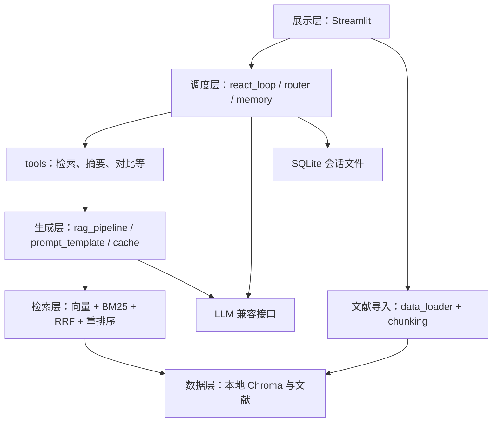

# 智能科研助理技术设计文档

本项目面向本科生课程实践，实现“上传论文 → 建立知识库 → 提问 → 检索与工具调用 → 返回带来源的回答”。参考 ai-chatbot 的代码，保持用户指定的课程目录，将已有实现映射到对应文件，避免额外服务和框架。本文统一维护技术方案、需求与验收状态。

**当前状态**：已实现 PDF、Word（.docx）及 TXT/Markdown 加载器，以及 Streamlit 批量上传、进度显示、状态追踪和失败项重试。固定、递归、句段分块、本地 Embedding 与 Chroma 操作封装已实现，上传后自动分块、批量向量化和增量索引，共 107 个测试通过。Embedding 经人工智能论文中英双语基准重新比较后保留 M3E-base；跨语言质量仍不足。Chroma/FAISS 实测后选择 Chroma，支持持久化、增量入库、Top-K、块列表和按文档删除。PDF 已补常见双栏、规则表格与续表、公式符号/上下标和原文位置保留。统一保留来源、稳定文档/块 ID 和位置；Word 使用段落/表格位置，纯文本使用行范围，不伪造物理页码。导入成功表示原文已保存、全部预期块已处理并持久化；重复块跳过，新文献无需重建旧索引，混合检索与其他业务模块仍待实现。实现依据和验证记录见 [PDF 加载器选择](QA/5.1.1%20PDF加载器选择.md)、[Word 和纯文本加载](QA/5.1.1%20Word与纯文本加载器实现.md)、[批量文档导入](QA/5.1.1%20批量文档导入与状态追踪.md)、[学术 PDF 解析优化](QA/5.1.2%20学术论文PDF解析优化.md)、[三种文本分块策略](QA/5.1.2%20三种文本分块策略.md)、[Embedding 对比和选择](QA/5.1.3%20Embedding模型对比与选择.md)、[向量数据库对比和选择](QA/5.1.3%20向量数据库对比与选择.md) 与 [批量向量化及增量索引](QA/5.1.3%20批量向量化与增量索引.md)。

## 1 设计依据与范围

- [课程实践方案](南京农业大学课程实践.docx)：五个模块、实验和交付要求。
- [项目交付模板](项目交付模板.docx)：报告章节、完成情况表与排版要求。
- [参考仓库固定版本](https://github.com/dsy1018/ai-chatbot/tree/6979d7173ed0f92910a8571dd4ca1b4a171a2c49)：提交 `6979d7173ed0f92910a8571dd4ca1b4a171a2c49`，读取日期 2026 年 9 月 28 日。

本次完整读取参考版本的 41 个文件：29 个 Python 文件（含 7 个空包初始化文件），以及配置、依赖、测试、部署和说明文档。以源码实际行为为准，不把 README 或简历介绍当作验证结果。

项目结构以用户给定模板为准，参考仓库提供实现依据。采用一个 Streamlit 进程直接调用 Python 业务模块，Chroma 和 SQLite 使用本地文件。上游 FastAPI、HTTP/SSE、请求模型已阅读，其流程与校验思路映射到模块函数和流式事件，不在本项目新增接口服务或 `app/api/` 目录。

课程明示要求全部保留，分阶段补齐。按用户 2026 年 9 月 29 日的指令，PDF 三种方案通过官方资料比较，只实现选定的 PyMuPDF，不实现 PyPDF2 和 pdfplumber，也不将资料对比冒充实测。其他分块、Embedding 和数据库选型的比较放在实验脚本与报告，不将所有候选都做成运行时插件。不加入其他备选题目、账号权限、分布式部署或额外前端框架。

### 1.1 不降低的核心要求

| 维度 | 最终必须具备的能力 | 具体落点 |
| --- | --- | --- |
| 深度融合 | Agent 为统一决策中枢，RAG 为核心知识工具，自主选择检索、计算、对比或直接回答 | `react_loop.py`、`router.py`、`tools.py` |
| 检索 | 向量 + BM25 + 手写 RRF，融合后 Top-20 候选交给 bge-reranker-base/v2 类模型精排 | `retrieval/` 四个文件 |
| 决策 | 手写 Thought → Action → Observation，语义路由、独立工具并行、超时重试、异常替代、死循环终止 | `agent/`；约 200 行为教学参考，不凑行数 |
| 记忆 | 会话隔离、Token 窗口、超阈值阶段性摘要；验证数十轮长对话 | `memory.py`；仍遵守实际模型上下文预算 |
| 可观测 | 每步轨迹、分工具 Token、检索质量/延迟、工具成功率/耗时，前端实时展示 | `logger.py` 与右侧/底部轨迹区 |
| 本地隐私 | Ollama + Qwen2.5/ChatGLM、本地 Embedding、索引和会话，准备权重后断网运行 | 不依赖云端，不静默外发私有文献 |
| 教学交付 | 小模块接口、真实实验、Bad Case 优化、手册、设计、Git 历史、Docker、演示 PPT | 固定课程目录，结果可复现 |

联网搜索是额外可选模式，默认关闭，不纳入完全离线验收。无 GPU 时可验证 CPU 推理；云端替代如需使用应另行明确，不能代替默认本地方案。

课程介绍中的“Hit@5 约 65% → 85% 以上、检索失败减少约 60%、计算路由节省约 80% Token”保留为待验证对照目标，不视为本项目结果。约 0.002 元/次本地成本、约 0.1 元/次云端成本、月约 3 元及 8GB 内存/4GB 显存均为课程给出的参考值，尚无本项目实测依据；报告记录真实耗时、功耗/成本口径和资源占用，不用示例代替测量。

### 1.2 三个研究问题与教学产出

1. 学术 PDF 中哪些 chunk_size、top_k、Embedding 配置最有效：同一数据集比较分块与三档检索。
2. Agent 路由相比固定“每题都 RAG”节省多少 Token：按问题类型记录准确率、调用轮次和总 Token。
3. 科研任务常用哪些工具组合，并行比串行减少多少延迟：用相同独立任务比较结果和耗时。

按检索 → 生成 → Agent → 集成 → 评测递进，RRF/ReAct 手写，加载与数据库使用成熟库。答辩需解释算法、接口、失败根因和成本/性能取舍；交付完整代码及环境说明、技术设计、系统评测、Bad Case、使用手册、Docker 和演示 PPT。研究意义由真实文献与实验支持，不将课程背景中的“研究空白”当作已证明结论。

## 2 固定项目结构

```text
project/
├── README.md
├── requirements.txt
├── config.yaml
├── src/
│   ├── data_loader/              模块一：文档加载
│   │   ├── pdf_loader.py
│   │   ├── docx_loader.py
│   │   └── text_loader.py
│   ├── chunking/                 模块一：文本分块
│   │   ├── fixed_chunk.py
│   │   ├── recursive_chunk.py
│   │   └── semantic_chunk.py
│   ├── retrieval/                模块一：检索层
│   │   ├── vector_store.py
│   │   ├── bm25_retriever.py
│   │   ├── hybrid_retriever.py
│   │   └── reranker.py
│   ├── generation/               模块二：生成层
│   │   ├── prompt_template.py
│   │   ├── rag_pipeline.py
│   │   ├── streaming.py
│   │   └── cache.py
│   ├── agent/                    模块三：Agent 层
│   │   ├── react_loop.py
│   │   ├── tools.py
│   │   ├── router.py
│   │   └── memory.py
│   ├── frontend/                 模块四：前端
│   │   ├── app.py
│   │   ├── pages/
│   │   └── components/
│   └── utils/                    工具函数
│       ├── logger.py
│       └── config.py
├── tests/                        测试
│   ├── test_retrieval.py
│   └── test_agent.py
├── docs/                         文档
│   ├── 技术设计文档.md
│   └── 用户使用手册.md
├── reports/                      评测报告
│   ├── 评测集.json
│   ├── 性能评测数据.xlsx
│   └── Bad_Case分析报告.md
└── docker/
    ├── Dockerfile
    └── docker-compose.yml
```

保留根目录 `AGENTS.md`、已有原始资料与报告骨架；包初始化文件按 Python 导入需要保留。文献、索引、SQLite 和日志仍使用现有 `data/`、`logs/` 运行目录。上表的业务测试与性能表在有实际实现和测量数据后编写，不创建空测试或假成绩表。`pages/`、`components/` 保留目录，界面未复杂到需要拆分前先用一个 `app.py`。

## 3 参考代码到本项目的映射

| 已完整阅读的参考文件 | 参考的实际实现 | 本项目位置与采用方式 |
| --- | --- | --- |
| `app/core/rag.py` 的 `load_document()`、Loader 映射 | PDF/Word/TXT/Markdown 按扩展名加载 | `data_loader/` 三个文件；保留分发思路，补课程 Word 表格与来源 |
| 同文件的 `split_documents()` | 递归字符切分 | `chunking/recursive_chunk.py`；另外两种策略放指定文件 |
| 同文件的向量库初始化、入库与增量添加 | Chroma 持久化与批量向量写入 | `retrieval/vector_store.py`，不增加向量库服务 |
| 同文件的分词、BM25、手写 RRF 和两种重排 | 双路召回、排名融合、模型/关键词重排序 | 分别映射 `bm25_retriever.py`、`hybrid_retriever.py`、`reranker.py` |
| `app/core/embeddings.py` | 在线/本地 Embedding 包装 | `vector_store.py` 的本地 `get_embeddings()`，比较两个模型后仅配置选定模型，不另建管理框架 |
| `app/core/llm.py`、`rag.py` 的 `build_context()` | 兼容 LLM、工具绑定、流式生成、上下文 | `generation/rag_pipeline.py`；Prompt 和流式分别放指定文件 |
| `app/core/agent.py` | 一轮 Function Calling、注册表、ToolMessage、事件生成器 | `agent/react_loop.py`、`tools.py`、`router.py`，补课程有界循环 |
| `app/core/memory.py` | 会话隔离、内存/SQLite、Token 窗口 | `agent/memory.py`；采用 SQLite，补简单摘要 |
| `app/tools/weather.py`、`search.py` | `@tool`、HTTP 超时、结果与错误文本 | `agent/tools.py`；天气只参考写法，科研工具集中实现 |
| `app/api/chat.py`、`knowledge.py`、`tools.py`、`app/models/schemas.py` | 对话/入库/工具流程、请求校验与事件响应 | 映射模块函数和少量字典；不新增 HTTP API 或 schemas 文件 |
| `app/main.py`、`core/metrics.py`、`utils/logger.py` | 生命周期、健康状态、计数、Token 估算与日志轮转 | 初始化由前端协调；统计和日志集中在 `utils/logger.py` |
| `frontend/app.py` | 侧栏、对话区、逐步渲染、会话与开关 | `src/frontend/app.py`，用模块调用替换 HTTP 客户端 |
| `config.py`、`.env.example` | 集中配置、密钥与运行参数 | `config.yaml` + `src/utils/config.py`；密钥读环境变量，不建立第二套配置 |
| `tests/conftest.py`、五份 `test_*.py`、`pytest.ini` | mock 隔离、记忆/RAG/工具/API/集成测试 | 核心检索归入 `test_retrieval.py`，工具/循环/记忆归入 `test_agent.py`；不声称上游测试已经通过 |
| 两份 Dockerfile、`docker-compose.yml`、两份忽略文件 | 容器与本地数据挂载 | `docker/` 中只运行一个 Streamlit 服务，保留数据挂载方式 |
| 两份依赖清单、7 个空初始化文件、`README.md`、`docs/architecture.md`、`RESUME.md` | 依赖约束、包组织、使用与设计介绍 | 按实际使用依赖和本项目成果整理，不照搬宣传结论 |

实现定位：[RAG 源码](https://github.com/dsy1018/ai-chatbot/blob/6979d7173ed0f92910a8571dd4ca1b4a171a2c49/app/core/rag.py)、[Agent 源码](https://github.com/dsy1018/ai-chatbot/blob/6979d7173ed0f92910a8571dd4ca1b4a171a2c49/app/core/agent.py)、[记忆源码](https://github.com/dsy1018/ai-chatbot/blob/6979d7173ed0f92910a8571dd4ca1b4a171a2c49/app/core/memory.py)、[前端源码](https://github.com/dsy1018/ai-chatbot/blob/6979d7173ed0f92910a8571dd4ca1b4a171a2c49/frontend/app.py)。

## 4 系统架构与数据流



五层是一个应用内的职责划分，不是五个服务。沿用 LangChain Document/Message 表达文本和消息，其余结果用简单字典；不要为少量字段设计通用协议或多层抽象。

### 4.1 文献导入与检索

读取文档并保留来源 → 按策略分块 → 对新块计算 Embedding → 加入本地 Chroma → 重建小规模 BM25 语料。新增文献不重算全部旧文献向量；BM25 重建沿用上游简单做法。

PDF 已实现为 `src/data_loader/pdf_loader.py` 的 `load_pdf(file_path)`：沿用参考 `load_document()` 的 Document 列表和来源字段，按用户选择将 `PyPDFLoader` 替换为 PyMuPDF。按真实字符位置读取文本，识别常见居中双栏，通栏内容作为上下区域边界；每个区域读完整左栏再读右栏。元数据保留绝对路径 `source`、`source_file`、`file_type`、文件内容 SHA-256 `doc_id`、从 0 开始的 `page`、从 1 开始的 `page_number` 和 `total_pages`。无文本页警告并跳过，保留原页码；全篇无文本和需要密码时明确报错，损坏文件的原生解析异常向上传递。

三种解析器的官方资料对比见 [PDF 加载器选择](QA/5.1.1%20PDF加载器选择.md)，不安装另外两种解析器。网格表使用 `find_tables(lines_strict)`，规则三线表按横线区域、列间留白与文字基线提取。表格独立返回 Markdown Document，正文中的对应区域保留定位标记，不重复单元格文字。跨页仅合并相邻页、页边位置和列结构一致、有原表编号与重复表头或明确续表标记的片段；去掉重复表头，保留每行来源页和各页区域。

文本层公式保留 Unicode 符号，用 `^{...}`、`_{...}` 表达可识别上下标；`formula_layout` 为原字符位置/字号的 JSON 字符串，`image_regions` 为原图区域的 JSON 字符串。复杂分式、图片公式通过原 PDF 和位置保留，不猜测完整 LaTeX，不引入 OCR 或视觉模型。复杂多级三线表无法可靠确定列时保留正文并记录警告；网格表的合并单元格保留工具识别的物理单元格，不承诺还原所有逻辑指标列。接口变化、适用范围和真实样例见 [学术 PDF 解析优化](QA/5.1.2%20学术论文PDF解析优化.md)。

Word 已实现 `load_docx(file_path)`，采用参考版本的 `python-docx==1.1.2`，顺序读取正文顶层段落和表格。每个非空段落/表格返回一个 Document，记录从 1 开始的 `block_index`、`block_type` 和 `paragraph_index` 或 `table_index`；空块跳过但不重编号。表格以制表符分隔单元格、换行分隔行，不输出物理页码，不处理旧版 .doc 或复杂嵌套内容。

纯文本已实现 `load_text(file_path)`，支持 `.txt`、`.md`、`.markdown`。原始字节按 `utf-8-sig` 解码，兼容 BOM，保留 Markdown 标记、缩进、空行和 CRLF；整篇返回一个 Document，记录 `line_start=1`、`line_end`，后续分块时再细化行位置。仅空白内容明确报错，非 UTF-8 编码异常向上传递，需转换为 UTF-8 后导入。两个加载器都保留来源和文件字节 SHA-256，详见 [Word 和纯文本加载记录](QA/5.1.1%20Word与纯文本加载器实现.md)。

批量导入已在 `src/data_loader/__init__.py` 实现：扩展名分发 → 临时文件解析 → 成功后保存到 `data/raw/<内容 SHA-256>/<原文件名>` → 修正 Document 的持久化来源。逐文件处理并产出进度，记录等待、处理中、成功、失败，以及尝试次数、耗时和错误；失败不阻断后续文件。同名不同内容分别保存，相同文件名与内容在本批去重。手动重试只处理失败项，每次点击尝试一轮，不重复加载成功项。

当前状态保存在 Streamlit 当前页面会话中，不建立后台任务队列或持久任务表。刷新或断开页面会话后状态可能清空，已成功保存的文件仍留在磁盘；状态表是本批加载结果，不是全知识库或向量化状态。详见 [批量导入实现记录](QA/5.1.1%20批量文档导入与状态追踪.md)。

三种分块已在指定文件实现 `split_fixed()`、`split_recursive()`、`split_semantic()`；统一入口 `src.chunking.split_documents()` 读取 YAML 默认值，目前实际为 `recursive`、512/64 字符。按用户明确范围，仅固定切分覆盖 256/512/1024 大小效果；递归和句段切分各使用默认 512/64 参数，上游的 500/50 仅为参考。三种策略共用来源处理，不合并不同页或 Word 正文块。

固定策略按大小减重叠的窗口步长切分。递归使用上游相同的 `RecursiveCharacterTextSplitter` 分隔符顺序，保留分隔符与空白，并修正重复段落、大重叠时的位置查找停滞。句段策略先保留完整短段落，长段落按中英文句子拆分，超长单句按字符兜底；不使用 Embedding。固定正文精确重叠，递归与句段只在切分单元边界重叠，实际重叠可能小于目标或为零。

块继承来源并增加稳定 `chunk_id`、父内容单元内的字符区间 `[start_index, end_index)`、从 0 开始的 `chunk_index` 和策略参数；TXT/Markdown 细化行范围，保留 PDF 公式/图片原位置。已独立识别的 PDF/Word 表格整块保留，标记 `chunk_preserved=table`，可能超出大小上限。普通正文严格限长；Markdown 表格或回退为正文的复杂表格不在独立表格保护范围。固定窗口可能截断公式文本，原 PDF 和公式位置仍用于回看，不声称每块完整还原公式。算法与边界见 [三种分块记录](QA/5.1.2%20三种文本分块策略.md)。

同一公开论文的五组分块统计（固定三档、递归与句段各一组默认参数）已写入 [实验报告](../reports/分块策略对比实验报告.md)。五组策略的检索对比尚未完成，召回、Hit@5/MRR 和最终最优策略仍待实测，后续比较沿用这五组设置。

向量和 BM25 候选经手写 RRF 融合，再重排序。块保留稳定 `doc_id`、`chunk_id`、文件名、页码或段落位置，融合按块标识而非只按正文去重。删除/同名重传同步源文件、向量、BM25 和缓存。

两路取足够候选，RRF 合并后截取 Top-20 送入模型重排，再保留最终 Top-K。上游两路各 5 项仅为参考默认，不能用最多 10 项冒充 Top-20 实验。Embedding 已基于 3 篇中文、3 篇英文人工智能论文比较 bge-large-zh-v1.5 与 m3e-base，保留 M3E；宏平均 Hit@5 为 34.38% 对 31.25%，文档编码约快 3.14 倍，英文及跨语言检索质量仍不足。Chroma/FAISS 存储选型已完成：FAISS 更快、更省磁盘；Chroma 在 `search_ef=100` 下达到精确检索 Top-5 的 100% 一致率，P95 中位数 1.205 毫秒，选择集成正文/来源管理的 Chroma，运行时只维护一种存储。该一致率不等于问题质量达标，详见 [向量数据库 QA](QA/5.1.3%20向量数据库对比与选择.md)。最终核心版本启用真实模型重排，关键词方案仅用于基线或明确标注的降级。

本地 `get_embeddings()` 沿用上游 `HuggingFaceEmbeddings`，按需加载并缓存唯一 M3E，输出 768 维归一化向量，不自动下载或转云端。固定版本、CPU 与批大小 32 来自 YAML；完整结果和范围见 [Embedding QA](QA/5.1.3%20Embedding模型对比与选择.md)。`VectorStore` 按稳定块 ID 查重，批量编码新块后持久化，支持 Top-K、正文/来源读取和按文档删除；旧块不重算。`batch_build_index()` 已接入上传页面，逐文件复用加载/保存与默认分块，每 500 块写入并刷新索引状态。索引失败保留原文、加载结果和已写入块，重试只补缺失块，全部成功后才标记 `indexed=True`。模型版本或索引参数不一致时要求新目录重建。原始文件、BM25 与缓存的同步删除属于后续集成。

### 4.2 生成与引用

`rag_pipeline.py` 协调检索、上下文和参考 LLM 封装，不为模型调用新建服务。参考 `build_context()` 的 `context`、`sources`、`chunk_count`；来源补文件名与位置。Prompt 按相关性拼接并限制长度，答案正文引用编号，前端展示对应依据。

`streaming.py` 消费生成器，沿用 `tool_call`、`tool_result`、`token`、`done`、`error` 事件语义，用 Streamlit 占位区逐步刷新；不使用 HTTP/SSE。错误后终止，不再标为成功。

空结果明确提示知识库没有相关文献并区分纯模型回答；低相关性展示候选依据；模型失败给出错误与重试建议。语义缓存放 `cache.py`，用内存列表存问题向量、答案和来源，按相似度匹配，文献变更清空，不增加缓存数据库。

流式正文在引用位置输出编号，来源位置可用时同步展示，不全部拖到结束才显示引用。日志完整记录问题、Top-K 文档、答案、耗时、Token 与 Top-1 相关性分数；记录分数分布，不将 RRF 分数直接解释为概率。

### 4.3 手写循环与工具

上游 `AgentManager.run()` 只有一轮工具选择，不能直接计为课程 ReAct 完成。`react_loop.py` 参考其 `bind_tools()`、执行与 `ToolMessage`，手写“决策 → 工具执行 → 观察 → 继续或结束”有限循环，Function Calling 用于结构化 Action，不调用高层 Agent 执行器。

使用 `config.yaml` 的迭代上限（现有样例为 8），设置完成条件、超时和明确错误；失败最多重试一次。`router.py` 只对模型同轮提出且互不依赖的调用做简单并行，不建立调度图。前端显示工具名、参数、结果、耗时和必要决策说明，不要求模型披露私有思维过程。

Thought 保存简短的本步计划，Action 保存工具与参数，Observation 保存结果/错误及下一步状态。明确算式快速路由计算器，论文比较调用对比工具与 RAG，一般概念可由本地模型直接回答。超时重试或跳过，异常后在注册表选择可用替代工具，重复无效操作或达到上限时强制结束并提示。

`tools.py` 用 `@tool` 和列表/字典注册，八个本地工具复用现有模块，联网搜索为第九个可选工具，默认关闭。此选择补足“8 个可调用”与“搜索可选”的原文差异，不增加业务子系统，详见第 10 节。

| 本地工具 | 输入与真实输出 |
| --- | --- |
| 知识库检索 | 问题 → 带来源的检索/RAG 结果 |
| 论文元信息 | 论文 ID → 标题、作者、年份、摘要、DOI；缺项如实提示 |
| 论文对比 | 两篇 ID → 方法、数据集、实验结果及原文依据 |
| 关键词提取 | 问题或文献 → 核心关键词 |
| 摘要生成 | 论文 ID → 背景、方法、结果、结论 |
| 当前时间 | 无输入 → 本机当前时间 |
| 计算器 | 简单算式 → 计算结果 |
| 文献列表 | 无输入 → 入库论文 ID、文件名与索引状态，复用文献管理 |

摘要与对比复用已有生成/检索函数。八个工具须断网时真实可调用；禁用搜索不计入这八个。

参考基线的直接 RAG 流程可先用于联调；课程融合时 Agent 通过检索工具调用同一流水线，避免提前检索和工具检索重复执行。关闭 Agent 时仍支持直接 RAG。

### 4.4 会话、页面与健康状态

`memory.py` 参考 SQLite、会话 ID 和 Token 窗口，保存用户消息与最终回答；轮次或 Token 达到阈值后，自动将旧历史压缩成阶段性摘要并保留最近对话，不扩展复杂执行图存储。工具中间消息只用于当前执行与日志。

`frontend/app.py` 保持侧栏文献/会话/开关、主区对话、折叠区工具过程。批量导入依次处理并显示进度，失败可重试；切换/清空会话同时操作真实历史，不只清空界面列表。页面较复杂后才使用已有 `pages/`、`components/`。

右侧或底部按循环步骤和工具子项展示简单轨迹树，包含 Thought、Action、Observation，不引入额外可视化框架。低相关性结果提示用户并展示依据供确认；引用、工具成功率和耗时随实际事件更新。

健康检查是内部 Python 函数接口，检查模型服务和本地索引的实际可用性，并在侧栏展示，不新增 HTTP 端点。日志记录问题、来源、答案、检索/工具/总耗时、模型调用与 Token；估算值标明“估算”。返回块数不是 Hit@5，质量指标只由标注评测计算。

## 5 模块接口与配置

### 5.1 最小函数约定

以下是实现时的接口起点；`load_pdf()`、`load_docx()`、`load_text()` 均已实现为 `file_path: str | Path -> list[Document]`，`load_document()` 分发格式。`create_import_tasks()` 将文件名/字节列表转为任务字典；`batch_import()` 更新任务并产出 `completed/total` 进度。分块的三个直接函数均接收 `documents, chunk_size, chunk_overlap=0`，统一入口 `split_documents()` 从 YAML 补齐未指定参数。`get_embeddings()` 首次调用才加载本地模型，返回 LangChain 兼容的 `embed_documents(texts)` 与 `embed_query(text)` 接口；后续调用复用同一模型。`VectorStore.add_chunks()` 返回新增块数，`search(query, k=None, doc_id=None)` 返回 `list[tuple[Document, float]]`，分数为余弦相似度；`count()`、`list_chunks()`、`delete_document()` 提供管理操作。加载、分块、Embedding、Chroma 和配置读取已实现，其余接口待实现。优先用普通参数和字典，实际命名在编码时核验。

| 文件 | 输入 | 输出或职责 |
| --- | --- | --- |
| `data_loader/*.py` | 文件路径 | Document 列表及来源位置 |
| `data_loader/__init__.py` | 文件名/字节列表、任务列表、保存目录 | 格式分发、批量加载与保存、状态和进度、失败项重试 |
| `chunking/*.py`、`chunking/__init__.py` | Document 列表、大小/重叠、统一入口的策略名 | 三种切分，文档块与来源/区间/稳定 ID；默认参数来自 YAML |
| `retrieval/vector_store.py` | 本地模型配置、任务列表/保存目录、Document 块或查询 | M3E/Chroma 操作及 `batch_build_index()` 加载→分块→批量增量入库，更新任务并产出文件进度 |
| `bm25_retriever.py`、`hybrid_retriever.py`、`reranker.py` | 问题与候选 | 关键词排序、RRF 融合与精排 |
| `generation/rag_pipeline.py` | 问题与历史 | 生成事件；来源、完整答案和统计 |
| `agent/react_loop.py`、`tools.py`、`router.py` | 问题、历史、工具描述 | 决策/调用/结果/答案事件 |
| `agent/memory.py` | 会话 ID 与消息 | 会话历史、窗口裁剪、摘要和 SQLite 保存 |
| `utils/config.py`、`logger.py` | 配置/环境变量、请求事件 | 读取设置、记录日志和简单统计 |

### 5.2 唯一运行配置

保留根目录 `config.yaml`，由 `src/utils/config.py` 读取，路径相对项目根目录。密钥通过环境变量读取，不新增根目录 `config.py` 或 `.env` 配置体系。

| 当前配置组 | 本项目用途 | 参考关系与注意事项 |
| --- | --- | --- |
| `app` | 页面名称、描述 | 当前导入页面已读取 |
| `importing` | 单份上传文件大小限制 | 当前前端和批量导入均使用，20 MB 起点参考上游上传接口 |
| `llm` | 本地服务、模型、Temperature | 适配上游兼容接口调用；服务地址须使用实际兼容端点 |
| `embedding` | 选定 M3E、固定版本、本地路径、设备与批大小 | 本地加载接口已读取；两个候选仅在实验脚本比较，运行时加载唯一模型，M3E 不加查询前缀 |
| `retrieval` | 已用 Chroma/集合名/search_ef/索引线程/Top-K；候选数和 Reranker 预留 | 默认 search_ef=100；BM25+RRF/重排待实现；Hit@5 实际取得前 5 个候选 |
| `chunking` | 策略、字符大小和重叠 | Python 统一入口已读取，默认 recursive、512/64；上游 500/50 仅供参考 |
| `agent` | 迭代上限、联网开关 | 课程补充项，不声称来自上游现成配置 |
| `paths` | 文献、索引和日志 | 保留现有 `data/raw`、`data/index`、`logs`；SQLite 路径实现时补入 |

当前页面已启用 `app`、`importing` 和 `paths.raw_documents`，Python 分块入口已启用 `chunking`，本地向量化入口已启用 `embedding`，Chroma 已读取 `retrieval` 的存储/集合/搜索参数与 `paths.vector_index`，由 `src/utils/config.py` 按文件位置定位配置；其他字段尚未接入业务。Embedding 的版本号用于权重准备与实验溯源，模型推理只读 `local_path`，`local_files_only=True`；模型失败不转云端。BM25 召回数、RRF 常数、Token 窗口、SQLite 路径等必要参数在实现对应功能时加入，先参考上游的 5、60、2000 等实验起点，不预建大量配置项。

依赖参考上游固定版本和真实使用范围：LangChain 基础组件、Chroma、文档库、BM25、模型库、Streamlit 等；不为仅参考 API 写法而安装 FastAPI/SSE/pydantic-settings。当前声明 Streamlit、PyYAML、PyMuPDF 1.28.2、langchain-core 0.3.29、python-docx 1.1.2，后两项沿用参考版本。递归分块新增 `langchain-text-splitters==0.3.5`，满足上游 LangChain 0.3.14 的分块库版本范围，并兼容现有 core 0.3.29；上游没有直接固定该包，不将本次选择描述为上游精确锁定版本。Embedding 沿用上游的 langchain-huggingface 0.1.2、sentence-transformers 3.3.1、transformers 4.46.3、tokenizers 0.20.3、huggingface-hub 0.26.5，另固定兼容的 torch 2.5.1；当前 macOS 的 SciPy 1.15.3 导入失败，改用验证可导入的 1.14.1。TXT/Markdown 只使用标准库读取，不安装 docx2txt、Markdown 渲染库或 unstructured。依赖兼容性检查已通过，仍不等于完整系统依赖。

Chroma 沿用上游 `langchain-chroma==0.1.4`，固定兼容的 `chromadb==0.5.23`、`numpy==1.26.4` 和 `posthog==3.25.0`；关闭遥测。FAISS 1.9.0.post1 仅为实验额外依赖，不加入业务 requirements。Chroma 传递安装 FastAPI 等库，但本项目不启动额外服务。

当前项目 `.venv` 使用 Python 3.10.10，由本机 pyenv 的该版本创建；根目录 `.python-version` 同步指定 3.10.10。直接依赖保持 `requirements.txt` 的固定版本，间接依赖由 pip 按 Python 3.10 兼容条件解析，不复制旧 Python 3.12 环境中的安装目录。

默认沿用现有本地推理方向。完整离线能力在模型权重已准备后实测；本地 Embedding 失败应明确报错，不照搬自动切换在线却仍声称离线。生成参数 top-k 是否支持以实际模型接口为准，不与检索 top-k 混淆。

## 6 分阶段实施与验证

| 阶段 | 工作 | 完成判据 |
| --- | --- | --- |
| A 基础闭环 | 加载、递归分块、Chroma、生成与单页界面 | 公开样本可导入、检索并得到带来源回答 |
| B 课程检索/生成 | 三种分块、模型实验、BM25/RRF/Reranker、流式、缓存与降级 | 原文可核查，三档检索和参数对比有真实记录 |
| C Agent/记忆 | 手写循环、科研工具、路由、并行、恢复、SQLite、摘要 | 工具可调用，错误可处理、循环可终止、会话隔离 |
| D 集成/交付 | 文献/会话管理、日志、健康、评测、报告、Docker | 完整演示、50+ 评测、至少一轮 Bad Case 优化、部署实测 |

先完成闭环再补课程缺项。只有联网搜索和“如适用”的多用户并发按原文可选；Reranker 等明示要求可后实现，不因上游默认关闭而删除。

参考 mock 和测试分层，用临时目录隔离索引/SQLite，导入前隔离外部依赖；检索测试集中在 `test_retrieval.py`，循环/工具/记忆集中在 `test_agent.py`，不追求上游测试数量。修复实际问题先复现，再验证。

评测用 10–20 篇同方向论文、至少 50 条四类问题，标注答案与来源；记录 Hit@5/MRR/Recall、工具准确率、平均轮次、延迟/Token、人工质量。用脚本输出数据和图表，不搭评测平台；取得真实结果后生成 `性能评测数据.xlsx`。

Docker 沿用参考的构建与本地文件挂载思路，`docker/docker-compose.yml` 只编排一个 Streamlit 服务，不移出 `docker/`。完整业务部署完成后再记录实测；当前 Compose 缺失的环境限制仍保留在使用手册。

## 7 参考实现中需要针对性补充的地方

以下为静态阅读结论，本轮未运行参考项目，不据此宣称测试失败或本项目已修复。

| 参考位置 | 实际情况 | 本项目必要处理 |
| --- | --- | --- |
| `agent.py`、`api/chat.py` | 一轮工具决策，RAG 在 Agent 前执行 | 在既定 Agent 文件补循环和检索工具，避免重复检索 |
| `rag.py` | Word 用 docx2txt，来源仅文件名，按正文融合去重 | 按指定 loader/检索文件补表格、位置与稳定块标识 |
| `api/knowledge.py` | 单文献删除只删源文件，保留索引 | 前端管理同步源文件、索引、BM25 和缓存 |
| `frontend/app.py` | 没有历史切换/文献列表，清空只改前端 | 调用现有模块操作真正历史与文献状态 |
| `main.py`、`metrics.py` | 状态未检查模型连通，返回块数不是质量指标 | 内部健康函数实测；质量用标注集计算 |
| `llm.py`、`memory.py` | 异常可作为文本输出，无摘要，清理是关闭时或显式执行 | 统一错误事件、补简单摘要，不宣称已有定时清理 |
| `tests/conftest.py`、`test_memory.py`、`test_rag.py` | 部分导入有全局初始化；测试访问不存在的 `memory._sessions`；hybrid 不使用传入 top-k | 适配实际隔离与断言，不直接声称 70 个测试通过 |

只处理与课程验收相关的问题，不借此重写框架。参考版本固定，后续变更应写明参考函数、本项目映射和必要差异。

## 8 课程需求与验收

保留原清单所有 M1–M5 编号、需求与验收方式。状态只描述本项目，参考代码不计为本项目完成；每项完成后补代码位置、验证结果与实验记录。

### 8.1 模块一 文档处理与检索层

| 编号 | 课程要求 | 验收方式 | 状态 |
| --- | --- | --- | --- |
| M1-01 | PDF、Word、TXT/Markdown 加载；批量导入、进度和失败重试 | 各格式真实样本文档，检查正文、表格、来源与导入状态 | 已实现：多格式加载、批量保存与进度、状态和失败项手动重试均通过验证，见 QA 记录；索引构建属于 M1-05 |
| M1-02 | 比较 PyPDF2、pdfplumber、PyMuPDF；处理双栏、跨页表格和公式 | 同一论文的解析对比，记录损失、性能和限制 | 已实现常见场景：双栏排序、规则表格与续页、公式文本及原文定位，专项测试和限制见 QA；按用户范围仅做三库官方资料比较，未做三库同机实验 |
| M1-03 | 至少三种分块：固定、递归、语义；仅固定大小比较 256/512/1024，递归/语义使用默认参数 | 同一文献和评测问题，比较五组设置的召回，提交分块实验报告 | 部分实现：三种策略与 21 个测试已完成，同一论文五组分块统计已记录；召回对比待检索层和评测问题接入 |
| M1-04 | 比较 bge-large-zh、m3e-base；Chroma 与 FAISS 选型 | 记录效果、速度、资源占用和选型理由 | 已实现：Embedding 双语基准保留 M3E；Chroma/FAISS 三轮实测与参数复测后选择 Chroma，效果、计时、磁盘与限制见 QA |
| M1-05 | 批量向量化、持久化索引、增量更新、Top-K 检索 | 重启可检索；新增文档无需全量重建 | 已实现：Python 与上传页面接通批量索引；新文献只编码新块、重复导入/部分失败恢复不重算旧向量，重开检索已验证，见批量索引 QA |
| M1-06 | BM25 + 向量检索；手写 RRF；接入 Reranker | 核验融合与重排；三档对比 Hit@5、MRR | 未实现 |

### 8.2 模块二 RAG 生成层

| 编号 | 课程要求 | 验收方式 | 状态 |
| --- | --- | --- | --- |
| M2-01 | 专用 Prompt；按相关性拼接与动态截断；比较生成参数 | 保存 Prompt 版本、Temperature/Top-p/Top-k 和实验结果 | 未实现 |
| M2-02 | 引用文档名和页码，回答可追溯 | 用真实原文逐项核验引用；无物理页码格式记录段落位置 | 未实现 |
| M2-03 | 流式答案与动态引用标记 | 界面可逐步输出，引用指向实际来源 | 未实现 |
| M2-04 | 基于 Embedding 相似度的语义缓存 | 比较重复、近似问题的命中和响应耗时 | 未实现 |
| M2-05 | 无结果、低相关性、模型调用失败三类降级 | 空库有明确提示；低相关性可查看来源；失败可重试 | 未实现 |
| M2-06 | 记录问题、Top-K 文档、答案、耗时、Token 和 Top-1 分数 | 实际请求的日志字段完整，统计基于真实数据 | 未实现 |

### 8.3 模块三 Agent 决策层

| 编号 | 课程要求 | 验收方式 | 状态 |
| --- | --- | --- | --- |
| M3-01 | 手写 ReAct 核心循环与 System Prompt | 有工具选择、执行和返回记录；任务完成或达到迭代上限时终止 | 未实现 |
| M3-02 | 开发并注册工具集；目标 8 个可调用工具 | 每个工具有输入、输出、真实调用记录；数量差异见下文 | 未实现 |
| M3-03 | 工具选择路由与独立工具并行执行 | 验证检索、对比、计算等问题的路由；比较并行耗时 | 未实现 |
| M3-04 | 超时重试/跳过、异常恢复、死循环强制终止 | 构造对应失败，核验有界恢复和用户提示 | 未实现 |
| M3-05 | 会话隔离、Token 滑动窗口、阶段性摘要 | 两个会话互不干扰；长历史可截断与压缩 | 未实现 |

### 8.4 模块四 系统集成与前端

| 编号 | 课程要求 | 验收方式 | 状态 |
| --- | --- | --- | --- |
| M4-01 | RAG 工具接入 Agent，接入记忆，统一 Message/Context 数据结构 | 上传到问答全链路使用真实数据，跨模块来源不丢失 | 未实现 |
| M4-02 | 统计 Token、检索指标/延迟、工具成功率/耗时；展示决策轨迹 | 记录可核查的工具决策与执行结果，不要求披露模型私有思维过程 | 未实现 |
| M4-03 | 健康检查模型服务与向量数据库 | 分别模拟服务可用与不可用，返回真实状态 | 未实现 |
| M4-04 | 上传、进度、文档列表/删除、向量化状态 | 批量文档操作和索引状态保持一致 | 部分实现：上传、加载/分块/索引阶段、批次进度与新增块数已接入；全知识库列表/删除面板待实现 |
| M4-05 | 流式对话、Markdown、引用、会话新建/切换/删除 | 实际会话操作、引用跳转和输出可演示 | 未实现 |
| M4-06 | 端到端联调；空库、大文档、长对话；并发如适用 | 保存测试记录；交付 3–5 张真实界面截图 | 未实现 |

当前 `src/frontend/app.py` 已接入批量文档导入、自动增量索引与失败项重试，问答、会话、全知识库管理和监控仍待接入，不计为完整业务界面完成。

### 8.5 模块五 评测与交付

| 编号 | 课程要求 | 验收方式 | 状态 |
| --- | --- | --- | --- |
| M5-01 | 选定研究方向，收集 10–20 篇论文 | 保存论文清单、版本和可定位的原文 | 未实现 |
| M5-02 | 至少 50 条问答，覆盖事实、对比、归纳、推理四类 | 每题有参考答案与依据；统计总量及四类覆盖 | 未实现 |
| M5-03 | Hit@5、MRR、Recall、工具调用准确率、平均轮次、延迟和 Token | 同一评测集跑配置对比，保留原始结果和图表 | 未实现 |
| M5-04 | 正确性、完整性、引用准确性人工评分 | 统一评分标准，逐题记录评分和理由 | 未实现 |
| M5-05 | 检索/生成/引用/Agent 四类 Bad Case；至少一轮优化 | 保存失败证据、根因、改动及优化前后对比 | 未实现 |
| M5-06 | 完整代码、环境说明、Git 历史、Docker 部署 | 在干净环境复现；检查实际运行记录 | 部分实现：已有骨架 |
| M5-07 | 评测报告、技术设计、用户手册、演示 PPT | 检查完整文档、真实截图/图表、演示与踩坑/优化记录 | 部分实现：已有 Markdown 骨架 |

## 9 交付模板约束

- 保留课程考核表与报告封面：学院、课程、学分、考核方式、题目、四位成员的班级/学号/姓名。个人信息与成绩不代填。
- 原模板为 2026–2027 学年第 1 学期，表中时间为 2026 年 12 月 30 日；该日期为模板字段，是否为实际截止日期待课程安排确认。
- 项目背景不超过 200 字。
- 团队分工包括角色、成员、职责、模块、贡献比例；四人的实际贡献比例合计 100%。
- 每个模块各有一张完成情况表，区分已实现、未实现、部分实现。
- 报告包括项目概述、团队分工、模块交付清单、技术实现记录、技术设计、总结展望、附录。
- 附录包含真实代码目录和可复现的环境配置步骤。
- 最终 Word 格式按原模板：目录黑体二号加粗；一级标题黑体三号加粗；正文按仿宋四号、1.5 倍行距处理。Markdown 骨架不能替代最终排版检查。

## 10 原文差异与处理

1. **工具数量**：模块三产出要求 8 个工具，具体工具清单只列知识库检索、论文元信息、论文对比、关键词提取、摘要生成、当前时间、联网搜索，共 7 类；联网搜索被标为可选。背景中另有计算器示例。本设计用原文六个必需工具，加背景中的计算器，再将已有文献管理的列表函数封装为第八个本地工具；联网搜索另作第九个可选工具，默认关闭。文献列表只复用现有功能，不增加业务子系统。该补足为本项目设计选择，不能误写为原文已列出的清单；八个本地工具均须实际可调用。
2. **引用精度**：交付模板写文档名，课程正文要求文档名和页码。按正文保留更完整的来源；Word/TXT 等没有可靠物理页码时使用段落或行位置，不伪造页码。
3. **模板示例状态**：原表格中的“已实现/未实现/部分实现”是填写示例，不是本项目现状。此清单按当前代码重新标注。
4. **模型下载示例**：模板的 `ollama pull bge-large-zh` 不直接作为执行依据；当前配置使用 BAAI 的 Embedding 模型标识，后续由实际选定的加载器接入并验证。
5. **报告编号**：模板的“技术实现记录”未显式带一级序号；报告骨架整理为第四章，保持后续第五到第七章内容。
6. **PDF 比较范围**：用户明确指定选择 PyMuPDF、另外两种无需实现。保留课程原始要求与编号，实际以三库官方资料对比完成选型，不新增另外两套加载器，也不声称完成三库同论文性能实验。

## 11 阶段验收与更新

先验证文档与来源，再比较分块及检索；随后接入生成与 Agent；最后联调前端并进行评测。每完成一项，都在本清单写入真实证据，避免只依据文件存在判断功能完成。

### 11.1 PDF 加载器实现记录（2026 年 9 月 29 日）

- 代码：`src/data_loader/pdf_loader.py`；测试：`tests/test_retrieval.py`。
- 参考：固定提交 `app/core/rag.py` 的 `load_document()` 和 Document 来源字段；上游 `tests/test_rag.py` 已核对，没有直接覆盖实际 PDF 加载的用例。本项目补实际生成 PDF 的解析测试，不启动上游全局 RAG/向量库。
- 验证：`.venv/bin/python -m unittest discover -s tests -p 'test_retrieval.py' -v`，11 个测试通过；`.venv/bin/python -m pip check` 通过。
- 测试入口修复：已复现从 `src/` 直接运行测试文件时的 `ModuleNotFoundError: No module named 'src'`；入口按文件位置加入项目根目录。使用用户的 Python 3.10.10 复跑原命令，11 个测试通过；项目虚拟环境的测试发现方式仍通过。
- 选型依据、接口边界和公开论文验证见 [5.1.1 PDF 加载器选择](QA/5.1.1%20PDF加载器选择.md)。本次只交付 PDF 加载，前端导入、OCR、其他格式和复杂排版优化未实现。

### 11.2 Word 与纯文本加载实现记录（2026 年 9 月 29 日）

- 代码：`src/data_loader/docx_loader.py`、`text_loader.py`；参考上游 `load_document()` 的 Document 和来源字段，按课程要求用 python-docx 替代 docx2txt，纯文本不走 Markdown 渲染。
- 验证：新增 Word 8 个、纯文本 8 个测试，连同 PDF 共 27 个通过；测试发现和从 `src/` 直接运行测试文件均通过。项目 `.venv` 已安装新依赖，`pip check` 通过。
- Python 3.10 兼容性：在临时虚拟环境补入 python-docx 后，从 `src/` 直接运行全部 27 个测试通过；没有修改用户 pyenv 全局环境。
- 真实样本：课程实践 Word 加载出 240 个非空块（237 段落、3 表格），项目交付模板加载出 136 个非空块（135 段落、1 表格）；来源和共享文档 ID 正确，原件未修改。
- 实现边界、使用方法和具体证据见 [Word 与纯文本加载器实现](QA/5.1.1%20Word与纯文本加载器实现.md)。该阶段 M1-01 为部分实现，批量导入、前端上传和状态追踪由下一阶段完成。

### 11.3 批量导入与状态追踪实现记录（2026 年 9 月 29 日）

- 代码：`src/data_loader/__init__.py`、`src/frontend/app.py`、`src/utils/config.py`，运行参数放入 `config.yaml`，保持指定目录结构。
- 参考：核对固定提交 `app/api/knowledge.py` 的上传校验与保存流程、`app/core/rag.py` 的格式分发、`frontend/app.py` 和 `tests/test_api.py` 的上传行为。上游为单文件上传，本项目补顺序批处理、进度和失败项重试，不引入 HTTP 服务。
- 验证：新增批量导入 12 个测试、Streamlit AppTest 2 个测试，连同原加载器共 41 个通过；测试操作真实上传组件、状态表、按钮与进度条，使用临时目录隔离文献，模拟临时加载失败以验证恢复。
- 补充检查：从 `src/` 使用项目 `.venv` 直接运行测试文件，41 个通过；`pip check`、`git diff --check` 与本地文档链接检查通过，30 项课程验收条目保持完整。
- 边界：只保存原始文件、加载正文，不构建索引；状态仅保留当前页面会话。每次手动重试对失败项尝试一轮，成功项不重复加载，100% 进度表示本轮处理结束，不表示全部成功。
- 操作、接口与验证细节见 [批量文档导入与状态追踪](QA/5.1.1%20批量文档导入与状态追踪.md)。M1-01 已实现，M4-04 部分实现。

### 11.4 项目虚拟环境切换记录（2026 年 9 月 29 日）

- 按用户要求用 `/Users/rean/.pyenv/versions/3.10.10/bin/python` 重建项目 `.venv`，`python --version` 为 `Python 3.10.10`，基础解释器和项目环境路径均核验正确；全局 pyenv 环境未安装或修改依赖。
- 按 `requirements.txt` 安装五项固定直接依赖，版本不变；pip 自动选取 Python 3.10 兼容的间接依赖，包括 NumPy 2.2.6、pandas 2.3.3。
- 根目录新增 `.python-version` 指定 3.10.10；README 和用户手册的创建命令改用 `python3.10`。
- 首次测试复现 AppTest 默认 3 秒初始化超时，将测试等待上限设为 10 秒；业务代码未改动。
- 验证：激活环境后的 Python、pip 和 Streamlit 均指向项目环境，`pip check` 通过；文档加载、批量导入和界面共 41 个测试通过。

### 11.5 学术 PDF 解析优化记录（2026 年 9 月 29 日）

- 代码只扩展 `src/data_loader/pdf_loader.py`，批量导入沿用原分发；不增加依赖或改变指定项目结构。参考版本只有普通加载与分块，本次版面处理属于课程补充。
- 双栏根据文本行位置、中央留白和纵向重叠识别，通栏分段；表格采用 PyMuPDF 网格识别与规则三线表位置提取，续表合并保留逐行页码。公式保留符号、上下标和原位置，图像公式可按保存后的 PDF 来源裁剪查看。
- 验证：新增 17 个真实绘制样例测试，全部 58 个测试通过；覆盖两页/三页、中文/英文续表、防误合并、密集公式行、复杂表头回退和保存后图像定位。
- 补充检查：从 `src/` 直接运行测试文件仍通过全部 58 个测试；`pip check`、差异空白检查、本地文档链接与 30 项课程验收条目完整性检查通过。
- 公开样本：复用《Attention Is All You Need》既有 PDF，返回 15 个正文页与 3 个物理表格单元（第 6、9、10 页）；渲染检查后核对第 6 页表 1 的四列、五行及首条数据。第 8 页多级表头回退正文，数值仍保留；第 9/10 页分组单元格不等于所有逻辑实验行均已拆开。
- 来源、字段、算法条件和限制见 [学术论文 PDF 解析优化](QA/5.1.2%20学术论文PDF解析优化.md)。不将样例通过率描述为所有论文解析准确率，不新增三库性能或检索效果结论。

### 11.6 三种分块策略实现记录（2026 年 9 月 29 日）

- 代码保持 `src/chunking/` 指定的三个策略文件；包入口共用参数校验、表格保护与块来源处理，不新增框架或模型。前端仅更新开发状态文字，导入流程尚未自动分块。
- 参考固定提交 `app/core/rag.py` 的初始化和 `split_documents()`、`tests/test_rag.py` 的短/长文档及来源测试；递归沿用分隔符，固定和句段策略为课程补充。
- 测试先复现 LangChain 重复段落、大重叠时位置停滞，位置查找增加至少向前一字符的限制后，区间与覆盖验证通过。新增 21 个分块测试，全部 79 个通过。
- 新增 `langchain-text-splitters==0.3.5`，项目环境保持 Python 3.10.10 与原有直接依赖版本；`pip check` 通过。
- 补充检查：从 `src/` 直接执行测试文件，79 个测试通过；差异空白和 40 个本地文档链接检查通过，30 项课程验收条目保持完整。
- 复用上轮公开论文的 18 个内容单元（15 正文页、3 表格），初次统计覆盖九组；按用户随后明确的范围，重新以固定三档大小、递归与句段各一组默认参数统计，当前报告保留这五组结果。表格最大长度 860 字符，作为保护例外单列；普通正文均不超限。结果与复现方法见 [分块实验报告](../reports/分块策略对比实验报告.md)。尚未比较检索召回或评选最优策略。

### 11.7 Embedding 中文网页初步对比与本地接入记录（2026 年 9 月 29 日）

- 已核对上游 `app/core/embeddings.py`、RAG 向量库接入和测试夹具。只在指定 `vector_store.py` 中增加按需缓存的 `get_embeddings()`，沿用 `HuggingFaceEmbeddings` 的文档/查询接口，不新增管理框架或在线回退。
- 在 M4、16 GiB、Python 3.10.10 环境，两个模型均用 CPU/FP32、4 线程、批次 32、最大 512 Token 编码。同一固定随机种子的公开中文检索子集含 50 个问题、767 个候选，效果与速度重复三轮；保留样本 SHA、版本、逐题排名和计时。
- 两者 Hit@5 均 100%；BGE 的 MRR@10 为 0.984，M3E 为 0.965。按预先说明的质量接近条件，选择文档编码约快 3.28 倍的 M3E，业务仅加载该模型，返回 768 维归一化向量。查询/文档不需要前缀；模型名、版本、本地目录、CPU 与批大小统一放入 YAML。
- 新依赖参考上游版本；固定 torch 2.5.1。当前 macOS 导入 SciPy 1.15.3 时失败，替换为实际验证成功的 1.14.1；其他既有直接依赖未升级。权重与原始数据仅存本地忽略目录，不提交。
- 新增本地接口 3 个、评测公式 1 个测试，全部 83 个测试通过，`pip check` 通过。选定模型在 `HF_HUB_OFFLINE=1` 下的真实文档/查询编码、有限值、归一化与实例复用检查通过。
- BGE 首次相似度矩阵计算出现 NumPy 数值警告，改用显式点积并另存单轮重编码复核。两模型全量向量/相似度均有限，归一化误差受控，50 题指标与 Top-10 顺序均与原结果一致；原三轮计时未改写。
- 补充验证：从 `src/` 直接运行测试文件，83 个测试通过；本地文档链接、原始计时/排名、数值复核和差异空白检查通过，30 项课程验收条目保持完整。权重与原始样本已核验处于 Git 忽略范围。
- 原始数据、数值检查、使用方式与边界见 [Embedding QA](QA/5.1.3%20Embedding模型对比与选择.md) 和 [原始实验结果](../reports/Embedding对比结果.json)。本实验不是完整论文评测，也未完成向量库选型、持久化/增量索引或页面向量化接入；M1-04 保持部分实现。

### 11.8 人工智能论文中英双语 Embedding 重新对比（2026 年 9 月 29 日）

- 按用户补充的中英文需求，采用 3 篇中文、3 篇英文人工智能论文原文，使用已有 PDF 加载器与默认递归 512/64 字符切分；全部 821 块作为混合候选库，不按问题预筛选来源或语言。论文版本、哈希和相关段落定位保存在 [双语评测集](../reports/Embedding论文双语评测集.json)。
- Codex 根据原文编写 48 个意图的中英文问题，共 96 条查询，尚未经人工复核；问题与标注在模型编码前锁定。中文→中文、英文→英文、中文→英文、英文→中文各 24 题，按组等权汇总。
- 两模型仍使用固定权重、CPU/FP32、4 线程、批次 32、最大 512 Token，编码三轮计时，以第三轮向量计算质量。M3E/BGE 的四组 Hit@5 依次为 58.33%/62.50%、54.17%/41.67%、20.83%/12.50%、4.17%/8.33%；宏平均为 34.38%/31.25%。完整库编码中位数为 54.439/170.747 秒，M3E 约快 3.14 倍。
- 按编码前记录的宏平均 Hit@5 优先规则，保留唯一业务模型 M3E；中文同语言与最差跨语言组的效果低于 BGE，也在 QA 如实列明。两候选都不能据此认定跨语言科研检索质量达标。部分双栏混排、长表格截断及未人工复核的标注可能影响结果，后续需单独检查。
- 两模型各有 5/821 个块超出 Token 限制；全量向量/相似度有限、归一化误差小于 1e-5。新增语言分组指标测试后，全部 84 个测试与 pip 依赖检查通过；逐题重算指标、样本/标注哈希核对通过。选定 M3E 的真实离线中英文文档/查询编码、768 维有限值、归一化及实例复用检查通过。
- 数据准备与比较脚本位于 reports；论文和权重仍在 Git 忽略目录。新结果写入 [论文双语结果](../reports/Embedding论文双语对比结果.json)，旧网页实验与数值复核未覆盖；当前选择说明已重写为 [Embedding QA](QA/5.1.3%20Embedding模型对比与选择.md)。本轮不替代最终 10–20 篇论文和 50+ 问答系统评测，M1-04 的存储选型仍待实现。

### 11.9 向量数据库对比与 Chroma 封装（2026 年 9 月 29 日）

- 已核对上游 `app/core/rag.py` 的 Chroma 初始化、入库、查询、语料读取及检索测试；保持原目录，仅在 `vector_store.py` 补充 `VectorStore`。沿用 LangChain Chroma，使用稳定块 ID 查重，新块才计算 M3E；正文/来源持久化，支持列表、Top-K/文档过滤和按文档删除。
- 复用 821 个中英文 AI 论文块、96 条查询，统一预计算 M3E float32 归一化向量，排除约 70.20 秒模型加载/编码。Chroma HNSW/cosine 对比 FAISS IDMap2/FlatIP 精确检索；三次独立建库，每次三遍查询，记录增量、删除、磁盘、独立进程重启及原始排名。
- 默认 Chroma search_ef=10 的 Top-5 相对精确检索一致率仅 91.04%，未满足提前说明的 99% 门槛，首轮结果保留。只将 search_ef 提高至 100 复测后达到 100%，P95 中位数 1.205 毫秒；FAISS 为 0.053 毫秒且更省磁盘。选择满足质量/延迟门槛、正文与来源管理更简单的 Chroma，不宣称性能优于 FAISS。一致率不等于问答正确率，问题标注 Hit@5 仍为 34.38%。
- 本机 FAISS 与 PyTorch 同进程加载后，M3E 编码发生段错误，原因未确认；实验通过独立进程准备共享向量解决，业务不导入 FAISS。其安装仅用于实验，不加入业务 requirements。选定 Chroma+真实 M3E 在 HF_HUB_OFFLINE=1 下加载、分块、新增、查重、中英查询、重开与删除全部通过。
- 沿用上游 langchain-chroma 0.1.4，固定 Chroma 0.5.23、NumPy 1.26.4 与 PostHog 3.25.0，关闭遥测；NumPy 降级是适配器兼容要求，其余既有直接依赖未升级。pip check 通过；Chroma 的 FastAPI 等为传递依赖，不启动额外服务。
- 新增 12 个真实临时 Chroma 测试，小型二维 Embedding 用于明确的排序/调用次数检查。全部 96 个测试通过，涵盖来源、负分、Top-K/过滤、查重、增量、删除、重开、配置/参数校验、同正文多来源和超过 500 块批量操作。
- [选型 QA](QA/5.1.3%20向量数据库对比与选择.md)、[默认参数结果](../reports/向量数据库默认参数对比结果.json)、[复测结果](../reports/向量数据库对比结果.json) 与 [实验脚本](../reports/compare_vector_stores.py) 保留真实证据与复现方式。M1-04 选型和 M1-05 Python 存储接口完成；页面索引接入、BM25/RRF/模型重排与完整问答仍未实现。

### 11.10 批量向量化与增量索引闭环（2026 年 9 月 29 日）

- 核对固定参考版本 `RAGEngine.ingest_file()`、`api/knowledge.py` 和 `tests/test_rag.py`，沿用加载→切分→向量化→存储顺序；保留本项目原文安全保存、稳定块 ID 与 Chroma，不复制 HTTP 接口或随机 UUID。
- 在原 `vector_store.py` 增加约 55 行 `batch_build_index()`，逐文档复用 `batch_import()`、默认分块和 `VectorStore.add_chunks()`。第一个有效文档才加载模型，一批复用实例；每 500 块刷新状态，本地 M3E 内部批大小仍为 32，新文献不重算旧向量。
- 页面已调用该入口；状态区分加载/分块/索引，显示内容单元、总分块、已处理块、本次新增和写入后的全库块数。全部预期块处理成功才设置 indexed=True；旧加载成功任务显示待索引，不计入索引成功，误报先复现再修复。100% 文件进度包含失败项，不代表全部成功。
- 索引失败保留原文/加载结果与已写入块，失败项手动重试复用加载结果，只补缺失块；成功项跳过，阶段中断可继续。空批次/加载失败不初始化模型，空分块不误报索引成功。不提供整份文档原子回滚。
- 新增 9 个批量索引、2 个界面测试，并升级原界面测试为真实临时 Chroma。600 块故障用例验证前 500 块保留、重试只编码余下 100 块；全部 107 个测试通过。测试模型使用明确二维向量，不用于模型效果或速度结论。
- 真实 M3E 在 HF_HUB_OFFLINE=1 下对临时四格式短示例完成全流程：初始 4 块、重复新增 0、新文献新增 1、最终 5 块，旧 ID 全部保留；重开后中英文查询返回正文与来源。真实编码方法仅包装记录批次，结果未替换；原始记录见 [功能验证 JSON](../reports/批量索引验证结果.json)。
- 无新增依赖，pip check 通过。接口、操作、状态与边界见 [批量索引 QA](QA/5.1.3%20批量向量化与增量索引.md)。M1-05 已接通页面；M4-04 仍部分实现，全知识库列表/删除、混合检索和完整问答未实现。
