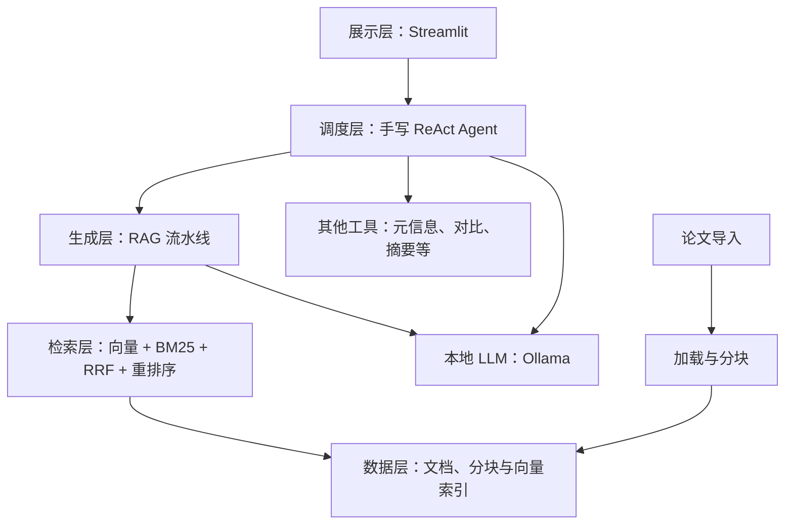

# 技术设计文档

智能科研助理通过本地论文知识库检索辅助回答问题，并由 Agent 选择和执行工具。本文当前记录架构方案与模块职责，接口和业务实现尚待完成。

## 1 系统架构

该图表示计划架构。目前可运行的是展示层的初始化说明页，其余模块为占位。

## 2 技术方案

| 组件 | 初步方案 | 待验证事项 |
| --- | --- | --- |
| Python | 3.10 及以上；初始化用 3.12 | 后续模型库兼容性与完整依赖锁定 |
| 前端 | Streamlit | 流式、文档管理、会话与轨迹展示 |
| LLM | Ollama + Qwen2.5 7B | 本机资源、生成参数、速度与回答质量 |
| 文档解析 | 比较 PyPDF2/pdfplumber/PyMuPDF；Word 用 python-docx | 双栏、表格与公式保真 |
| 分块 | 固定、递归、句段边界 | 大小、重叠及召回差异 |
| Embedding | BGE；实验比较 m3e-base | 中文/英文论文效果、速度和资源 |
| 向量存储 | 优先试用 Chroma；比较 FAISS | 持久化、增量更新和检索性能 |
| 检索与重排 | BM25 + 手写 RRF + BGE Reranker | 三档检索对比与指标 |
| Agent | 手写 ReAct | 工具契约、路由、并行、恢复和记忆 |

## 3 模块与接口

| 模块 | 源码位置 | 输入与输出职责 | 实现状态 |
| --- | --- | --- | --- |
| 加载 | `src/data_loader/` | 文档 → 文本/表格及来源位置 | 未实现 |
| 分块 | `src/chunking/` | 文本与元数据 → 可索引的文档块 | 未实现 |
| 检索 | `src/retrieval/` | 问题 → 排序后的文档块与分数 | 未实现 |
| 生成 | `src/generation/` | 问题、历史、上下文 → 答案/引用/统计 | 未实现 |
| Agent | `src/agent/` | 会话问题 → 工具调用、结果与回答 | 未实现 |
| 展示 | `src/frontend/` | 上传、对话、来源、会话和状态 | 部分实现：说明页 |
| 工具 | `src/utils/` | 模块共享配置与日志 | 未实现 |

具体函数签名、Message/Context 字段和工具输入输出在首次实现时确定。本阶段不建立尚未验证的数据模型抽象。

## 4 数据流与来源

文献导入后读取正文及位置，分块继承来源，再建立向量和关键词索引。问题进入 Agent 后，按工具决策调用 RAG；RAG 融合检索、重排并拼接上下文，将生成结果和真实引用返回前端。

PDF 来源需保留文档标识、文件名与页码；Word/文本保留段落或行位置。后续接口要使这些位置在加载、分块、检索和引用各步骤都可核查。

## 5 配置说明

| 配置组 | 用途 | 当前是否读取 |
| --- | --- | --- |
| `app` | 页面名称与描述 | 是 |
| `llm` | Ollama 地址、模型、Temperature | 否，参数样例 |
| `embedding` | 本地 Embedding 模型标识 | 否，参数样例 |
| `retrieval` | 存储、返回/候选数量、重排模型 | 否，参数样例 |
| `chunking` | 分块策略、大小与重叠 | 否，参数样例 |
| `agent` | 迭代上限、联网开关 | 否，参数样例 |
| `paths` | 文献、索引和日志目录 | 否，参数样例 |

相对路径的计划基准为项目根目录。默认不使用云端 API；后续离线能力须在模型权重已准备且断网的环境中实测，不能由配置值直接推断。

## 6 待补充实现记录

各模块实际算法与接口、Prompt 版本、日志字段、超时与重试策略、缓存规则、模型/存储选型实验，以及端到端健康检查记录。

## 7 官方参考

- [Streamlit 安装说明](https://docs.streamlit.io/get-started/installation)
- [Streamlit Docker 部署说明](https://docs.streamlit.io/deploy/tutorials/docker)
- [BAAI BGE 中文模型说明](https://huggingface.co/BAAI/bge-large-zh-v1.5)
- [Ollama 文档](https://docs.ollama.com/)
