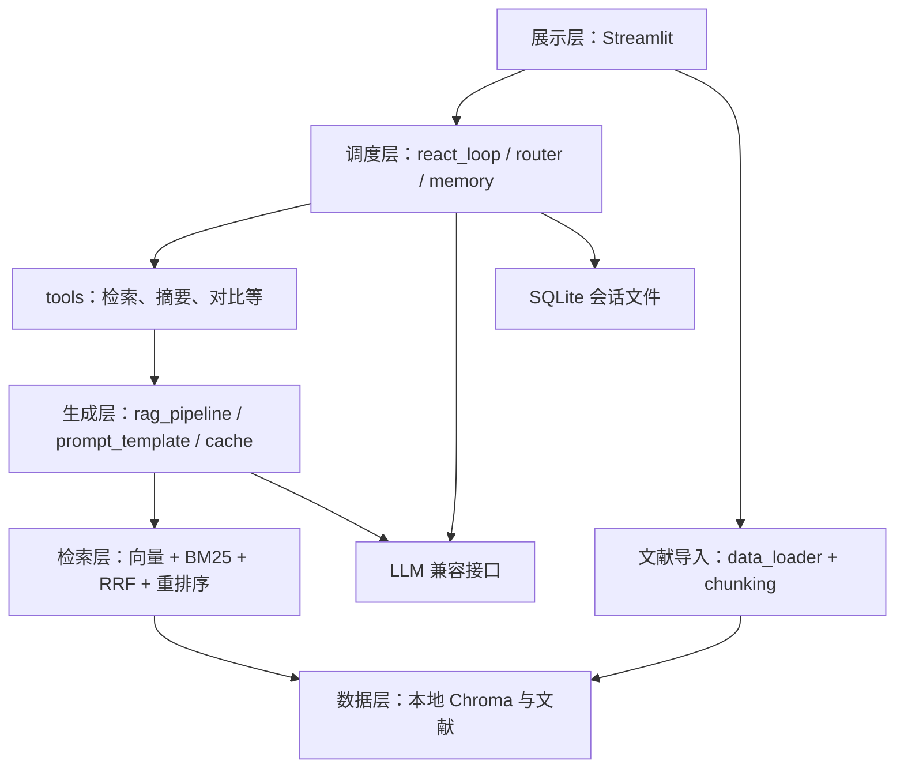

# 智能科研助理技术设计文档

本项目面向本科生课程实践，实现“上传论文 → 建立知识库 → 提问 → 检索与工具调用 → 返回带来源的回答”。参考 ai-chatbot 的代码，保持用户指定的课程目录，将已有实现映射到对应文件，避免额外服务和框架。本文统一维护技术方案、需求与验收状态。

**当前状态**：已实现 PDF、Word（.docx）及 TXT/Markdown 加载器，以及 Streamlit 批量上传、进度显示、状态追踪和失败项重试。固定、递归、句段分块、本地 Embedding 与 Chroma 操作封装已实现，上传后自动分块、批量向量化和增量索引，页面已接通向量/BM25/RRF/模型重排 Top-K 检索，共 288 个测试通过；RAG Prompt、上下文排序/截断、引用溯源、本地流式/非流式生成、页面问答、语义缓存、三类降级、完整请求日志与Top-1分布已实现，八组生成参数对照已完成。Embedding 经人工智能论文中英双语基准重新比较后保留 M3E-base；跨语言质量仍不足。Chroma/FAISS 实测后选择 Chroma，支持持久化、增量入库、Top-K、块列表和按文档删除。PDF 已补常见双栏、规则表格与续表、公式符号/上下标和原文位置保留。统一保留来源、稳定文档/块 ID 和位置；Word 使用段落/表格位置，纯文本使用行范围，不伪造物理页码。导入成功表示原文已保存、全部预期块已处理并持久化；重复块跳过，新文献无需重建旧索引，Agent已实现Thought/Action/Observation核心有界循环、实际结果反馈与明确终止（Agent112项，全项目400项通过）；已注册知识库检索、论文元信息、论文对比、关键词、结构化摘要和当前时间六个真实本地工具（6/8），DuckDuckGo搜索已实现为默认关闭的可选工具，本轮真实联网未取得有效结果页；计算器、文献列表、并行/恢复、记忆与前端Agent接入仍待实现，见[摘要时间搜索QA](QA/5.3.2%20摘要时间与联网搜索工具.md)。实现依据和验证记录见 [PDF 加载器选择](QA/5.1.1%20PDF加载器选择.md)、[Word 和纯文本加载](QA/5.1.1%20Word与纯文本加载器实现.md)、[批量文档导入](QA/5.1.1%20批量文档导入与状态追踪.md)、[学术 PDF 解析优化](QA/5.1.2%20学术论文PDF解析优化.md)、[三种文本分块策略](QA/5.1.2%20三种文本分块策略.md)、[Embedding 对比和选择](QA/5.1.3%20Embedding模型对比与选择.md)、[向量数据库对比和选择](QA/5.1.3%20向量数据库对比与选择.md)、[批量向量化及增量索引](QA/5.1.3%20批量向量化与增量索引.md)、[向量 Top-K 检索](QA/5.1.3%20向量相似度Top-K检索.md)、[BM25 关键词检索](QA/5.1.4%20BM25关键词检索.md)、[RRF 混合检索](QA/5.1.4%20RRF混合检索.md)、[模型重排序](QA/5.1.4%20模型重排序.md) 与 [三档检索评测](QA/5.1.4%20检索质量评估实验.md)，生成参数见 [对比与选择](QA/5.2.1%20生成参数对比与选择.md)，流式与页面验证见 [流式 QA](QA/5.2.2%20流式输出与引用.md)，缓存见 [语义缓存 QA](QA/5.2.3%20语义缓存.md)，三类异常行为见 [降级 QA](QA/5.2.3%20降级策略.md)，请求记录与分布见 [日志 QA](QA/5.2.4%20日志与检索质量自评.md)。

## 1 设计依据与范围

- [课程实践方案](南京农业大学课程实践.docx)：五个模块、实验和交付要求。
- [项目交付模板](项目交付模板.docx)：报告章节、完成情况表与排版要求。
- [参考仓库固定版本](https://github.com/dsy1018/ai-chatbot/tree/6979d7173ed0f92910a8571dd4ca1b4a171a2c49)：提交 `6979d7173ed0f92910a8571dd4ca1b4a171a2c49`，读取日期 2026 年 9 月 28 日。

本次完整读取参考版本的 41 个文件：29 个 Python 文件（含 7 个空包初始化文件），以及配置、依赖、测试、部署和说明文档。以源码实际行为为准，不把 README 或简历介绍当作验证结果。

项目结构以用户给定模板为准，参考仓库提供实现依据。采用一个 Streamlit 进程直接调用 Python 业务模块，Chroma 和 SQLite 使用本地文件。上游 FastAPI、HTTP/SSE、请求模型已阅读，其流程与校验思路映射到模块函数和流式事件，不在本项目新增接口服务或 `app/api/` 目录。

课程明示要求全部保留，分阶段补齐。按用户 2026 年 9 月 29 日的指令，PDF 三种方案通过官方资料比较，只实现选定的 PyMuPDF，不实现 PyPDF2 和 pdfplumber，也不将资料对比冒充实测。其他分块、Embedding 和数据库选型的比较放在实验脚本与报告，不将所有候选都做成运行时插件。不加入其他备选题目、账号权限、分布式部署或额外前端框架。

### 1.1 不降低的核心要求

| 维度 | 最终必须具备的能力 | 具体落点 |
| --- | --- | --- |
| 深度融合 | Agent 为统一决策中枢，RAG 为核心知识工具，自主选择检索、计算、对比或直接回答 | `react_loop.py`、`router.py`、`tools.py` |
| 检索 | 向量 + BM25 + 手写 RRF，融合后 Top-20 候选交给 bge-reranker-base/v2 类模型精排 | `retrieval/` 四个文件 |
| 决策 | 手写 Thought → Action → Observation，语义路由、独立工具并行、超时重试、异常替代、死循环终止 | `agent/`；约 200 行为教学参考，不凑行数 |
| 记忆 | 会话隔离、Token 窗口、超阈值阶段性摘要；验证数十轮长对话 | `memory.py`；仍遵守实际模型上下文预算 |
| 可观测 | 每步轨迹、分工具 Token、检索质量/延迟、工具成功率/耗时，前端实时展示 | `logger.py` 与右侧/底部轨迹区 |
| 本地隐私 | Ollama + Qwen2.5/ChatGLM、本地 Embedding、索引和会话，准备权重后断网运行 | 不依赖云端，不静默外发私有文献 |
| 教学交付 | 小模块接口、真实实验、Bad Case 优化、手册、设计、Git 历史、Docker、演示 PPT | 固定课程目录，结果可复现 |

联网搜索是额外可选模式，默认关闭，不纳入完全离线验收。无 GPU 时可验证 CPU 推理；云端替代如需使用应另行明确，不能代替默认本地方案。

课程介绍中的“Hit@5 约 65% → 85% 以上、检索失败减少约 60%、计算路由节省约 80% Token”保留为待验证对照目标，不视为本项目结果。约 0.002 元/次本地成本、约 0.1 元/次云端成本、月约 3 元及 8GB 内存/4GB 显存均为课程给出的参考值，尚无本项目实测依据；报告记录真实耗时、功耗/成本口径和资源占用，不用示例代替测量。

### 1.2 三个研究问题与教学产出

1. 学术 PDF 中哪些 chunk_size、top_k、Embedding 配置最有效：同一数据集比较分块与三档检索。
2. Agent 路由相比固定“每题都 RAG”节省多少 Token：按问题类型记录准确率、调用轮次和总 Token。
3. 科研任务常用哪些工具组合，并行比串行减少多少延迟：用相同独立任务比较结果和耗时。

按检索 → 生成 → Agent → 集成 → 评测递进，RRF/ReAct 手写，加载与数据库使用成熟库。答辩需解释算法、接口、失败根因和成本/性能取舍；交付完整代码及环境说明、技术设计、系统评测、Bad Case、使用手册、Docker 和演示 PPT。研究意义由真实文献与实验支持，不将课程背景中的“研究空白”当作已证明结论。

## 2 固定项目结构

```text
project/
├── README.md
├── requirements.txt
├── config.yaml
├── src/
│   ├── data_loader/              模块一：文档加载
│   │   ├── pdf_loader.py
│   │   ├── docx_loader.py
│   │   └── text_loader.py
│   ├── chunking/                 模块一：文本分块
│   │   ├── fixed_chunk.py
│   │   ├── recursive_chunk.py
│   │   └── semantic_chunk.py
│   ├── retrieval/                模块一：检索层
│   │   ├── vector_store.py
│   │   ├── bm25_retriever.py
│   │   ├── hybrid_retriever.py
│   │   └── reranker.py
│   ├── generation/               模块二：生成层
│   │   ├── prompt_template.py
│   │   ├── rag_pipeline.py
│   │   ├── streaming.py
│   │   └── cache.py
│   ├── agent/                    模块三：Agent 层
│   │   ├── react_loop.py
│   │   ├── tools.py
│   │   ├── router.py
│   │   └── memory.py
│   ├── frontend/                 模块四：前端
│   │   ├── app.py
│   │   ├── pages/
│   │   └── components/
│   └── utils/                    工具函数
│       ├── logger.py
│       └── config.py
├── tests/                        测试
│   ├── test_retrieval.py
│   └── test_agent.py
├── docs/                         文档
│   ├── 技术设计文档.md
│   └── 用户使用手册.md
├── reports/                      评测报告
│   ├── 评测集.json
│   ├── 性能评测数据.xlsx
│   └── Bad_Case分析报告.md
└── docker/
    ├── Dockerfile
    └── docker-compose.yml
```

保留根目录 `AGENTS.md`、已有原始资料与报告骨架；包初始化文件按 Python 导入需要保留。文献、索引、SQLite 和日志仍使用现有 `data/`、`logs/` 运行目录。上表的业务测试与性能表在有实际实现和测量数据后编写，不创建空测试或假成绩表。`pages/`、`components/` 保留目录，界面未复杂到需要拆分前先用一个 `app.py`。

## 3 参考代码到本项目的映射

| 已完整阅读的参考文件 | 参考的实际实现 | 本项目位置与采用方式 |
| --- | --- | --- |
| `app/core/rag.py` 的 `load_document()`、Loader 映射 | PDF/Word/TXT/Markdown 按扩展名加载 | `data_loader/` 三个文件；保留分发思路，补课程 Word 表格与来源 |
| 同文件的 `split_documents()` | 递归字符切分 | `chunking/recursive_chunk.py`；另外两种策略放指定文件 |
| 同文件的向量库初始化、入库与增量添加 | Chroma 持久化与批量向量写入 | `retrieval/vector_store.py`，不增加向量库服务 |
| 同文件的分词、BM25、手写 RRF 和两种重排 | 双路召回、排名融合、模型/关键词重排序 | 分别映射 `bm25_retriever.py`、`hybrid_retriever.py`、`reranker.py` |
| `app/core/embeddings.py` | 在线/本地 Embedding 包装 | `vector_store.py` 的本地 `get_embeddings()`，比较两个模型后仅配置选定模型，不另建管理框架 |
| `app/core/llm.py`、`rag.py` 的 `build_context()` | 兼容 LLM、工具绑定、流式生成、上下文 | `generation/rag_pipeline.py`；Prompt 和流式分别放指定文件 |
| `app/core/agent.py` | 一轮 Function Calling、注册表、ToolMessage、事件生成器 | `agent/react_loop.py`、`tools.py`、`router.py`，补课程有界循环 |
| `app/core/memory.py` | 会话隔离、内存/SQLite、Token 窗口 | `agent/memory.py`；采用 SQLite，补简单摘要 |
| `app/tools/weather.py`、`search.py` | `@tool`、HTTP 超时、结果与错误文本 | `agent/tools.py`；天气只参考写法，科研工具集中实现 |
| `app/api/chat.py`、`knowledge.py`、`tools.py`、`app/models/schemas.py` | 对话/入库/工具流程、请求校验与事件响应 | 映射模块函数和少量字典；不新增 HTTP API 或 schemas 文件 |
| `app/main.py`、`core/metrics.py`、`utils/logger.py` | 生命周期、健康状态、计数、Token 估算与日志轮转 | 初始化由前端协调；统计和日志集中在 `utils/logger.py` |
| `frontend/app.py` | 侧栏、对话区、逐步渲染、会话与开关 | `src/frontend/app.py`，用模块调用替换 HTTP 客户端 |
| `config.py`、`.env.example` | 集中配置、密钥与运行参数 | `config.yaml` + `src/utils/config.py`；密钥读环境变量，不建立第二套配置 |
| `tests/conftest.py`、五份 `test_*.py`、`pytest.ini` | mock 隔离、记忆/RAG/工具/API/集成测试 | 核心检索归入 `test_retrieval.py`，工具/循环/记忆归入 `test_agent.py`；不声称上游测试已经通过 |
| 两份 Dockerfile、`docker-compose.yml`、两份忽略文件 | 容器与本地数据挂载 | `docker/` 中只运行一个 Streamlit 服务，保留数据挂载方式 |
| 两份依赖清单、7 个空初始化文件、`README.md`、`docs/architecture.md`、`RESUME.md` | 依赖约束、包组织、使用与设计介绍 | 按实际使用依赖和本项目成果整理，不照搬宣传结论 |

实现定位：[RAG 源码](https://github.com/dsy1018/ai-chatbot/blob/6979d7173ed0f92910a8571dd4ca1b4a171a2c49/app/core/rag.py)、[Agent 源码](https://github.com/dsy1018/ai-chatbot/blob/6979d7173ed0f92910a8571dd4ca1b4a171a2c49/app/core/agent.py)、[记忆源码](https://github.com/dsy1018/ai-chatbot/blob/6979d7173ed0f92910a8571dd4ca1b4a171a2c49/app/core/memory.py)、[前端源码](https://github.com/dsy1018/ai-chatbot/blob/6979d7173ed0f92910a8571dd4ca1b4a171a2c49/frontend/app.py)。

## 4 系统架构与数据流



五层是一个应用内的职责划分，不是五个服务。沿用 LangChain Document/Message 表达文本和消息，其余结果用简单字典；不要为少量字段设计通用协议或多层抽象。

### 4.1 文献导入与检索

读取文档并保留来源 → 按策略分块 → 对新块计算 Embedding → 加入本地 Chroma → 重建小规模 BM25 语料。新增文献不重算全部旧文献向量；BM25 重建沿用上游简单做法。当前页面每次提交 BM25 查询时从最新 Chroma 正文重建；长期复用 Python 检索实例时，新增/删除后调用 rebuild()。

PDF 已实现为 `src/data_loader/pdf_loader.py` 的 `load_pdf(file_path)`：沿用参考 `load_document()` 的 Document 列表和来源字段，按用户选择将 `PyPDFLoader` 替换为 PyMuPDF。按真实字符位置读取文本，识别常见居中双栏，通栏内容作为上下区域边界；每个区域读完整左栏再读右栏。元数据保留绝对路径 `source`、`source_file`、`file_type`、文件内容 SHA-256 `doc_id`、从 0 开始的 `page`、从 1 开始的 `page_number` 和 `total_pages`。无文本页警告并跳过，保留原页码；全篇无文本和需要密码时明确报错，损坏文件的原生解析异常向上传递。

三种解析器的官方资料对比见 [PDF 加载器选择](QA/5.1.1%20PDF加载器选择.md)，不安装另外两种解析器。网格表使用 `find_tables(lines_strict)`，规则三线表按横线区域、列间留白与文字基线提取。表格独立返回 Markdown Document，正文中的对应区域保留定位标记，不重复单元格文字。跨页仅合并相邻页、页边位置和列结构一致、有原表编号与重复表头或明确续表标记的片段；去掉重复表头，保留每行来源页和各页区域。

文本层公式保留 Unicode 符号，用 `^{...}`、`_{...}` 表达可识别上下标；`formula_layout` 为原字符位置/字号的 JSON 字符串，`image_regions` 为原图区域的 JSON 字符串。复杂分式、图片公式通过原 PDF 和位置保留，不猜测完整 LaTeX，不引入 OCR 或视觉模型。复杂多级三线表无法可靠确定列时保留正文并记录警告；网格表的合并单元格保留工具识别的物理单元格，不承诺还原所有逻辑指标列。接口变化、适用范围和真实样例见 [学术 PDF 解析优化](QA/5.1.2%20学术论文PDF解析优化.md)。

Word 已实现 `load_docx(file_path)`，采用参考版本的 `python-docx==1.1.2`，顺序读取正文顶层段落和表格。每个非空段落/表格返回一个 Document，记录从 1 开始的 `block_index`、`block_type` 和 `paragraph_index` 或 `table_index`；空块跳过但不重编号。表格以制表符分隔单元格、换行分隔行，不输出物理页码，不处理旧版 .doc 或复杂嵌套内容。

纯文本已实现 `load_text(file_path)`，支持 `.txt`、`.md`、`.markdown`。原始字节按 `utf-8-sig` 解码，兼容 BOM，保留 Markdown 标记、缩进、空行和 CRLF；整篇返回一个 Document，记录 `line_start=1`、`line_end`，后续分块时再细化行位置。仅空白内容明确报错，非 UTF-8 编码异常向上传递，需转换为 UTF-8 后导入。两个加载器都保留来源和文件字节 SHA-256，详见 [Word 和纯文本加载记录](QA/5.1.1%20Word与纯文本加载器实现.md)。

批量导入已在 `src/data_loader/__init__.py` 实现：扩展名分发 → 临时文件解析 → 成功后保存到 `data/raw/<内容 SHA-256>/<原文件名>` → 修正 Document 的持久化来源。逐文件处理并产出进度，记录等待、处理中、成功、失败，以及尝试次数、耗时和错误；失败不阻断后续文件。同名不同内容分别保存，相同文件名与内容在本批去重。手动重试只处理失败项，每次点击尝试一轮，不重复加载成功项。

当前状态保存在 Streamlit 当前页面会话中，不建立后台任务队列或持久任务表。刷新或断开页面会话后状态可能清空，已成功保存的文件仍留在磁盘；`batch_import()` 仅记录加载/保存结果，当前页面通过 `batch_build_index()` 补充本批分块、向量化与索引状态，不是全知识库列表。详见 [批量导入实现记录](QA/5.1.1%20批量文档导入与状态追踪.md) 与 [增量索引记录](QA/5.1.3%20批量向量化与增量索引.md)。

三种分块已在指定文件实现 `split_fixed()`、`split_recursive()`、`split_semantic()`；统一入口 `src.chunking.split_documents()` 读取 YAML 默认值，目前实际为 `recursive`、512/64 字符。按用户明确范围，仅固定切分覆盖 256/512/1024 大小效果；递归和句段切分各使用默认 512/64 参数，上游的 500/50 仅为参考。三种策略共用来源处理，不合并不同页或 Word 正文块。

固定策略按大小减重叠的窗口步长切分。递归使用上游相同的 `RecursiveCharacterTextSplitter` 分隔符顺序，保留分隔符与空白，并修正重复段落、大重叠时的位置查找停滞。句段策略先保留完整短段落，长段落按中英文句子拆分，超长单句按字符兜底；不使用 Embedding。固定正文精确重叠，递归与句段只在切分单元边界重叠，实际重叠可能小于目标或为零。

块继承来源并增加稳定 `chunk_id`、父内容单元内的字符区间 `[start_index, end_index)`、从 0 开始的 `chunk_index` 和策略参数；TXT/Markdown 细化行范围，保留 PDF 公式/图片原位置。已独立识别的 PDF/Word 表格整块保留，标记 `chunk_preserved=table`，可能超出大小上限。普通正文严格限长；Markdown 表格或回退为正文的复杂表格不在独立表格保护范围。固定窗口可能截断公式文本，原 PDF 和公式位置仍用于回看，不声称每块完整还原公式。算法与边界见 [三种分块记录](QA/5.1.2%20三种文本分块策略.md)。

同一公开论文的五组分块统计（固定三档、递归与句段各一组默认参数）已写入 [实验报告](../reports/分块策略对比实验报告.md)。五组策略的检索对比尚未完成，召回、Hit@5/MRR 和最终最优策略仍待实测，后续比较沿用这五组设置。

向量和 BM25 候选经手写 RRF 融合，再重排序。块保留稳定 `doc_id`、`chunk_id`、文件名、页码或段落位置，融合按块标识而非只按正文去重。删除/同名重传同步源文件、向量、BM25 和缓存。

两路取足够候选，RRF 合并后截取 Top-20 送入模型重排，再保留最终 Top-K。上游两路各 5 项仅为参考默认，不能用最多 10 项冒充 Top-20 实验。Embedding 已基于 3 篇中文、3 篇英文人工智能论文比较 bge-large-zh-v1.5 与 m3e-base，保留 M3E；宏平均 Hit@5 为 34.38% 对 31.25%，文档编码约快 3.14 倍，英文及跨语言检索质量仍不足。Chroma/FAISS 存储选型已完成：FAISS 更快、更省磁盘；Chroma 在 `search_ef=100` 下达到精确检索 Top-5 的 100% 一致率，P95 中位数 1.205 毫秒，选择集成正文/来源管理的 Chroma，运行时只维护一种存储。该一致率不等于问题质量达标，详见 [向量数据库 QA](QA/5.1.3%20向量数据库对比与选择.md)。最终核心版本启用真实模型重排，关键词方案仅用于基线或明确标注的降级。

本地 `get_embeddings()` 沿用上游 `HuggingFaceEmbeddings`，按需加载并缓存唯一 M3E，输出 768 维归一化向量，不自动下载或转云端。固定版本、CPU 与批大小 32 来自 YAML；完整结果和范围见 [Embedding QA](QA/5.1.3%20Embedding模型对比与选择.md)。`VectorStore` 按稳定块 ID 查重，批量编码新块后持久化，支持 Top-K、正文/来源读取和按文档删除；旧块不重算。`batch_build_index()` 已接入上传页面，逐文件复用加载/保存与默认分块，每 500 块写入并刷新索引状态。索引失败保留原文、加载结果和已写入块，重试只补缺失块，全部成功后才标记 `indexed=True`。模型版本或索引参数不一致时要求新目录重建。页面已接通 `VectorStore.search(query, k=None, doc_id=None)`，默认 K 从 YAML 读取；结果按余弦相似度降序返回正文与来源，保留负分，不设固定阈值。不足 K 时返回全部匹配块，空问题/空库/无匹配文档返回空列表。搜索只编码查询，不重算文档向量；页面支持文档 ID 筛选及按格式展示位置，模型/数据库错误明确上报。Chroma HNSW 为近似检索，原始分数和排名核验见 [Top-K QA](QA/5.1.3%20向量相似度Top-K检索.md)。`BM25Retriever` 已实现 BM25Okapi，复用 Chroma 正文、稳定块 ID 与来源，默认 K 与向量查询一致；英文按词、中文按单字，分词前做 NFKC 全角字符归一化。仅对有词项交集且符合文档过滤的块按原始分数降序排序，保留零/负分。空语料不构造索引；rebuild() 更新语料不重算向量。为支持无需权重的关键词检索，VectorStore 构造/读取不加载 M3E，只在实际新块写入或有效向量查询时加载；模型/语料错误不静默回退，说明见 [BM25 QA](QA/5.1.4%20BM25关键词检索.md)。原始文件同步删除及前端管理仍属于后续集成；缓存在下一次请求核对语料哈希后失效，BM25 的更新由重建处理。

`HybridRetriever.search(query, k=None, doc_id=None, *, rerank=False)` 已接通页面：两路各取 `max(candidate_k, 最终K)`，默认候选数 20；手写 RRF 累加 `1/(rrf_k+排名)`，排名从 1 开始，默认常数 60。按稳定块 ID 合并、单路重复只计首次贡献、同分按 ID 排序，原正文/来源保留，返回融合分数与最终 Top-K。每次查询重建当前 BM25，共享 Chroma，新增/删除后不重算旧向量；正常单路空结果可由另一路返回，异常明确上报。`k=20` 可取得融合候选；`rerank=True` 则先将默认融合 Top-20 交给本地 BGE 再截取最终 K。算法与核验见 [RRF QA](QA/5.1.4%20RRF混合检索.md)。

`Reranker.rerank(query, candidates, k=None)` 已实现成对模型评分，复用 sentence-transformers 的 CrossEncoder，流程参考上游 `_rerank_cross_encoder()`。运行时选定本地 bge-reranker-base，懒加载/缓存、CPU/FP32、批次 8、输入合计上限 512 Token；模型库在设定本地缓存后才导入。sigmoid 对应上游 normalize=True，按模型分数降序，同分沿用融合顺序，不改变原 Document；不与 RRF 分数相加，不解释为命中概率。空候选不加载，模型缺失/推理失败明确报错，不降级为关键词。页面可选“RRF + 模型重排”，真实分数与官方 Transformers 推理一致，见 [模型重排 QA](QA/5.1.4%20模型重排序.md)。超长输入会截断，完整原文保留不等于模型已阅读全部内容；当前 6 篇论文开发集的三档 Hit@5、Recall@5、MRR@5 和三轮时延已实测，见 [检索质量 QA](QA/5.1.4%20检索质量评估实验.md)。独立数据集与完整系统评测仍待补充。

### 4.2 生成与引用

`prompt_template.py` 当前版本 `rag-v3`：`build_rag_messages(question, context="")` 返回 LangChain 的 System/Human 消息。系统消息固定科研助理角色、事实与推断边界、资料不足提示和 Markdown“回答/参考来源”格式；用户消息包含上下文及问题。沿用上游编号，模型只写 `[参考文档N]`，文件名及位置由系统补全。模板不调用模型，原始设计见 [Prompt QA](QA/5.2.1%20RAG专用Prompt模板.md)，v2 变更见 [引用 QA](QA/5.2.1%20引用溯源机制.md)，v3 空库规则见 [降级 QA](QA/5.2.3%20降级策略.md)。

`rag_pipeline.py` 已实现 `build_context(question, results)`，接收同一路检索的 Document/分数，降序排序、同分保留原顺序，按动态字符预算拼接。预算为 `min(6000, 12000 - 系统/问题/标签开销)`，配置来自 generation；包含来源和分隔符。超长正文优先在句段边界截断，保留完整来源及截断提示，位置标为原始块范围。参考 `context`、`sources`、`chunk_count`，增加实际长度、预算、截断及省略数。空结果沿用 Prompt 提示，预算不足明确报错；不修改原 Document，不调用模型。字符不是 Token，LLM 接入时须核验实际窗口，见 [上下文 QA](QA/5.2.1%20上下文智能拼接与截断.md)。检索到模型生成及前端依据展示已接通，缓存命中可跳过该链路；独立答案引用语义评测仍待完成。

`build_context()` 现已为每个入选块建立 `references` 快照，含编号、文件名、真实位置、实际入上下文的正文和原元数据/稳定 ID。`resolve_citations(answer, context)` 用同轮映射补全正文为“编号：文件名；页码/真实位置”，按实际引用重建来源列表；不采用模型手写的来源区，不列未使用的块，标记无效编号、缺少引用或不完整来源。重复引用去重，同文件不同块保留；截断证据不含未读尾部。真实多格式链路和两篇论文第 3 页已核验，见 [引用 QA](QA/5.2.1%20引用溯源机制.md)。编号映射、原文追溯、本地模型生成和前端展示已接通，缓存复用时保留同范围的引用快照；独立引用语义正确性评测仍待完成。

`streaming.py` 消费生成器，沿用 `tool_call`、`tool_result`、`token`、`done`、`error` 事件语义，用 Streamlit 占位区逐步刷新；不使用 HTTP/SSE。错误后终止，不再标为成功。

三类降级已实现：空结果在流式及最终答案加固定提示后使用纯模型生成，具体论文事实仍不编造；实际入选的最高BGE sigmoid分数<0.1时先展示候选原文并等待确认，确认前不调用模型，知识库/配置改变要求重提；API失败保留部分正文并给出连接/超时/HTTP/格式/断流建议。两个接口绕过系统代理直连本机，不自动重试或转云端。0.1不是命中概率，低相关答案不缓存，详见 [降级 QA](QA/5.2.3%20降级策略.md)。`cache.py` 的 `SemanticCache` 已接入页面，会话内最多100条；相同问题优先，近似问题用本地M3E余弦相似度≥0.97及数字/标识/否定/语言规则匹配。命中跳过检索、重排和生成，保留来源快照，本次LLM Token为0；只保存正常结束且引用校验通过的非空有来源答案。正文/元数据与配置/实际Prompt哈希控制范围，新增、删除、同数量替换和配置变更失效，生成期间变更不写入。清空当前对话同时清缓存，不增加数据库；超过256字符只精确匹配，规则及原模型质量局限见 [语义缓存 QA](QA/5.2.3%20语义缓存.md)。

流式正文在引用位置输出编号，来源位置可用时同步展示，不全部拖到结束才显示引用。完整请求日志已接入聊天入口：本地按日期追加JSONL，唯一请求/会话编号关联开始、检索和最终快照；保留完整Top-K原文及来源、实际截断Context、原始/展示回答、实际阶段耗时、Ollama Token或未知值、缓存/错误/确认状态。低相关性确认按同一编号更新，缓存跳过不当作新检索；页面显示按重排模型/版本分组的10档Top-1分布，空结果/失败单独计数。日志故障明确提示，清空对话保留历史日志；分数不是置信概率或命中率，详情见 [日志 QA](QA/5.2.4%20日志与检索质量自评.md)。

### 4.3 手写循环与工具

上游 `AgentManager.run()` 只有一轮工具选择，不能直接计为课程 ReAct 完成。`react_loop.py` 参考其 `bind_tools()`、执行与 `ToolMessage`，手写“决策 → 工具执行 → 观察 → 继续或结束”有限循环，Function Calling 用于结构化 Action，不调用高层 Agent 执行器。

System Prompt已统一为“角色定义 → 可用工具描述 → 阶段职责 → 输出格式约束”。`build_agent_messages()`将共同科研助理角色与实际工具用途/参数Schema放入SystemMessage，问题、Context与Action的Thought置于HumanMessage；Observation另接关联调用/结果消息。Action仅描述并绑定已选工具，空工具列表明确不可调用，Thought请求Schema只允许answer。三个阶段分别使用JSON规划、原生工具调用与JSON观察，沿用Python校验；详见[Agent System Prompt设计](QA/5.3.1%20Agent的System%20Prompt结构.md)。

Thought保留独立单轮规划接口：`build_thought_messages(question, tools, context)`组织System/Human消息与真实工具描述，`think()`用现有本地Ollama输出简短计划、`next_step=tool/answer`与候选工具名，校验后返回实际用量/耗时。Context含当前资料和调用方提供的observations；只规划，不执行工具、生成参数或最终答案。Thought采用JSON Schema结构化输出；单独调用它不等同于Function Calling Action或完整ReAct，详见[Thought QA](QA/5.3.1%20Thought单轮规划.md)。

Action已接通：`act(question, thought, tools, context)`只向本地模型提供本步已选工具，使用原生Function Calling生成参数；`execute_tool()`查注册表并实际invoke，返回tool_call/tool_result、实际参数/结果/错误/耗时及关联AIMessage/ToolMessage。回答计划跳过工具；无效调用不执行，工具异常不假称成功。单轮接口保留；现由run_react接入完整循环，见[Action QA](QA/5.3.1%20Action工具选择与执行.md)。

Observation已接通：`observe()`读取Context中的真实结果/错误，以及关联AIMessage/ToolMessage，输出简短说明、`decision=continue/finish`、布尔`task_complete`及最终答案。`run_react(question, tools=None, context=None)`逐轮执行三个阶段，把结果和判断带入下一轮；任务成功、无法继续、达到上限及模型错误分别返回done.stop_reason=`task_complete/incomplete/max_iterations/error`，后面三种均不标记成功。上限来自agent.max_iterations=8，按完整轮次计；最后一轮完成优先于上限结束。输入状态和展示事件均使用副本，详见[Observation与终止 QA](QA/5.3.1%20Observation与循环终止.md)。

已使用 `config.yaml` 的迭代上限（现有值为 8）与结构化完成标志；HTTP超时沿用300秒，模型/协议错误立即结束。同步工具执行超时、失败最多重试一次及替代策略待M3-04实现，当前仅允许模型根据错误重新规划。`router.py` 只对模型同轮提出且互不依赖的调用做简单并行，不建立调度图。前端显示工具名、参数、结果、耗时和必要决策说明，不要求模型披露私有思维过程。

Thought 保存简短的本步计划，Action 保存工具与参数，Observation 保存结果/错误及下一步状态。明确算式快速路由计算器，论文比较调用对比工具与 RAG，一般概念可由本地模型直接回答。超时重试或跳过，异常后在注册表选择可用替代工具，重复无效操作或达到上限时强制结束并提示。

`tools.py` 用 `@tool` 和列表/字典注册，八个本地工具复用现有模块，联网搜索为第九个可选工具，默认关闭。此选择补足“8 个可调用”与“搜索可选”的原文差异，不增加业务子系统，详见第 10 节。

| 本地工具 | 输入与真实输出 |
| --- | --- |
| 知识库检索（已实现knowledge_base_search） | 问题、可选上传doc_id → 混合+模型重排、本地RAG与真实文档/页码引用；低相关性待用户确认 |
| 论文元信息（已实现paper_metadata） | 上传SHA-256文档ID → 原文标题、作者、年份、摘要、DOI与逐字段位置证据；缺项如实提示 |
| 论文对比（已实现paper_compare） | 两个不同上传ID → 方法、数据集、实验结果与两篇原文引用；每篇摘要/检索证据分配预算，资料不足如实提示 |
| 关键词提取（已实现keyword_extract） | 问题text或上传doc_id二选一 → 最多5个中英文原文关键词与位置证据；文档开头预算、截断状态明确 |
| 摘要生成（已实现paper_summary） | 上传doc_id → 背景、方法、结果、结论四栏中文摘要、真实位置引用、缺项/截断与实际Token |
| 当前时间（已实现current_time） | 无输入 → 本机ISO 8601当前时间与时区，含UTC偏移；不调用模型 |
| 计算器 | 简单算式 → 计算结果 |
| 文献列表 | 无输入 → 入库论文 ID、文件名与索引状态，复用文献管理 |

当前`AVAILABLE_TOOLS`注册上述六个已实现本地工具；`get_available_tools()`每次读取联网开关，启用时再加入web_search。`run_react()`省略工具列表时使用该实际注册表，显式空列表仍禁用工具；工具内部也核验开关，手动传入搜索工具不能绕过默认禁用。RAG复用模块二生成、引用、降级与请求日志，低相关性不能由Agent自行确认；会话语义缓存暂未接入。元信息复用原文加载器，取前三页/6000字符连续前缀，模型只提取四个短字段并匹配原文，摘要直接按原文边界提取；缺项为null/空作者数组，不联网补全。详见[科研工具QA](QA/5.3.2%20知识库检索与论文元信息工具.md)。

论文对比按三个维度分别中英文检索、合并去重并重排，每篇给予相同预算，为摘要另留预算。两篇Top-1按模块二阈值判断，低分维度单独记录；缺一篇证据不生成。两篇各调用一次本地模型选择方法/数据集/实验结果的证据编号，程序回填原文比较表与引用，不自由改写数字或实验条件。关键词由本地模型选择并匹配原词，返回位置；不扩展同义词或联网补充。见[论文对比与关键词QA](QA/5.3.2%20论文对比与关键词工具.md)。

摘要直接读取已上传原文并复用分块、上下文预算和引用函数，不要求已有向量索引。开头优先可识别的Abstract/摘要及其后五块，结论标题及后两块提前，其余按原文顺序补足预算；无法识别时保留开头。一次本地结构化生成，每栏一句中文与真实编号，缺项显示资料不足并返回insufficient_evidence；编号验证不代替语义核验。当前时间读取运行机器系统时钟和时区，不写死北京时间。

可选web_search沿用上游DuckDuckGo HTML入口、httpx/BeautifulSoup、15秒超时、最多五条标题/摘要/URL及uddg解包；不读取网页全文，不伪造本地页码。默认agent.online_search_enabled=false；运行时设为布尔true后注册，搜索词会发送到外部站点。验证页、未知HTML、HTTP及网络错误进入真实工具错误，不当作无结果或自动重试。本轮真实搜索未获有效结果页，解析/故障测试通过不代表服务可用，详见[摘要时间搜索QA](QA/5.3.2%20摘要时间与联网搜索工具.md)。八个本地工具须断网时真实可调用；可选搜索不计入这八个。

参考基线的直接 RAG 流程可先用于联调；课程融合时 Agent 通过检索工具调用同一流水线，避免提前检索和工具检索重复执行。关闭 Agent 时仍支持直接 RAG。

### 4.4 会话、页面与健康状态

`memory.py` 参考 SQLite、会话 ID 和 Token 窗口，保存用户消息与最终回答；轮次或 Token 达到阈值后，自动将旧历史压缩成阶段性摘要并保留最近对话，不扩展复杂执行图存储。工具中间消息只用于当前执行与日志。

`frontend/app.py` 保持侧栏文献/会话/开关、主区对话、折叠区工具过程。批量导入依次处理并显示进度，失败可重试；切换/清空会话同时操作真实历史，不只清空界面列表。页面较复杂后才使用已有 `pages/`、`components/`。

右侧或底部按循环步骤和工具子项展示简单轨迹树，包含 Thought、Action、Observation，不引入额外可视化框架。低相关性结果提示用户并展示依据供确认；引用、工具成功率和耗时随实际事件更新。

健康检查是内部 Python 函数接口，检查模型服务和本地索引的实际可用性，并在侧栏展示，不新增 HTTP 端点。日志记录问题、来源、答案、检索/工具/总耗时、模型调用与 Token；估算值标明“估算”。返回块数不是 Hit@5，质量指标只由标注评测计算。

## 5 模块接口与配置

### 5.1 最小函数约定

以下是实现时的接口起点；`load_pdf()`、`load_docx()`、`load_text()` 均已实现为 `file_path: str | Path -> list[Document]`，`load_document()` 分发格式。`create_import_tasks()` 将文件名/字节列表转为任务字典；`batch_import()` 更新任务并产出 `completed/total` 进度。分块的三个直接函数均接收 `documents, chunk_size, chunk_overlap=0`，统一入口 `split_documents()` 从 YAML 补齐未指定参数。`get_embeddings()` 首次调用才加载本地模型，返回 LangChain 兼容的 `embed_documents(texts)` 与 `embed_query(text)` 接口；后续调用复用同一模型。`VectorStore.add_chunks()` 返回新增块数，`search(query, k=None, doc_id=None)` 返回 `list[tuple[Document, float]]`，分数为余弦相似度；`count()`、`list_chunks()`、`delete_document()` 提供管理操作。`BM25Retriever.search(query, k=None, doc_id=None)` 返回同样的 Document/分数二元组，分数为 BM25 原始值；`rebuild()` 刷新当前语料并返回可检索块数。`HybridRetriever.search()` 返回同样二元组，默认分数为 RRF 排名贡献之和；启用 rerank=True 时为 sigmoid 后的模型相关性分数。`Reranker.rerank()` 单独对同格式候选精排；`rrf_fusion(vector_results, bm25_results, rrf_k=60)` 返回全部融合候选，由调用层截取 K。加载、分块、Embedding、Chroma、BM25、RRF、模型重排、Prompt、上下文策略、引用溯源和配置读取已实现，其余接口待实现。优先用普通参数和字典，实际命名在编码时核验。

| 文件 | 输入 | 输出或职责 |
| --- | --- | --- |
| `data_loader/*.py` | 文件路径 | Document 列表及来源位置 |
| `data_loader/__init__.py` | 文件名/字节列表、任务列表、保存目录 | 格式分发、批量加载与保存、状态和进度、失败项重试 |
| `chunking/*.py`、`chunking/__init__.py` | Document 列表、大小/重叠、统一入口的策略名 | 三种切分，文档块与来源/区间/稳定 ID；默认参数来自 YAML |
| `retrieval/vector_store.py` | 本地模型配置、任务列表/保存目录、Document 块或查询 | M3E/Chroma 操作及 `batch_build_index()` 加载→分块→批量增量入库，更新任务并产出文件进度 |
| `bm25_retriever.py`、`hybrid_retriever.py`、`reranker.py` | 问题与候选 | 关键词排序、RRF 融合与精排 |
| `generation/prompt_template.py` | 用户问题、已准备的上下文字符串 | `build_rag_messages()` 返回 System/Human 消息；模板版本 `rag-v3`，已实现 |
| `generation/rag_pipeline.py` | 问题、Document/分数列表；完整答案与同轮 Context | 已实现 `build_context()`、`prepare_rag_context()`、`generate_answer()`、`resolve_citations()`：排序/截断、本地生成、引用与实际用量；空库纯模型/低相关确认/故障建议共用流式和非流式；完整请求日志由页面协调接入utils/logger.py |
| `generation/streaming.py` | 问题和同轮 Context；token/done/error 字典事件 | 已实现 `stream_answer()`、`render_partial_answer()`：逐行 NDJSON、正文快照、增量引用、实际完成统计及中断提示；页面已接通 |
| `generation/cache.py` | 问题、有效范围、已完成答案；缓存命中或空结果 | 已实现 `SemanticCache.lookup()/put()/clear()` 与 `cache_scope()`；精确/余弦匹配、保守约束、容量淘汰、知识库/配置失效及本次零LLM用量；页面已接通 |
| `agent/react_loop.py`、`tools.py`、`router.py` | 问题、历史、工具描述 | 决策/调用/结果/答案事件 |
| `agent/memory.py` | 会话 ID 与消息 | 会话历史、窗口裁剪、摘要和 SQLite 保存 |
| `utils/config.py`、`logger.py` | 唯一配置、实际请求快照 | 已实现配置读取；record_rag_request()/read_rag_requests()/retrieval_score_distribution()：按日JSONL、最新快照、Top-1分布；Agent工具日志待后续 |

### 5.2 唯一运行配置

保留根目录 `config.yaml`，由 `src/utils/config.py` 读取，路径相对项目根目录。密钥通过环境变量读取，不新增根目录 `config.py` 或 `.env` 配置体系。

| 当前配置组 | 本项目用途 | 参考关系与注意事项 |
| --- | --- | --- |
| `app` | 页面名称、描述 | 当前导入页面已读取 |
| `importing` | 单份上传文件大小限制 | 当前前端和批量导入均使用，20 MB 起点参考上游上传接口 |
| `llm` | 本机 Ollama、模型、Temperature/Top-p/生成 Top-k、Token 上限、重复惩罚 | 流式/非流式接口已读取；原生 `/api/chat`，base_url 为本机服务根地址而非 `/v1`；当前选 0.1/0.9/40 |
| `generation` | 上下文/Prompt 字符上限、答案缓存与降级门槛 | `build_context()` 读取6000/12000字符；缓存读取 `cache.similarity_threshold=0.97`、`cache.max_entries=100`；`low_relevance_threshold=0.1` 仅用于 BGE 重排后的确认门槛；字符预算不等同于Token窗口 |
| `embedding` | 选定 M3E、固定版本、本地路径、设备与批大小 | 本地加载接口已读取；两个候选仅在实验脚本比较，运行时加载唯一模型，M3E 不加查询前缀 |
| `retrieval` | 已用 Chroma/集合名/search_ef/索引线程/Top-K/候选数/RRF 常数/重排模型配置 | 默认 search_ef=100；两路各 20 项、RRF 常数 60；本地 BGE 重排批次 8、输入上限 512 Token，最终 Top-K 共用；Hit@5 实际取得前 5 个候选 |
| `chunking` | 策略、字符大小和重叠 | Python 统一入口已读取，默认 recursive、512/64；上游 500/50 仅供参考 |
| `agent` | 迭代上限、联网开关 | 核心循环已读取max_iterations；online_search_enabled已接入注册与执行校验，默认false |
| `paths` | 文献、索引和日志 | 保留现有 `data/raw`、`data/index`、`logs`；SQLite 路径实现时补入 |

当前页面已启用 `app`、`importing` 和 `paths.raw_documents`，Python 分块入口已启用 `chunking`，本地向量化入口已启用 `embedding`，Chroma 已读取 `retrieval` 的存储/集合/搜索参数与 `paths.vector_index`，由 `src/utils/config.py` 按文件位置定位配置；流式/非流式生成已读取 `llm` 的模型/地址与采样、Token 上限；Agent核心循环已读取max_iterations及online_search_enabled，前端Agent接入仍待实现。Embedding 的版本号用于权重准备与实验溯源，模型推理只读 `local_path`，`local_files_only=True`；模型失败不转云端。BM25/RRF 已复用 retrieval.top_k；混合检索已读取 candidate_k=20、rrf_k=60；重排已读取本地路径、设备、批次和输入上限。reranker_model/revision 用于固定权重准备和溯源，运行时只读本地路径；更换模型后重启进程刷新缓存。Token 窗口、SQLite 路径等必要参数在实现对应功能时加入，不预建大量配置项。

依赖参考上游固定版本和真实使用范围：LangChain 基础组件、Chroma、文档库、BM25、模型库、Streamlit 等；不为仅参考 API 写法而安装 FastAPI/SSE/pydantic-settings。当前声明 Streamlit、PyYAML、PyMuPDF 1.28.2、langchain-core 0.3.29、python-docx 1.1.2，后两项沿用参考版本。递归分块新增 `langchain-text-splitters==0.3.5`，满足上游 LangChain 0.3.14 的分块库版本范围，并兼容现有 core 0.3.29；上游没有直接固定该包，不将本次选择描述为上游精确锁定版本。Embedding 沿用上游的 langchain-huggingface 0.1.2、sentence-transformers 3.3.1、transformers 4.46.3、tokenizers 0.20.3、huggingface-hub 0.26.5，另固定兼容的 torch 2.5.1；当前 macOS 的 SciPy 1.15.3 导入失败，改用验证可导入的 1.14.1。TXT/Markdown 只使用标准库读取，不安装 docx2txt、Markdown 渲染库或 unstructured。依赖兼容性检查已通过，仍不等于完整系统依赖。

Chroma 沿用上游 `langchain-chroma==0.1.4`，固定兼容的 `chromadb==0.5.23`、`numpy==1.26.4` 和 `posthog==3.25.0`；关闭遥测。BM25 新增上游固定的 rank-bm25==0.2.2，分词只用标准库，不增加 jieba。FAISS 1.9.0.post1 仅为实验额外依赖，不加入业务 requirements。Chroma 传递安装 FastAPI 等库，但本项目不启动额外服务。

当前项目 `.venv` 使用 Python 3.10.10，由本机 pyenv 的该版本创建；根目录 `.python-version` 同步指定 3.10.10。直接依赖保持 `requirements.txt` 的固定版本，间接依赖由 pip 按 Python 3.10 兼容条件解析，不复制旧 Python 3.12 环境中的安装目录。

默认沿用现有本地推理方向。完整离线能力在模型权重已准备后实测；本地 Embedding 失败应明确报错，不照搬自动切换在线却仍声称离线。生成参数 Top-k 已通过 Ollama 原生 options 实测，不与检索 top_k 混淆。

## 6 分阶段实施与验证

| 阶段 | 工作 | 完成判据 |
| --- | --- | --- |
| A 基础闭环 | 加载、递归分块、Chroma、生成与单页界面 | 公开样本可导入、检索并得到带来源回答 |
| B 课程检索/生成 | 三种分块、模型实验、BM25/RRF/Reranker、流式、缓存与降级 | 原文可核查，三档检索和参数对比有真实记录 |
| C Agent/记忆 | 手写循环、科研工具、路由、并行、恢复、SQLite、摘要 | 工具可调用，错误可处理、循环可终止、会话隔离 |
| D 集成/交付 | 文献/会话管理、日志、健康、评测、报告、Docker | 完整演示、50+ 评测、至少一轮 Bad Case 优化、部署实测 |

先完成闭环再补课程缺项。只有联网搜索和“如适用”的多用户并发按原文可选；Reranker 等明示要求可后实现，不因上游默认关闭而删除。

参考 mock 和测试分层，用临时目录隔离索引/SQLite，导入前隔离外部依赖；检索测试集中在 `test_retrieval.py`，循环/工具/记忆集中在 `test_agent.py`，不追求上游测试数量。修复实际问题先复现，再验证。

评测用 10–20 篇同方向论文、至少 50 条四类问题，标注答案与来源；记录 Hit@5/MRR/Recall、工具准确率、平均轮次、延迟/Token、人工质量。用脚本输出数据和图表，不搭评测平台；当前检索开发集已产出真实三档结果、图表与 `性能评测数据.xlsx`，详见检索质量 QA；正式集与系统级指标后续补充。

Docker 沿用参考的构建与本地文件挂载思路，`docker/docker-compose.yml` 只编排一个 Streamlit 服务，不移出 `docker/`。完整业务部署完成后再记录实测；当前 Compose 缺失的环境限制仍保留在使用手册。

## 7 参考实现中需要针对性补充的地方

以下为静态阅读结论，本轮未运行参考项目，不据此宣称测试失败或本项目已修复。

| 参考位置 | 实际情况 | 本项目必要处理 |
| --- | --- | --- |
| `agent.py`、`api/chat.py` | 一轮工具决策，RAG 在 Agent 前执行 | 在既定 Agent 文件补循环和检索工具，避免重复检索 |
| `rag.py` | Word 用 docx2txt，来源仅文件名，按正文融合去重 | 按指定 loader/检索文件补表格、位置与稳定块标识 |
| `api/knowledge.py` | 单文献删除只删源文件，保留索引 | 前端管理同步源文件、索引、BM25 和缓存 |
| `frontend/app.py` | 没有历史切换/文献列表，清空只改前端 | 调用现有模块操作真正历史与文献状态 |
| `main.py`、`metrics.py` | 状态未检查模型连通，返回块数不是质量指标 | 内部健康函数实测；质量用标注集计算 |
| `llm.py`、`memory.py` | 异常可作为文本输出，无摘要，清理是关闭时或显式执行 | 统一错误事件、补简单摘要，不宣称已有定时清理 |
| `tests/conftest.py`、`test_memory.py`、`test_rag.py` | 部分导入有全局初始化；测试访问不存在的 `memory._sessions`；hybrid 不使用传入 top-k | 适配实际隔离与断言，不直接声称 70 个测试通过 |

只处理与课程验收相关的问题，不借此重写框架。参考版本固定，后续变更应写明参考函数、本项目映射和必要差异。

## 8 课程需求与验收

保留原清单所有 M1–M5 编号、需求与验收方式。状态只描述本项目，参考代码不计为本项目完成；每项完成后补代码位置、验证结果与实验记录。

### 8.1 模块一 文档处理与检索层

| 编号 | 课程要求 | 验收方式 | 状态 |
| --- | --- | --- | --- |
| M1-01 | PDF、Word、TXT/Markdown 加载；批量导入、进度和失败重试 | 各格式真实样本文档，检查正文、表格、来源与导入状态 | 已实现：多格式加载、批量保存与进度、状态和失败项手动重试均通过验证，见 QA 记录；索引构建属于 M1-05 |
| M1-02 | 比较 PyPDF2、pdfplumber、PyMuPDF；处理双栏、跨页表格和公式 | 同一论文的解析对比，记录损失、性能和限制 | 已实现常见场景：双栏排序、规则表格与续页、公式文本及原文定位，专项测试和限制见 QA；按用户范围仅做三库官方资料比较，未做三库同机实验 |
| M1-03 | 至少三种分块：固定、递归、语义；仅固定大小比较 256/512/1024，递归/语义使用默认参数 | 同一文献和评测问题，比较五组设置的召回，提交分块实验报告 | 部分实现：三种策略与 21 个测试已完成，五组真实分块统计/来源/限长已复核；缺少五组检索召回对比，不能用递归默认的三档检索实验替代，见模块一完整性 QA |
| M1-04 | 比较 bge-large-zh、m3e-base；Chroma 与 FAISS 选型 | 记录效果、速度、资源占用和选型理由 | 已实现：Embedding 双语基准保留 M3E；Chroma/FAISS 三轮实测与参数复测后选择 Chroma，效果、计时、磁盘与限制见 QA |
| M1-05 | 批量向量化、持久化索引、增量更新、Top-K 检索 | 重启可检索；新增文档无需全量重建 | 已实现：批量索引与页面 Top-K 搜索接通；新文献只编码新块，检索仅编码问题；K、余弦排序/分数、来源、文档过滤与重开已验证，见批量索引及 Top-K QA |
| M1-06 | BM25 + 向量检索；手写 RRF；接入 Reranker | 核验融合与重排；三档对比 Hit@5、MRR | 已实现（当前开发集）：BM25、手写 RRF 和本地 BGE 模型重排接口/页面及功能核验完成；6 篇论文三档真实 Hit@5/Recall@5/MRR@5、三轮时延、原始数据和图表见检索质量 QA；独立正式评测集按 M5 扩充 |

### 8.2 模块二 RAG 生成层

| 编号 | 课程要求 | 验收方式 | 状态 |
| --- | --- | --- | --- |
| M2-01 | 专用 Prompt；按相关性拼接与动态截断；比较生成参数 | 保存 Prompt 版本、Temperature/Top-p/Top-k 和实验结果 | 已实现：当前rag-v3；排序/字符截断与rag-v2八组生成参数对照完成，选 T=0.1/p=0.9/k=40；保存160条原答案，未声称重跑v3完整参数实验；当前生成123项测试通过，质量局限见生成参数/流式/降级QA |
| M2-02 | 引用文档名和页码，回答可追溯 | 用真实原文逐项核验引用；无物理页码格式记录段落位置 | 已实现（引用接口与页面）：入选块映射、文件名/位置、原文证据与错误提示通过；真实多格式文件和论文页码已核验，流式/非流式 LLM 与页面已接通；9月30日复测仍有缺正文引用和引用不支持陈述的Bad Case，见模块一与模块二测试QA；独立引用语义人工评分待完成 |
| M2-03 | 流式答案与动态引用标记 | 界面可逐步输出，引用指向实际来源 | 已实现：本地 Ollama NDJSON→token/done/error→Streamlit 占位区打字机；闭合引用立即映射文件名/位置，中断保留部分文本并提示；18项新增测试、真实本地模型与浏览器验证通过，见流式 QA |
| M2-04 | 基于 Embedding 相似度的语义缓存 | 比较重复、近似问题的命中和响应耗时 | 已实现：会话内精确＋M3E余弦匹配，命中跳过检索/重排/生成并保留引用；范围变更失效，结束/引用检查不合格结果不存；历史真实中英文链路通过，9月30日中文复用通过但误拒答被缓存，英文缺正文引用导致六请求实测未全通过；不能保证语义正确，见缓存与模块一二QA |
| M2-05 | 无结果、低相关性、模型调用失败三类降级 | 空库有明确提示；低相关性可查看来源；失败可重试 | 已实现：空库纯模型与固定提示、低相关候选确认、友好故障/重试建议及部分文本保留；真实模型/AppTest与288项回归通过，门槛和模型输出局限见降级QA |
| M2-06 | 记录问题、Top-K 文档、答案、耗时、Token 和 Top-1 分数 | 实际请求的日志字段完整，统计基于真实数据 | 已实现：按日完整JSONL、原文/实际Context分开、实际/未知/缓存用量、状态去重和按模型版本分布；288项回归与真实5请求/15快照通过，局限见日志QA |

### 8.3 模块三 Agent 决策层

| 编号 | 课程要求 | 验收方式 | 状态 |
| --- | --- | --- | --- |
| M3-01 | 手写 ReAct 核心循环与 System Prompt | 有工具选择、执行和返回记录；任务完成或达到迭代上限时终止 | 已实现核心循环与System Prompt结构：共同角色、实际工具描述、阶段输出约束、结果反馈、完成标志和迭代上限；当前Agent112项，全项目400项通过，核心循环真实Qwen五例通过。详见System Prompt及Observation QA；生产工具和前端接入按后续验收项完成 |
| M3-02 | 开发并注册工具集；目标 8 个可调用工具 | 每个工具有输入、输出、真实调用记录；数量差异见下文 | 部分实现：已有knowledge_base_search、paper_metadata、paper_compare、keyword_extract、paper_summary和current_time六个本地工具与真实调用记录（6/8）；计算器/文献列表待实现。另有默认关闭的web_search可选工具，本轮真实联网遇非结果页，未取得有效结果；不计入本地八工具。见摘要时间搜索QA，开发测试工具不计数 |
| M3-03 | 工具选择路由与独立工具并行执行 | 验证检索、对比、计算等问题的路由；比较并行耗时 | 未实现 |
| M3-04 | 超时重试/跳过、异常恢复、死循环强制终止 | 构造对应失败，核验有界恢复和用户提示 | 部分实现：迭代上限强制终止与错误提示已实现；工具超时、限次重试及替代恢复规则待完成 |
| M3-05 | 会话隔离、Token 滑动窗口、阶段性摘要 | 两个会话互不干扰；长历史可截断与压缩 | 未实现 |

### 8.4 模块四 系统集成与前端

| 编号 | 课程要求 | 验收方式 | 状态 |
| --- | --- | --- | --- |
| M4-01 | RAG 工具接入 Agent，接入记忆，统一 Message/Context 数据结构 | 上传到问答全链路使用真实数据，跨模块来源不丢失 | 部分实现：RAG已封装为默认注册工具，返回真实来源并复用Message/Context；记忆和Streamlit Agent界面待接入 |
| M4-02 | 统计 Token、检索指标/延迟、工具成功率/耗时；展示决策轨迹 | 记录可核查的工具决策与执行结果，不要求披露模型私有思维过程 | 未实现 |
| M4-03 | 健康检查模型服务与向量数据库 | 分别模拟服务可用与不可用，返回真实状态 | 未实现 |
| M4-04 | 上传、进度、文档列表/删除、向量化状态 | 批量文档操作和索引状态保持一致 | 部分实现：上传、加载/分块/索引阶段、批次进度与新增块数已接入；全知识库列表/删除面板待实现 |
| M4-05 | 流式对话、Markdown、引用、会话新建/切换/删除 | 实际会话操作、引用跳转和输出可演示 | 部分实现：RAG 流式正文、Markdown、动态引用/证据及当前页面历史/清空已接通；持久会话的新建/切换/删除、引用跳转与 Agent 展示待完成 |
| M4-06 | 端到端联调；空库、大文档、长对话；并发如适用 | 保存测试记录；交付 3–5 张真实界面截图 | 未实现 |

当前 `src/frontend/app.py` 已接入批量文档导入、自动增量索引、失败项重试、检索及 RAG 流式引用问答；持久会话、Agent、全知识库管理和完整监控仍待接入，不计为完整业务界面完成。

### 8.5 模块五 评测与交付

| 编号 | 课程要求 | 验收方式 | 状态 |
| --- | --- | --- | --- |
| M5-01 | 选定研究方向，收集 10–20 篇论文 | 保存论文清单、版本和可定位的原文 | 未实现 |
| M5-02 | 至少 50 条问答，覆盖事实、对比、归纳、推理四类 | 每题有参考答案与依据；统计总量及四类覆盖 | 未实现 |
| M5-03 | Hit@5、MRR、Recall、工具调用准确率、平均轮次、延迟和 Token | 同一评测集跑配置对比，保留原始结果和图表 | 部分实现：当前开发集的三档检索 Hit@5/Recall@5/MRR@5、时延及图表已完成；正式集、Agent/端到端/Token 指标待实现 |
| M5-04 | 正确性、完整性、引用准确性人工评分 | 统一评分标准，逐题记录评分和理由 | 未实现 |
| M5-05 | 检索/生成/引用/Agent 四类 Bad Case；至少一轮优化 | 保存失败证据、根因、改动及优化前后对比 | 未实现 |
| M5-06 | 完整代码、环境说明、Git 历史、Docker 部署 | 在干净环境复现；检查实际运行记录 | 部分实现：已有骨架 |
| M5-07 | 评测报告、技术设计、用户手册、演示 PPT | 检查完整文档、真实截图/图表、演示与踩坑/优化记录 | 部分实现：已有技术设计/用户手册及真实检索评测、图表、Excel；完整系统报告与演示 PPT 待交付 |

## 9 交付模板约束

- 保留课程考核表与报告封面：学院、课程、学分、考核方式、题目、四位成员的班级/学号/姓名。个人信息与成绩不代填。
- 原模板为 2026–2027 学年第 1 学期，表中时间为 2026 年 12 月 30 日；该日期为模板字段，是否为实际截止日期待课程安排确认。
- 项目背景不超过 200 字。
- 团队分工包括角色、成员、职责、模块、贡献比例；四人的实际贡献比例合计 100%。
- 每个模块各有一张完成情况表，区分已实现、未实现、部分实现。
- 报告包括项目概述、团队分工、模块交付清单、技术实现记录、技术设计、总结展望、附录。
- 附录包含真实代码目录和可复现的环境配置步骤。
- 最终 Word 格式按原模板：目录黑体二号加粗；一级标题黑体三号加粗；正文按仿宋四号、1.5 倍行距处理。Markdown 骨架不能替代最终排版检查。

## 10 原文差异与处理

1. **工具数量**：模块三产出要求 8 个工具，具体工具清单只列知识库检索、论文元信息、论文对比、关键词提取、摘要生成、当前时间、联网搜索，共 7 类；联网搜索被标为可选。背景中另有计算器示例。本设计用原文六个必需工具，加背景中的计算器，再将已有文献管理的列表函数封装为第八个本地工具；联网搜索另作第九个可选工具，默认关闭。文献列表只复用现有功能，不增加业务子系统。该补足为本项目设计选择，不能误写为原文已列出的清单；八个本地工具均须实际可调用。
2. **引用精度**：交付模板写文档名，课程正文要求文档名和页码。按正文保留更完整的来源；Word/TXT 等没有可靠物理页码时使用段落或行位置，不伪造页码。
3. **模板示例状态**：原表格中的“已实现/未实现/部分实现”是填写示例，不是本项目现状。此清单按当前代码重新标注。
4. **模型下载示例**：模板的 `ollama pull bge-large-zh` 不直接作为执行依据；当前配置使用 BAAI 的 Embedding 模型标识，后续由实际选定的加载器接入并验证。
5. **报告编号**：模板的“技术实现记录”未显式带一级序号；报告骨架整理为第四章，保持后续第五到第七章内容。
6. **PDF 比较范围**：用户明确指定选择 PyMuPDF、另外两种无需实现。保留课程原始要求与编号，实际以三库官方资料对比完成选型，不新增另外两套加载器，也不声称完成三库同论文性能实验。

## 11 阶段验收与更新

先验证文档与来源，再比较分块及检索；随后接入生成与 Agent；最后联调前端并进行评测。每完成一项，都在本清单写入真实证据，避免只依据文件存在判断功能完成。

### 11.1 PDF 加载器实现记录（2026 年 9 月 29 日）

- 代码：`src/data_loader/pdf_loader.py`；测试：`tests/test_retrieval.py`。
- 参考：固定提交 `app/core/rag.py` 的 `load_document()` 和 Document 来源字段；上游 `tests/test_rag.py` 已核对，没有直接覆盖实际 PDF 加载的用例。本项目补实际生成 PDF 的解析测试，不启动上游全局 RAG/向量库。
- 验证：`.venv/bin/python -m unittest discover -s tests -p 'test_retrieval.py' -v`，11 个测试通过；`.venv/bin/python -m pip check` 通过。
- 测试入口修复：已复现从 `src/` 直接运行测试文件时的 `ModuleNotFoundError: No module named 'src'`；入口按文件位置加入项目根目录。使用用户的 Python 3.10.10 复跑原命令，11 个测试通过；项目虚拟环境的测试发现方式仍通过。
- 选型依据、接口边界和公开论文验证见 [5.1.1 PDF 加载器选择](QA/5.1.1%20PDF加载器选择.md)。本次只交付 PDF 加载，前端导入、OCR、其他格式和复杂排版优化未实现。

### 11.2 Word 与纯文本加载实现记录（2026 年 9 月 29 日）

- 代码：`src/data_loader/docx_loader.py`、`text_loader.py`；参考上游 `load_document()` 的 Document 和来源字段，按课程要求用 python-docx 替代 docx2txt，纯文本不走 Markdown 渲染。
- 验证：新增 Word 8 个、纯文本 8 个测试，连同 PDF 共 27 个通过；测试发现和从 `src/` 直接运行测试文件均通过。项目 `.venv` 已安装新依赖，`pip check` 通过。
- Python 3.10 兼容性：在临时虚拟环境补入 python-docx 后，从 `src/` 直接运行全部 27 个测试通过；没有修改用户 pyenv 全局环境。
- 真实样本：课程实践 Word 加载出 240 个非空块（237 段落、3 表格），项目交付模板加载出 136 个非空块（135 段落、1 表格）；来源和共享文档 ID 正确，原件未修改。
- 实现边界、使用方法和具体证据见 [Word 与纯文本加载器实现](QA/5.1.1%20Word与纯文本加载器实现.md)。该阶段 M1-01 为部分实现，批量导入、前端上传和状态追踪由下一阶段完成。

### 11.3 批量导入与状态追踪实现记录（2026 年 9 月 29 日）

- 代码：`src/data_loader/__init__.py`、`src/frontend/app.py`、`src/utils/config.py`，运行参数放入 `config.yaml`，保持指定目录结构。
- 参考：核对固定提交 `app/api/knowledge.py` 的上传校验与保存流程、`app/core/rag.py` 的格式分发、`frontend/app.py` 和 `tests/test_api.py` 的上传行为。上游为单文件上传，本项目补顺序批处理、进度和失败项重试，不引入 HTTP 服务。
- 验证：新增批量导入 12 个测试、Streamlit AppTest 2 个测试，连同原加载器共 41 个通过；测试操作真实上传组件、状态表、按钮与进度条，使用临时目录隔离文献，模拟临时加载失败以验证恢复。
- 补充检查：从 `src/` 使用项目 `.venv` 直接运行测试文件，41 个通过；`pip check`、`git diff --check` 与本地文档链接检查通过，30 项课程验收条目保持完整。
- 边界：只保存原始文件、加载正文，不构建索引；状态仅保留当前页面会话。每次手动重试对失败项尝试一轮，成功项不重复加载，100% 进度表示本轮处理结束，不表示全部成功。
- 操作、接口与验证细节见 [批量文档导入与状态追踪](QA/5.1.1%20批量文档导入与状态追踪.md)。M1-01 已实现，M4-04 部分实现。

### 11.4 项目虚拟环境切换记录（2026 年 9 月 29 日）

- 按用户要求用 `/Users/rean/.pyenv/versions/3.10.10/bin/python` 重建项目 `.venv`，`python --version` 为 `Python 3.10.10`，基础解释器和项目环境路径均核验正确；全局 pyenv 环境未安装或修改依赖。
- 按 `requirements.txt` 安装五项固定直接依赖，版本不变；pip 自动选取 Python 3.10 兼容的间接依赖，包括 NumPy 2.2.6、pandas 2.3.3。
- 根目录新增 `.python-version` 指定 3.10.10；README 和用户手册的创建命令改用 `python3.10`。
- 首次测试复现 AppTest 默认 3 秒初始化超时，将测试等待上限设为 10 秒；业务代码未改动。
- 验证：激活环境后的 Python、pip 和 Streamlit 均指向项目环境，`pip check` 通过；文档加载、批量导入和界面共 41 个测试通过。

### 11.5 学术 PDF 解析优化记录（2026 年 9 月 29 日）

- 代码只扩展 `src/data_loader/pdf_loader.py`，批量导入沿用原分发；不增加依赖或改变指定项目结构。参考版本只有普通加载与分块，本次版面处理属于课程补充。
- 双栏根据文本行位置、中央留白和纵向重叠识别，通栏分段；表格采用 PyMuPDF 网格识别与规则三线表位置提取，续表合并保留逐行页码。公式保留符号、上下标和原位置，图像公式可按保存后的 PDF 来源裁剪查看。
- 验证：新增 17 个真实绘制样例测试，全部 58 个测试通过；覆盖两页/三页、中文/英文续表、防误合并、密集公式行、复杂表头回退和保存后图像定位。
- 补充检查：从 `src/` 直接运行测试文件仍通过全部 58 个测试；`pip check`、差异空白检查、本地文档链接与 30 项课程验收条目完整性检查通过。
- 公开样本：复用《Attention Is All You Need》既有 PDF，返回 15 个正文页与 3 个物理表格单元（第 6、9、10 页）；渲染检查后核对第 6 页表 1 的四列、五行及首条数据。第 8 页多级表头回退正文，数值仍保留；第 9/10 页分组单元格不等于所有逻辑实验行均已拆开。
- 来源、字段、算法条件和限制见 [学术论文 PDF 解析优化](QA/5.1.2%20学术论文PDF解析优化.md)。不将样例通过率描述为所有论文解析准确率，不新增三库性能或检索效果结论。

### 11.6 三种分块策略实现记录（2026 年 9 月 29 日）

- 代码保持 `src/chunking/` 指定的三个策略文件；包入口共用参数校验、表格保护与块来源处理，不新增框架或模型。前端仅更新开发状态文字，导入流程尚未自动分块。
- 参考固定提交 `app/core/rag.py` 的初始化和 `split_documents()`、`tests/test_rag.py` 的短/长文档及来源测试；递归沿用分隔符，固定和句段策略为课程补充。
- 测试先复现 LangChain 重复段落、大重叠时位置停滞，位置查找增加至少向前一字符的限制后，区间与覆盖验证通过。新增 21 个分块测试，全部 79 个通过。
- 新增 `langchain-text-splitters==0.3.5`，项目环境保持 Python 3.10.10 与原有直接依赖版本；`pip check` 通过。
- 补充检查：从 `src/` 直接执行测试文件，79 个测试通过；差异空白和 40 个本地文档链接检查通过，30 项课程验收条目保持完整。
- 复用上轮公开论文的 18 个内容单元（15 正文页、3 表格），初次统计覆盖九组；按用户随后明确的范围，重新以固定三档大小、递归与句段各一组默认参数统计，当前报告保留这五组结果。表格最大长度 860 字符，作为保护例外单列；普通正文均不超限。结果与复现方法见 [分块实验报告](../reports/分块策略对比实验报告.md)。尚未比较检索召回或评选最优策略。

### 11.7 Embedding 中文网页初步对比与本地接入记录（2026 年 9 月 29 日）

- 已核对上游 `app/core/embeddings.py`、RAG 向量库接入和测试夹具。只在指定 `vector_store.py` 中增加按需缓存的 `get_embeddings()`，沿用 `HuggingFaceEmbeddings` 的文档/查询接口，不新增管理框架或在线回退。
- 在 M4、16 GiB、Python 3.10.10 环境，两个模型均用 CPU/FP32、4 线程、批次 32、最大 512 Token 编码。同一固定随机种子的公开中文检索子集含 50 个问题、767 个候选，效果与速度重复三轮；保留样本 SHA、版本、逐题排名和计时。
- 两者 Hit@5 均 100%；BGE 的 MRR@10 为 0.984，M3E 为 0.965。按预先说明的质量接近条件，选择文档编码约快 3.28 倍的 M3E，业务仅加载该模型，返回 768 维归一化向量。查询/文档不需要前缀；模型名、版本、本地目录、CPU 与批大小统一放入 YAML。
- 新依赖参考上游版本；固定 torch 2.5.1。当前 macOS 导入 SciPy 1.15.3 时失败，替换为实际验证成功的 1.14.1；其他既有直接依赖未升级。权重与原始数据仅存本地忽略目录，不提交。
- 新增本地接口 3 个、评测公式 1 个测试，全部 83 个测试通过，`pip check` 通过。选定模型在 `HF_HUB_OFFLINE=1` 下的真实文档/查询编码、有限值、归一化与实例复用检查通过。
- BGE 首次相似度矩阵计算出现 NumPy 数值警告，改用显式点积并另存单轮重编码复核。两模型全量向量/相似度均有限，归一化误差受控，50 题指标与 Top-10 顺序均与原结果一致；原三轮计时未改写。
- 补充验证：从 `src/` 直接运行测试文件，83 个测试通过；本地文档链接、原始计时/排名、数值复核和差异空白检查通过，30 项课程验收条目保持完整。权重与原始样本已核验处于 Git 忽略范围。
- 原始数据、数值检查、使用方式与边界见 [Embedding QA](QA/5.1.3%20Embedding模型对比与选择.md) 和 [原始实验结果](../reports/Embedding对比结果.json)。本实验不是完整论文评测，也未完成向量库选型、持久化/增量索引或页面向量化接入；M1-04 保持部分实现。

### 11.8 人工智能论文中英双语 Embedding 重新对比（2026 年 9 月 29 日）

- 按用户补充的中英文需求，采用 3 篇中文、3 篇英文人工智能论文原文，使用已有 PDF 加载器与默认递归 512/64 字符切分；全部 821 块作为混合候选库，不按问题预筛选来源或语言。论文版本、哈希和相关段落定位保存在 [双语评测集](../reports/Embedding论文双语评测集.json)。
- Codex 根据原文编写 48 个意图的中英文问题，共 96 条查询，尚未经人工复核；问题与标注在模型编码前锁定。中文→中文、英文→英文、中文→英文、英文→中文各 24 题，按组等权汇总。
- 两模型仍使用固定权重、CPU/FP32、4 线程、批次 32、最大 512 Token，编码三轮计时，以第三轮向量计算质量。M3E/BGE 的四组 Hit@5 依次为 58.33%/62.50%、54.17%/41.67%、20.83%/12.50%、4.17%/8.33%；宏平均为 34.38%/31.25%。完整库编码中位数为 54.439/170.747 秒，M3E 约快 3.14 倍。
- 按编码前记录的宏平均 Hit@5 优先规则，保留唯一业务模型 M3E；中文同语言与最差跨语言组的效果低于 BGE，也在 QA 如实列明。两候选都不能据此认定跨语言科研检索质量达标。部分双栏混排、长表格截断及未人工复核的标注可能影响结果，后续需单独检查。
- 两模型各有 5/821 个块超出 Token 限制；全量向量/相似度有限、归一化误差小于 1e-5。新增语言分组指标测试后，全部 84 个测试与 pip 依赖检查通过；逐题重算指标、样本/标注哈希核对通过。选定 M3E 的真实离线中英文文档/查询编码、768 维有限值、归一化及实例复用检查通过。
- 数据准备与比较脚本位于 reports；论文和权重仍在 Git 忽略目录。新结果写入 [论文双语结果](../reports/Embedding论文双语对比结果.json)，旧网页实验与数值复核未覆盖；当前选择说明已重写为 [Embedding QA](QA/5.1.3%20Embedding模型对比与选择.md)。本轮不替代最终 10–20 篇论文和 50+ 问答系统评测，M1-04 的存储选型仍待实现。

### 11.9 向量数据库对比与 Chroma 封装（2026 年 9 月 29 日）

- 已核对上游 `app/core/rag.py` 的 Chroma 初始化、入库、查询、语料读取及检索测试；保持原目录，仅在 `vector_store.py` 补充 `VectorStore`。沿用 LangChain Chroma，使用稳定块 ID 查重，新块才计算 M3E；正文/来源持久化，支持列表、Top-K/文档过滤和按文档删除。
- 复用 821 个中英文 AI 论文块、96 条查询，统一预计算 M3E float32 归一化向量，排除约 70.20 秒模型加载/编码。Chroma HNSW/cosine 对比 FAISS IDMap2/FlatIP 精确检索；三次独立建库，每次三遍查询，记录增量、删除、磁盘、独立进程重启及原始排名。
- 默认 Chroma search_ef=10 的 Top-5 相对精确检索一致率仅 91.04%，未满足提前说明的 99% 门槛，首轮结果保留。只将 search_ef 提高至 100 复测后达到 100%，P95 中位数 1.205 毫秒；FAISS 为 0.053 毫秒且更省磁盘。选择满足质量/延迟门槛、正文与来源管理更简单的 Chroma，不宣称性能优于 FAISS。一致率不等于问答正确率，问题标注 Hit@5 仍为 34.38%。
- 本机 FAISS 与 PyTorch 同进程加载后，M3E 编码发生段错误，原因未确认；实验通过独立进程准备共享向量解决，业务不导入 FAISS。其安装仅用于实验，不加入业务 requirements。选定 Chroma+真实 M3E 在 HF_HUB_OFFLINE=1 下加载、分块、新增、查重、中英查询、重开与删除全部通过。
- 沿用上游 langchain-chroma 0.1.4，固定 Chroma 0.5.23、NumPy 1.26.4 与 PostHog 3.25.0，关闭遥测；NumPy 降级是适配器兼容要求，其余既有直接依赖未升级。pip check 通过；Chroma 的 FastAPI 等为传递依赖，不启动额外服务。
- 新增 12 个真实临时 Chroma 测试，小型二维 Embedding 用于明确的排序/调用次数检查。全部 96 个测试通过，涵盖来源、负分、Top-K/过滤、查重、增量、删除、重开、配置/参数校验、同正文多来源和超过 500 块批量操作。
- [选型 QA](QA/5.1.3%20向量数据库对比与选择.md)、[默认参数结果](../reports/向量数据库默认参数对比结果.json)、[复测结果](../reports/向量数据库对比结果.json) 与 [实验脚本](../reports/compare_vector_stores.py) 保留真实证据与复现方式。M1-04 选型和 M1-05 Python 存储接口完成；页面索引接入、BM25/RRF/模型重排与完整问答仍未实现。

### 11.10 批量向量化与增量索引闭环（2026 年 9 月 29 日）

- 核对固定参考版本 `RAGEngine.ingest_file()`、`api/knowledge.py` 和 `tests/test_rag.py`，沿用加载→切分→向量化→存储顺序；保留本项目原文安全保存、稳定块 ID 与 Chroma，不复制 HTTP 接口或随机 UUID。
- 在原 `vector_store.py` 增加约 55 行 `batch_build_index()`，逐文档复用 `batch_import()`、默认分块和 `VectorStore.add_chunks()`。第一个有效文档才加载模型，一批复用实例；每 500 块刷新状态，本地 M3E 内部批大小仍为 32，新文献不重算旧向量。
- 页面已调用该入口；状态区分加载/分块/索引，显示内容单元、总分块、已处理块、本次新增和写入后的全库块数。全部预期块处理成功才设置 indexed=True；旧加载成功任务显示待索引，不计入索引成功，误报先复现再修复。100% 文件进度包含失败项，不代表全部成功。
- 索引失败保留原文/加载结果与已写入块，失败项手动重试复用加载结果，只补缺失块；成功项跳过，阶段中断可继续。空批次/加载失败不初始化模型，空分块不误报索引成功。不提供整份文档原子回滚。
- 新增 9 个批量索引、2 个界面测试，并升级原界面测试为真实临时 Chroma。600 块故障用例验证前 500 块保留、重试只编码余下 100 块；全部 107 个测试通过。测试模型使用明确二维向量，不用于模型效果或速度结论。
- 真实 M3E 在 HF_HUB_OFFLINE=1 下对临时四格式短示例完成全流程：初始 4 块、重复新增 0、新文献新增 1、最终 5 块，旧 ID 全部保留；重开后中英文查询返回正文与来源。真实编码方法仅包装记录批次，结果未替换；原始记录见 [功能验证 JSON](../reports/批量索引验证结果.json)。
- 无新增依赖，pip check 通过。接口、操作、状态与边界见 [批量索引 QA](QA/5.1.3%20批量向量化与增量索引.md)。M1-05 已接通页面；M4-04 仍部分实现，全知识库列表/删除、混合检索和完整问答未实现。

### 11.11 向量相似度 Top-K 检索（2026 年 9 月 29 日）

- 核对固定参考版本 `RAGEngine._retrieve_vector()`、`tests/test_rag.py::TestRetrieve` 和前端来源展示；沿用 LangChain Chroma 查询与结果来源展示，不另建检索类或 HTTP 接口。底层在存储封装阶段已有 Top-K，本轮补接口边界说明、空问题提前返回及页面使用闭环。
- 页面增加中英查询、默认 K=5 的正整数输入、可选文档 ID，搜索整个持久化集合，不依赖本批上传状态。按相似度降序展示正文、分数、文件名、文档/块 ID 与 PDF 页码、Word 段落/表格或文本行范围；跨页表格显示页码范围，不伪造 Word 页码。
- 使用 `similarity_search_with_score()` 的余弦距离转相似度 `1−距离`；不照搬上游 0.3 阈值，避免不足 K，分数不作概率。空问题无需模型初始化；初始化或查询失败明确提示，修复后重新提交，不静默转云端。
- 新增 2 个真实 Chroma 接口测试和 4 个 AppTest 界面用例；全部 113 个测试通过。覆盖默认 K、查询切换不重算文档、空问题不访问数据库、旧库查询、K 上限于匹配块数、负分、来源、过滤、空库及错误恢复。无新增依赖，`pip check` 与差异空白检查通过。
- 在离线模式使用真实 M3E，复用已有 6 篇中英论文 821 个文档向量，首/中/末三块现场重编码核对缓存。四个语言组合各查 K=1/5/20，共 12 组，均与 NumPy 全量余弦排序一致；最大分数误差约 1.19×10⁻⁶。16 次查询现场编码，搜索期间不重新编码文档；过滤、K 超出库大小、空输入、无匹配和重开验证通过。临时数据库不修改业务知识库；该核验不代表答案质量或所有查询的精确排名保证。
- 说明见 [Top-K QA](QA/5.1.3%20向量相似度Top-K检索.md)，原始数据见 [验证 JSON](../reports/向量Top-K检索验证结果.json)。M1-05 的 Top-K 页面闭环完成，混合检索、模型重排和生成式问答仍待实现。

### 11.12 BM25 关键词检索（2026 年 9 月 29 日）

- 阅读固定参考版本的 `_tokenize()`、`_rebuild_bm25_index()`、`_retrieve_bm25()`、检索测试及依赖，采用 rank-bm25==0.2.2 / BM25Okapi。保留英文词/中文单字分词，不新增分词模型或服务。
- 真实论文检查发现上游正则遗漏全角英数，增加标准库 NFKC 归一化，仅影响词项，不改原文。复现单文档负分和两文档零分被上游 >0 过滤漏检的情况；改为先筛有词项交集的块，再按原始分数取 K，保留零/负分，不把分数当概率。
- 新增 BM25Retriever，读取同一 Chroma 正文与来源，支持 Top-K、文档过滤、空/无词项语料和 rebuild()。页面每次提交构建当前语料，新增/删除立即反映；Python 长期复用实例时手动重建，不重复向量化文献，不建立第二套正文存储。
- VectorStore 改为仅实际新块写入/有效向量查询加载模型，BM25 读取无需权重。页面增加向量/BM25 选择，复用原有来源展示，错误明确上报，不静默切换检索方式。
- 新增 11 个 BM25、1 个模型加载边界与 3 个界面测试，全部 128 个测试通过；按公式独立核对词频/长度计分，全角、零/负分、重建、来源、过滤与错误恢复均验证。pip check 通过。
- 实际 6 篇中英 AI 论文的 821 个块，NFKC 前有 42 个全角块无可识别词项，处理后全部可建立索引；7 条术语查询的数量、排序、来源、过滤及重开验证通过。BatchNormalization 连写术语不存在，真实返回空列表。删除 BERT 的 154 块后重建剩余 667 块；BM25 全程不加载模型或计算查询向量。真实 M3E 的两个论文块现场写入、重开向量查询和重复跳过回归通过。
- 实现与操作见 [BM25 QA](QA/5.1.4%20BM25关键词检索.md)，原始功能核验见 [验证 JSON](../reports/BM25关键词检索验证结果.json)。M1-06 部分实现；RRF、Reranker 和三档检索质量实验待后续完成，不以关键词数量当作 Hit@5/MRR。

### 11.13 RRF 混合检索（2026 年 9 月 29 日）

- 阅读固定参考版本的 `_retrieve_hybrid()`、配置与检索测试，沿用手写双路排名贡献累加及常数 60；按稳定块 ID 合并，保留不同来源的相同正文，单路重复只计首次贡献，同分按块 ID 排序。
- 实现 `rrf_fusion()` 和 `HybridRetriever.search()`，两路共享 Chroma，默认各取 20 个候选；最终 K 更大时扩大每路候选，融合后截取 K。BM25 每次读取当前语料，新文献/删除立即反映，不重算旧文档向量。
- 页面新增“RRF 混合检索”，复用 K、文档过滤与来源展示，标注 RRF 分数；模型或数据库异常明确上报，不静默降级。`search(k=20)` 提供后续模型重排候选，尚未执行重排。
- 新增 7 个公式、6 个混合检索、3 个界面测试，全部 144 个测试通过，覆盖单/双路、空结果、重复来源、候选数、配置、文档过滤、语料更新及错误恢复。
- 在临时 Chroma 复用 6 篇中英 AI 论文的 821 个真实 M3E 文档向量，离线现场编码问题；7 组实际两路结果逐块按独立公式核对，顺序完全一致、最大分数误差 0.0，正文/来源保留正确。Top-20、K 超过语料数、空库不加载模型与重开结果均核验通过；业务索引未写入实验数据。
- 说明见 [RRF QA](QA/5.1.4%20RRF混合检索.md)，原始排名与分数见 [验证 JSON](../reports/RRF混合检索验证结果.json)。M1-06 仍为部分实现；不以公式核验替代 Hit@5/MRR 或模型重排，三档质量实验待后续完成。

### 11.14 BGE 模型重排序（2026 年 9 月 29 日）

- 阅读固定参考版本的模型重排、懒加载、测试与依赖；沿用问题—正文对、模型打分、降序截取流程。复用已安装 sentence-transformers 3.3.1 的 CrossEncoder；显式 sigmoid 对应 normalize=True，不安装额外 FlagEmbedding，不静默降级为关键词。
- 按当前配置准备 bge-reranker-base 固定版本 2cfc18c9415c912f9d8155881c133215df768a70，权重位于忽略目录 data/models/bge-reranker-base。只读本地、关闭远程代码、CPU/FP32、批次 8、输入上限 512 Token，首次有效精排才加载并复用实例。
- 实现 Reranker.rerank()；混合接口新增显式 rerank=True，先精排融合后的默认 Top-20，再返回最终 Top-K。保留原文/来源，同分保留融合顺序；空结果不加载，非法配置、模型加载/推理或分数异常直接上报。
- 页面新增“RRF + 模型重排”，显示模型相关性分数并保留三种原有模式。新增 7 个精排、3 个加载、3 个混合链路与 3 个界面测试，全部 160 个测试通过；pip check 通过，无新增依赖。
- 真实离线核验使用 6 篇中英 AI 论文的 821 块、现场 M3E 查询和真实 BGE；每个语言组合的首题及一组文档过滤，共 5 组各精排 20 候选。100 个分数与直接 Transformers 的 logits/sigmoid 计算误差为 0.0，排序、来源和重开验证通过；合成长段验证输入截至 512 Token、原文保留。业务索引未写入实验数据。
- 说明见 [模型重排 QA](QA/5.1.4%20模型重排序.md)，权重哈希与原始分数见 [验证 JSON](../reports/模型重排序验证结果.json)。M1-06 的模型重排功能完成，整项仍部分实现；三档质量实验尚未完成，不将本轮分数一致性当成 Hit@5/MRR 提升。


### 11.15 检索质量三档评测（2026 年 9 月 29 日）

- 阅读固定上游混合/重排源码、对应测试及指标记录方式；上游调用/返回块数/耗时统计不作为质量指标，在 reports 新增独立课程实验脚本。
- 锁定现有 6 篇中英 AI 论文、821 块、48 个意图的 96 条配对查询，保持递归 512/64 字符、M3E/Chroma、候选 20、RRF 常数 60、BGE-base/CPU/FP32 与最终 Top-5。全部块混合检索，不预筛目标论文；临时索引不写业务库。
- 三档真实 Hit@5 为 34.38% / 35.42% / 45.83%，Recall@5 为 33.16% / 33.51% / 42.88%，MRR@5 为 0.2188 / 0.2597 / 0.3788。重排相对 RRF 净增 10 条命中，提升 10.42 个百分点；不宣称达到背景中的 85%。
- 预热后运行三轮，排名一致；平均完整检索延迟为 19.35 / 69.53 / 1207.54 ms，P95 为 22.13 / 73.55 / 1756.67 ms。模型加载/索引构建单列，不当作 LLM 端到端延迟。
- RRF Top-20 含标注相关块的查询只有 49/96，重排无法弥补其余 47 条的候选缺失；保留改善和退化问题 ID。跨语言仍弱，问题/标注未经独立人工复核，当前为开发集。
- 新增 5 个指标/数据校验用例，完整 165 个测试通过，pip check 通过。独立集合/排名运算复算质量、来源与三轮时延一致；两幅 PNG 与 Excel 公式、导出缓存和预览检查通过。Matplotlib 3.9.4 仅为实验绘图依赖，业务依赖不变。
- 设计、结论、复现与限制见 [检索质量 QA](QA/5.1.4%20检索质量评估实验.md)，逐题排名与配置见 [原始结果](../reports/检索三档对比结果.json)，汇总/分组/逐题公式见 [性能评测数据](../reports/性能评测数据.xlsx)。M1-06 完成当前三档检索实验；M1-03 五组分块召回、M5 正式数据集及生成/Agent/人工质量/优化仍待完成。


### 11.16 模块一完整性核验（2026 年 9 月 29 日）

- 按 5.1.1～5.1.4 核对加载、分块、存储、检索代码和既有实验。完整 165 个测试通过（9.160 秒），pip check 通过，未发现模块一占位函数或需修改业务算法的阻断性缺陷。
- 新增真实链路核验脚本：公开 Attention PDF 与生成的 DOCX/TXT/MD/Markdown 共 5 份成功、1 份损坏 PDF 失败，初次 102 块；重复任务新增/编码为零，追加 1 块只编码该块且旧向量不变。四种检索及来源/过滤通过，20 候选经真实 BGE 精排。
- 顺序退出入库进程后，全新进程加载真实 M3E，核验 102 块正文/元数据与查询 Top-5 一致；删除追加文档后不可再召回，源文件保留。最初嵌套模型进程遭遇 OpenMP SHM 错误，顺序独立进程通过；不宣称多模型进程并发已验证。
- 五组分块的块数、限长、位置与稳定 ID 重新复核；尚缺同一标注基准下的五组检索召回对比，M1-03 仍为部分实现，模块一不能标记全部完成。跨语言质量偏低与开发集未人工复核作为独立限制保留。
- 既有三档质量逐题/总体独立复算、输入与复核哈希、Excel 汇总核对通过。当前页面和 QA 的历史加载状态、模型懒加载描述已澄清，未改模型配置或重跑选型比赛。
- 逐项证据、边界与复现见 [模块一完整性 QA](QA/5.1%20模块一完整性验证.md)，脚本见 [verify_module_one.py](../reports/verify_module_one.py)，实际结果见 [验证 JSON](../reports/模块一完整性验证结果.json)。

### 11.17 RAG 专用 Prompt 模板（2026 年 9 月 29 日）

- 阅读固定上游 `app/api/chat.py` 的 `RAG_SYSTEM_PROMPT`、`app/core/rag.py` 的 `build_context()` 及其检索/聊天测试。沿用角色、参考文档、Markdown 与来源规范，将动态上下文留在 Human 消息，固定角色规范置于 System 消息。
- 实现 `build_rag_messages(question, context="")`，模板版本 `rag-v1`，包括系统角色、检索上下文、用户问题和输出格式。明确科研事实依据、推断标注、资料不足及真实来源位置；Word/文本不伪造物理页码。
- 非空上下文和问题原样填入；空上下文加入无相关文档提示，空问题报错。公式、JSON 花括号和 Markdown 不作为新模板变量，不引入模型调用或新依赖。
- 新增 8 个模板测试通过，完整 173 个测试通过（7.921 秒），pip check 通过。测试验证消息与数据保留，不代表本地模型输出质量、引用准确性或全部注入防御已通过。
- 接口、示例、参考适配和验证见 [Prompt QA](QA/5.2.1%20RAG专用Prompt模板.md)。M2-01 保持部分实现；上下文排序/预算、模型调用、参数实验和实际引用机制仍待接入，M2-02 不计完成。

### 11.18 上下文智能拼接与动态截断（2026 年 9 月 29 日）

- 读取固定上游 `build_context()`、上下文测试及 Token 估算源码。沿用 Context 字典、参考编号/分隔符，在当前 `rag_pipeline.py` 补充排序与预算，不新增服务、依赖或模型权重。
- `build_context(question, results)` 按同路分数降序、同分稳定排序；读取 YAML 的 6000 字符上下文上限、12000 字符 Prompt 文本上限。依据真实模板扣除系统规范与问题长度，来源/分隔符/截断提示计入余量。
- 完整正文能放下时原样保留；超长优先在可用前缀后半段的句段边界截断，并标记。来源不截断、不伪造位置；原文及元数据不修改。返回实际入选来源/块数和预算、长度、截断/遗漏统计，预算不足明确报错。
- 新增 16 个用例，生成模块合计 24 个，完整 189 个测试通过（8.053 秒），pip check 通过。回放既有真实三档 288 条排名，两档预算共 576 次核验全部满足长度约束；未重新调用检索模型或 LLM，不宣称质量提升。
- 实现和结果见 [上下文 QA](QA/5.2.1%20上下文智能拼接与截断.md)。采用字符预算，不是精确 Token 计数；实际模型窗口、历史/协议与输出预留在 LLM 接入时核验。M2-01 剩生成参数对比；生成与答案引用核验仍待实现。

### 11.19 引用溯源机制（2026 年 9 月 29 日）

- 读取固定上游编号/来源、聊天返回、前端 caption 及对应测试。其文件名列表没有绑定具体答案引用，本次在已有流水线文件补充映射与解析，不新增服务或依赖。
- Context 新增实际入选块的 `references` 快照，保留编号、文件名、位置、稳定 ID/定位元数据和实际已读正文。截断后只返回可见前缀作为正文证据；不改原文、元数据或预算策略。
- `resolve_citations()` 按完整原始答案的正文编号补全文件名/页码，重建来源区。只列实际引用，重复去重，同文件不同块不合并；无效编号、无引用和来源不完整有提示。常见代码/转义示例不计作引用，模型的普通引用链接不当作可信地址。
- Prompt 升级 `rag-v2`，来源区要求只写编号，由系统补全元数据。新增 17 个引用用例，生成模块共 41 个，完整 206 个测试通过（7.937 秒），pip check 通过。
- 实际临时 PDF/DOCX/TXT/MD 共 6 块的加载→分块→引用链路通过；核对公开 Attention/BERT 原 PDF 哈希并定位事实，两条由 Codex 依据原文构造的答案引用正确对应各自第 3 页及稳定块 ID。没有调用 LLM 或产生模型引用准确率结论。
- 机制、接口、示例与真实核验见 [引用 QA](QA/5.2.1%20引用溯源机制.md)。M2-02 引用接口完成；模型生成、流式/前端接入及引用语义人工评测仍待完成。


### 11.20 生成参数对比与选择（2026 年 9 月 29 日）

- 读取固定上游 `app/core/llm.py` 与真实集成/mock 测试；上游硬编码 temperature=0.7，没有三参数对照。按本地课程要求在既有 `rag_pipeline.py` 接入 Ollama 原生非流式 `generate_answer()`，标准库调用，不新增框架或业务服务。
- 准备官方 Ollama 0.34.0 与固定 digest 的 Qwen2.5:7b/Q4_K_M；本机 M4/16 GiB、Metal、29/29 层 GPU。权重和运行包在忽略目录，服务只监听本机、关闭云端；本轮未进行完整应用断网测试。
- 六篇中英 AI 论文的真实标注块固定构造10题，rag-v2、窗口8192/输出512、repeat_penalty=1.0不变；八组单变量、两个种子17/29、随机执行顺序，保存160条原始答案、Token、耗时、来源和复算分数。
- 选 Temperature=0.1、Top-p=0.9、Top-k=40，并由 YAML 驱动实际调用。基线关键事实覆盖100%，0.4/0.8分别92.19%/98.44%；Top-p与Top-k改动未带来这些质量指标的稳定提升。覆盖率不是答案准确率；T=0同样可用，没有普适最优结论。
- 逐条开发审阅记录两条“二维”遗漏、一条有明确依据却拒答、一条未标注的可推导512；基线正文编号仅4/16覆盖、全规则6/20。英文来源区解析、缺正文引用、空库格式和拒答措辞保留为后续问题，不能宣称选择参数已解决。
- 新增14个请求/失败/评分测试，生成模块55个、完整220个通过（9.981秒），从src目录直接运行生成测试通过；pip check通过。真实实验与mock测试隔离，输入/全部答案/审阅/图表及复现见 [生成参数 QA](QA/5.2.1%20生成参数对比与选择.md)。M2-01完成，页面问答、流式、缓存、降级、日志、正式独立人工评分继续保留。


### 11.21 流式输出与动态引用（2026 年 9 月 29 日）

- 阅读固定上游 LLM 流式、聊天 SSE、Streamlit 占位区及对应 mock/集成测试；保留 token/done/error 流程，以本地 Ollama NDJSON 直接传递 Python 事件。没有新增服务、依赖或模型配置。
- `stream_answer()` 在收到片段时立即返回正文快照；末尾未闭合引用暂存，编号闭合后补全本轮真实文件名和位置。保留代码/转义、来源区重建、未知/缺失引用提示；英文来源标题误计正文引用的缺陷已复现并修正，历史参数实验数据不覆盖。
- 页面接通混合检索与重排→Context→本地流式生成，用占位区替换 Markdown；结束后展示来源原文、实际 Token 与耗时。当前历史仅展示和清空，不计为多轮上下文记忆或持久会话。
- EOF/网络/错误包/非法 JSON 明确返回 error，页面保留部分文本并标未完成；只有服务 done 产生最终结果，长度上限仍保留不完整提示。关闭消费者关闭连接，不转云端或假造完成结果。
- 新增18项流式与聊天组件测试，生成模块73项，完整238项通过（9.392秒），pip check通过。实际 Qwen 三题保存所有片段、时序和回答；中文/英文有效引用分别在9.727/0.995秒出现、10.372/4.696秒结束，另一英文原题只有末尾引用，正确提示正文缺引用。
- 真实浏览器用公开 Attention 的94块、实际 M3E/Chroma/RRF/BGE/Qwen 验证，生成期间显示来源，完成后展开原文；输入1120/输出205 Token。该检索未召回8头/64维事实块，保留答案质量局限。验证加入的文档块随后删除，原件保留；过程/完成截图、原始记录、复测脚本见 [流式 QA](QA/5.2.2%20流式输出与引用.md)。M2-03完成，语义缓存、完整降级、运行日志与独立引用语义评分仍待完成。


### 11.22 语义缓存（2026 年 9 月 29 日）

- 阅读固定上游Embedding/RAG源码和分层测试；上游只复用模型实例，没有答案语义缓存。本次在指定cache.py补充能力，使用既有本地M3E，没有新增依赖/服务/数据库。
- 每个Streamlit会话内存列表最多100条，相同问题无需编码；近似问题核对数字/标识/否定/语言后用余弦相似度≥0.97匹配最高项。长于256字符只精确匹配，避免M3E尾部截断误判；超过容量淘汰最早写入项。
- 只存服务正常结束、非空且至少一个有效正文来源、没有警告的答案；断流、长度上限、无来源和引用错误不存。来源/答案深拷贝，命中本次用量为0、原用量单独保留，页面显示匹配方式及原问题。
- 当前正文/元数据、实际Prompt、生成/检索/模型配置与索引路径哈希控制范围；新增、删除、同数量替换、位置或配置变化清空旧条目。生成中变更不写旧答案，清空当前对话同步清缓存；缓存写入失败保留完整回答。
- 新增19项（13缓存＋6界面），生成92项、完整257项测试通过（10.312秒），pip check通过。真实M3E的10对开发问题中3/4改写命中，6个不同意图未命中；15%与20%仅凭向量相似度0.9930会误判，数字约束阻止复用。小型Codex标注探测不代替独立人工评测。
- 临时真实Chroma两个论文标注块，实际M3E/RRF/BGE/Qwen和AppTest六次请求；两次原问答调用检索/LLM，四次精确或近似命中均为0次。中文12.4584秒降到0.0216秒，英文3.8273秒降到0.0222秒；保留答案/来源与实际原用量。中文原模型误拒答被原样缓存，速度通过不代表答案质量通过；真实删除后范围变更、旧答案失效。输入/用户索引不改动，全部记录和复现见 [语义缓存 QA](QA/5.2.3%20语义缓存.md)。M2-04完成，完整降级、日志和独立答案质量评分待完成。


### 11.23 三类降级策略（2026 年 9 月 29 日）

- 阅读固定上游 RAG/LLM/chat 源码及相关测试；沿用 Context、token/done/error，补充上游缺失的候选确认。空库 Prompt 明确允许通用概念纯模型回答，系统保证固定无文献提示，版本升为 rag-v3；原参数实验和历史记录不覆盖。
- prepare_rag_context() 只用于问答的 BGE 重排结果，保留每个入选来源的分数。实际入选最高分<0.1先展示文件/位置/原文，待用户确认再生成；确认期间知识库或配置变化拒绝旧内容，新问题/清空/取消移除待确认请求。低相关性、空库及失败答案均不缓存。
- 从原96条真实记录观察：低于0.1的16条中Top-1正确0条，Top-5命中1条；仅是保守确认门槛，不是最优值、正确概率或质量通过保证。预算排除的高分块不会让低分剩余内容自动通过。
- 连接/超时/HTTP404/400/其他HTTP、非法响应/错误包/断流提供操作建议，保留部分正文及原始详情，失败不标完成/伪造用量，不自动重试。实测系统代理将不可达本机端口转为HTTP502；两个接口改为显式绕过代理直连本机，复测取得连接拒绝。
- 新增17项，生成109项、完整274项测试通过（14.004秒），pip check通过。临时实际Chroma两篇公开论文标注块、M3E/RRF/BGE/Qwen与AppTest验证空库、低相关确认和真实连接/404故障：确认前0次生成；两个降级完成答案也未缓存。没有修改用户索引；不是浏览器视觉或独立质量验收。
- 实测低相关票价问题未获得有效论文引用，模型仍写无相关文档，而实际有两个候选；系统保留low模式/原文与原答，质量局限如实记录。原始数据、代理阶段记录、复测脚本与使用说明见 [降级 QA](QA/5.2.3%20降级策略.md)。M2-05完成，M2-06运行日志、Top-1分布和独立答案质量评测仍待完成。


### 11.24 RAG 请求日志与Top-1分布（2026 年 9 月 30 日）

- 阅读固定上游logger.py/metrics.py与RAG/API分层测试；沿用按日文件及线程锁，用已有utils/logger.py和paths.logs实现UTF-8 JSONL，无新增依赖/服务。默认logs/rag_YYYY-MM-DD.jsonl，按项目根解析路径、北京时间分日，保留旧记录。
- 每次聊天提交生成唯一request_id与页面session_id，记录开始、检索/等待确认和完成/错误/取消/替换快照。完整Top-K排名/正文/元数据/分数与实际入选截断Context分开；问题、原始/展示回答、引用、警告、模型/参数、阶段耗时、真实Token及错误详情完整保留。未取得服务用量为null，未调用/缓存为0，原缓存用量单列。
- 按请求编号读取最新快照，确认不会重复计分；缓存跳过、空结果、失败不补零分。有结果但生成API失败的检索仍计入。页面按BGE重排模型/版本显示10档分数分布、均值/范围/样本数；原始Top-1与预算内context.top_score分别记录，不将分布视为置信概率或Hit@5。
- 日志故障提示但保留完整答案；单进程线程锁保护追加/读取，半行与坏行保留并跳过，清空聊天不删日志。旧验证脚本补临时日志路径，防止复测污染用户统计；上传/独立检索表单和Agent工具监控不冒充已完成。
- 新增14项（8日志文件＋6页面），生成123项、完整288项测试通过（16.046秒），pip check通过。真实本地M3E/RRF/BGE/Qwen、两个公开论文标注块、临时Chroma和AppTest记录5个请求/15条JSONL快照：4次有结果检索、1次空结果；分数第一档1次、0.6–0.7档3次，均值0.512433，真实404用量未知、取消为0。
- 原模型两次回答12层但缺有效正文引用，缓存命中0并重新生成，保留每次833/21 Token及引用警告，不把未命中说成加速。缓存命中排除路径由界面测试及先前真实缓存实验覆盖。没有改用户索引/日志和原始标注；不是独立质量或浏览器视觉评测。源码、原始JSONL/JSON与复测见 [日志 QA](QA/5.2.4%20日志与检索质量自评.md)。M2-06完成，Agent、分块召回对比与独立答案质量评分继续保留。

### 11.25 模块一与模块二测试（2026 年 9 月 30 日）

- 阅读固定上游RAG源码与单元/真实集成测试。Python3.10.10下165项检索与123项生成测试全部通过，共288项、15.937秒；pip check通过。保留逐条输出，没有增加占位测试或升级依赖。
- 真实M3E/BGE复测5份多格式文档成功、1份损坏PDF失败，共102块；五组分块功能、失败项重试、重复零编码、追加1块旧向量不变、四种检索/过滤与新进程持久化重开通过。M1-03仍缺五组召回对比。
- 两篇完整Attention/BERT PDF加载→递归分块→248块入库→混合+BGE→Context→Qwen→页面和日志连接通过；中英文两题保留全部Top-5、来源、答案与真实Token。另复测三题流式、一次真实非流式、三类降级及5请求/15快照日志。
- 真实答案质量未全通过：中文Transformer问题漏召回目标块，模型混用BERT参数并错误推断维度；英文BERT事实数字正确但缺正文引用。缓存中文精确/近似命中跳过检索和生成，却复用带合法编号的误拒答；英文第四请求缺引用导致实测失败，validation_complete=false，后续请求/删除检查未执行。没有把缓存加速、有效编号或功能通过说成语义正确。
- 仅补完整PDF连接脚本和既有验证脚本的输出保护、本机直连/失败前保存；业务代码、模型、Prompt及配置不改，历史实验不覆盖。全部索引/聊天日志采用临时目录；本轮启动的Ollama测试服务在验证后关闭。未进行本轮浏览器视觉、物理断网、并发或独立人工评分。
- 范围、逐项结果和复现见[模块一与模块二测试QA](QA/模块一与模块二测试.md)，质量问题见[Bad Case报告](../reports/Bad_Case分析报告.md)。验收继续区分功能实现、待补实验和模型质量；Agent与正式系统评测不计完成。

### 11.26 Thought单轮规划（2026 年 10 月 2 日）

- 阅读固定上游Agent/LLM源码及工具注册/API分层测试，区分上游一轮Function Calling与本项目课程ReAct。仅在既定react_loop.py实现Thought，不新增框架、依赖、服务或配置层。
- `build_thought_messages()`以LangChain Message和BaseTool组织问题、工具用途/参数Schema及简单Context；`think()`读取现有llm配置调用一次本机Ollama，返回1～200字符简短计划、下一步类型、候选工具名及实际模型/Token/耗时。只展示必要计划说明，不要求内部推理过程。
- JSON Schema与Python双重检查；未知工具、错误字段/输出、截断和故障明确拒绝，空问题/重复名称提前报错。复用本机直连与友好错误逻辑，不执行工具、自动重试、转云端或生成最终答案。
- 新增12项测试通过，全项目300项通过（19.364秒）；更新成功观察的计划说明后12项复测通过（0.059秒），pip check和diff检查通过。真实本地Qwen四例验证概念、计算、成功观察与工具不足，保留实际计划/Token，工具执行次数0。测试工具/人工观察不计为生产注册、Action执行或正式路由评测。
- 实测脚本、原始结果和范围见[Thought QA](QA/5.3.1%20Thought单轮规划.md)。M3-01维持部分实现：Action/Observation、有界循环、八工具、路由/恢复/并行与记忆未实现，前端仍为直接RAG。用户已有.vscode目录未修改；本轮模型验证服务结束后关闭。

### 11.27 Action工具选择与执行（2026 年 10 月 2 日）

- 阅读固定上游Agent的工具注册/invoke/ToolMessage执行流程、工具注册与API事件测试，并核对Ollama官方工具调用协议。沿用现有Message、@tool及简单列表，不新增服务、依赖或Agent框架。
- 在react_loop.py补`act()`：承接Thought的候选工具，原生tools参数仅提供本步选中工具；一次生成参数、一次实际执行，返回tool_call/tool_result。回答计划跳过，错误/未完成/多次或换工具调用不执行；准备关联AIMessage/ToolMessage，不生成最终答案或自动继续循环。
- tools.py的`execute_tool()`按注册表查找、额外字段/非法JSON检查及LangChain参数校验后实际invoke；保留原始结果/异常、执行耗时及消息状态。参数深拷贝与本步工具引用固定，避免记录/注册表变化改变已选调用。异常不重试，没有额外工具执行超时控制，不计为恢复完成。
- Thought/Action共用本机请求配置，仍读现有llm字段及本机直连。新增14项Action测试，Agent26项、全项目314项通过（15.261秒），pip check/diff检查通过。真实Qwen四例完成乘法、无参当前时间、实际除零异常和概念问题跳过，保留模型Token、调用消息和实际执行次数。
- 原始证据、复现和边界见[Action QA](QA/5.3.1%20Action工具选择与执行.md)。三个真实执行的开发工具不计为八个生产科研工具；M3-01仍部分实现，Observation、有界循环/终止、并行/恢复、记忆及前端接入待完成。本轮服务结束后关闭，不改用户知识库/聊天日志或历史实测数据。

### 11.28 Observation与循环终止（2026 年 10 月 2 日）

- 核对上游AgentManager的工具消息反馈及API事件测试，在既有Thought/Action之上手写有界循环；不增加依赖、框架或第二套配置。
- observe读取真实结构化结果/错误和原生工具消息，校验continue/finish、布尔完成标志与答案；run_react将结果和判断带入下一轮，使用agent.max_iterations=8。完成、未完成、上限和错误分别明确结束，恰好最后一轮完成仍算成功。
- Context与展示事件使用副本；工具/模型故障保留实际记录，不伪造成功、自动重试或转云端。迭代上限不代替同步工具超时与后续恢复策略。
- 新增14项测试，Agent40项、全项目328项通过（21.285秒），pip check/diff检查通过。真实Qwen五例验证两轮计算、直接回答、资料不足、除零与上限1，全部通过；原始轨迹与初次记录脚本故障均保留，见[Observation QA](QA/5.3.1%20Observation与循环终止.md)。
- M3-01核心循环已实现；开发验证工具不计为八个生产科研工具，路由/并行、恢复、记忆及前端Agent集成仍按后续验收项完成。现有配置与文献/索引不变，测试服务结束后关闭。

### 11.29 Agent System Prompt结构（2026 年 10 月 2 日）

- 阅读上游对话角色Prompt、bind_tools、Agent及工具注册/API mock测试，核对现有三个阶段职责；在既有react_loop.py统一角色、可用工具、阶段职责和输出格式四段结构，不另建模块或框架。
- build_agent_messages从实际工具生成用途/参数Schema，放入System；问题、Context和Action的Thought置于Human，Observation沿用真实工具消息。保留Thought消息入口，Action的描述及原生tools字段只提供已选工具，不把未开发的工具加入Prompt。
- 三阶段沿用JSON规划、原生Function Calling和JSON观察，并保留Python校验。首次实测发现空工具仍可规划tool；先复现请求Schema缺口，再限制空列表时next_step仅为answer。
- 新增5项测试并调整既有断言，Agent45项、全项目333项通过（18.607秒），pip check/diff检查通过。新Prompt下真实Qwen五例全部通过，首次失败及修复后证据分别保存，设计与复现见[System Prompt QA](QA/5.3.1%20Agent的System%20Prompt结构.md)。
- M3-01的核心循环与System Prompt结构已完成；生产工具、路由/并行、恢复、记忆、前端接入按各自验收项继续，不将消息边界测试当作提示词注入安全保证。本轮未改依赖、配置和文献/索引，模型测试服务结束后关闭。


### 11.30 知识库检索与论文元信息工具（2026 年 10 月 2 日）

- 参考固定上游工具源码和测试，沿用`@tool`、简单注册列表和真实invoke，补充两个本地科研工具；`run_react()`未传工具列表时默认使用它们，显式空列表保持禁用，八工具目前完成2/8。
- 知识库工具复用向量/BM25/RRF/BGE精排、模块二上下文/生成/引用/降级和请求日志。低相关性返回待确认候选，生成Token为0，Observation禁止将其误标为任务完成；实际异常由执行器记录，不新增恢复或云端回退。
- 元信息工具只读已上传SHA-256原文，复用四种加载器，取前三页及连续字符预算。模型结构化选择标题/作者/年份/DOI并匹配原文，摘要按标题和结束边界取原文，返回五字段和位置证据；缺项明确，不编造DOI。
- 首次行号选择及后续长摘要复制方案实测失败后，简化为四个短字段加规则摘要，保留失败和复测原始记录。完整Attention和ViT分别正确提取8/12位作者及2017/2021年；中文功能样例五字段齐全。真实RAG回答BLEU为28.4，引用attention.pdf物理第1页；默认Agent实际调用元信息并完成任务。功能核验不等同于系统质量准确率。
- 新增21项测试，Agent66项，全项目354项通过（24.899秒）；真实五项功能核验全部通过，RAG日志1个completed请求、真实总Token1337。来源证据、复现及摘要版式限制见[科研工具QA](QA/5.3.2%20知识库检索与论文元信息工具.md)。原文匹配只核对内容存在，语义归属仍需独立人工质量评测。
- 本轮不改配置和依赖，不改变用户原文/索引；专用服务验证后关闭。剩余六工具、并行/恢复、记忆与前端Agent集成待后续实现。


### 11.31 论文对比与关键词提取工具（2026 年 10 月 2 日）

- 参考固定上游工具源码/测试，新增paper_compare和keyword_extract，并接入已有注册表和执行器；目前八个本地工具完成4/8，默认Agent使用四个真实工具，配置/依赖不改。
- 论文对比校验两个不同的上传SHA-256 ID，按方法、数据集、实验结果分别中英文混合检索/精排，合并去重、均分两篇预算，并为摘要保留空间。复用RAG上下文/引用；无索引或整篇低相关性不生成，维度低分与截断仍提示。
- 真实自由生成出现主方法误判、实验条件错写和合并编号后，最终改为每篇一次结构化选择三个证据编号、程序回填原文比较表与真实引用。缺项null并展示资料不足，不将模型改写事实当原文。两个模型调用的真实Token合计返回，未知用量不补零。
- 关键词输入为问题text或上传doc_id二选一，本地模型最多选择5个中英文词，程序匹配原文、去重和保留跨行/PDF/Word/纯文本位置；前三页/开头连续预算的读取范围明确，不冒充全文。空/非法输入、扩展词、英文词内误匹配和未完成响应均有真实错误。
- Observation补充缺证据不可完成，并将既有finish非空答案/continue未完成约束同步至完整Schema分支，修复真实关键词调用暴露的空答案及稀疏分支字段丢失；Python检查保留。
- 新增23项测试，Agent89项、全项目377项通过（17.496秒）；最终真实四项核验通过。比较三维均选到两篇来源，用量1827/39 Token、22.388秒；问题/文档关键词和默认Agent调用通过。仍存在检索低分、摘要/表格不完整，不将功能核验当独立质量准确率。完整失败/修复记录、真实结果和复现见[论文对比与关键词QA](QA/5.3.2%20论文对比与关键词工具.md)。
- 原文和用户已有索引保持不变；验证后关闭本轮专用服务。其余四工具、快速路由/并行/恢复、记忆及前端Agent接入待后续实现。


### 11.32 摘要、时间与可选联网搜索工具（2026 年 10 月 2 日）

- 阅读固定上游search.py/weather.py、工具注册与mock测试；沿用@tool和简单列表。在既有tools.py补paper_summary/current_time/web_search，不新增服务或框架；httpx 0.28.1与beautifulsoup4 4.12.3沿用上游版本，现有httpx无需升级。
- 摘要按上传SHA-256读取真实原文，沿用分块与6000字符上下文预算，开头与可识别结论优先；一次本地Qwen结构化生成背景/方法/结果/结论，程序校验文本/真实编号并填入文档位置。缺项、截断、未知用量和真实故障明确保留，不将顺序数值当检索置信度，不要求先建索引；与元信息工具的原文摘要字段区分。
- 首次实测部分编号指向作者/标题，排除摘要前目录性块并加强提示后复测；保留前后原始结果。两篇AI论文与中文DOCX功能样例均返回四栏及真实来源，编号有效和功能通过不代表独立引用质量达标，中文样例中的86%为构造输入，绝非项目实测成绩。
- 当前时间返回系统ISO 8601时间、UTC偏移和时区，不调用LLM；真实时钟核对及默认Agent实际调用完成。默认六个本地工具；get_available_tools读取现有联网开关，只有布尔true才加入搜索，显式空工具列表保持禁用。
- 搜索采用DuckDuckGo HTML、最多五条标题/摘要/URL、15秒超时与重定向链接解包；默认关闭，启用后才联网，工具内部再次校验开关。验证/未知页面、HTTP和网络错误进入执行器error；只有明确的无结果页面返回no_results，不自动重试。两次真实搜索均未取得有效结果页，未宣称实网成功。
- 新增23项测试，Agent112项、完整400项通过（17.944秒），pip check/diff检查通过。最终本地六项功能核验通过、可选真实网络项失败；完整记录、用量、质量限制与复现见[摘要时间搜索QA](QA/5.3.2%20摘要时间与联网搜索工具.md)。
- 本次未改config.yaml默认值、不改变用户原文/索引；本轮专用模型服务验证后关闭。本地工具目前6/8，计算器、文献列表、并行/恢复、记忆与前端Agent集成继续按后续验收项实施。
