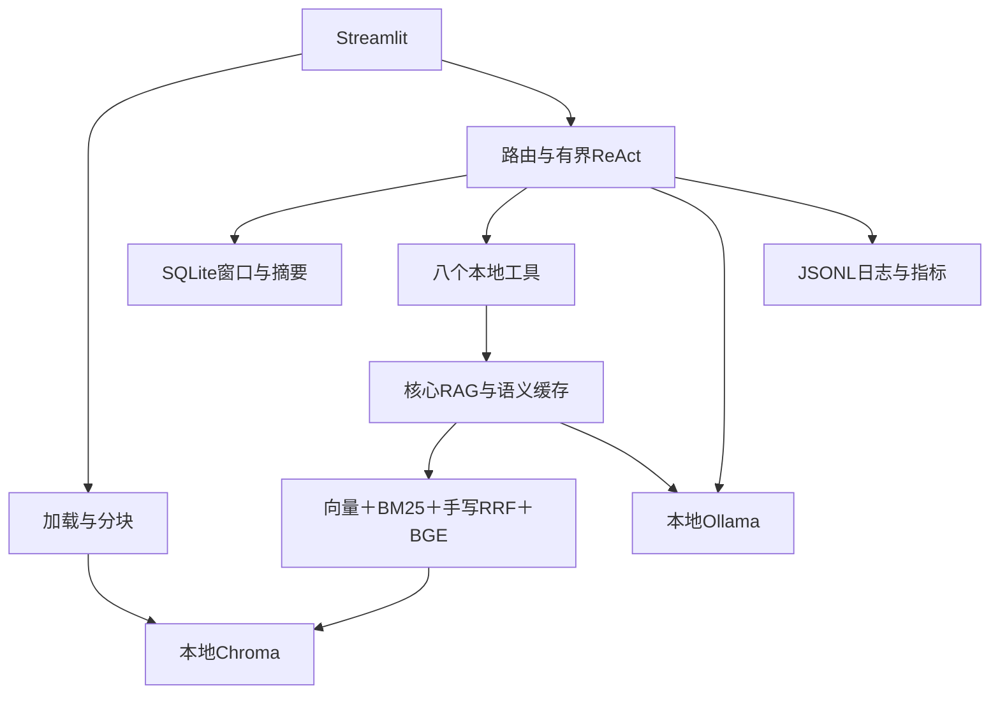

# 技术设计文档

本页统一维护课程需求与验收。依据[课程实践](%E5%8D%97%E4%BA%AC%E5%86%9C%E4%B8%9A%E5%A4%A7%E5%AD%A6%E8%AF%BE%E7%A8%8B%E5%AE%9E%E8%B7%B5.docx)、[交付模板](%E9%A1%B9%E7%9B%AE%E4%BA%A4%E4%BB%98%E6%A8%A1%E6%9D%BF.docx)；实验见[课程实验记录](../reports/%E8%AF%BE%E7%A8%8B%E5%AE%9E%E9%AA%8C%E8%AE%B0%E5%BD%95.md)，操作见[用户手册](%E7%94%A8%E6%88%B7%E4%BD%BF%E7%94%A8%E6%89%8B%E5%86%8C.md)。更新：2026-10-10。

## 1 架构与实现

单个Streamlit应用直接调用Python业务模块；LangChain仅提供Message、Document、分块和工具等基础组件，RRF及有界ReAct手写。本地模型失败明确提示，默认关闭联网搜索。

| 模块/源码 | 接口与职责 |
| --- | --- |
| `src/data_loader/` | 按扩展名加载PDF/DOCX/TXT/Markdown，返回带来源位置的Document；批量进度与失败项重试 |
| `src/chunking/` | 固定、递归、句段三种策略；稳定doc_id/chunk_id和来源继承 |
| `src/retrieval/` | `VectorStore.search()`、BM25、混合融合与模型精排；本地持久化和增量更新 |
| `src/generation/` | Prompt、上下文预算、流式生成、引用定位、缓存、三类降级 |
| `src/agent/` | Thought/Action/Observation循环、注册工具、路由与并行、SQLite记忆 |
| `src/frontend/` | 上传、科研对话、文档检索、知识库、会话和执行轨迹 |
| `src/utils/` | YAML配置、消息转换、日志及Token/检索/工具指标 |

参考[ai-chatbot@6979d717](https://github.com/dsy1018/ai-chatbot/tree/6979d7173ed0f92910a8571dd4ca1b4a171a2c49)：上游 `app/core/rag.py` 映射加载/分块/检索/生成，`embeddings.py`/`llm.py`映射本地模型调用，`agent.py`/`memory.py`映射决策/记忆，`app/tools/`映射简单工具注册，`frontend/app.py`映射界面。保留本项目目录、YAML和直接模块调用；上游单轮Function Calling不作为多步ReAct完成依据。

本轮按用户确认恢复到`1f40458`（回退提交`d758f91`），再参考本地`/Users/rean/github/Agent-RAG`的`88147d2`：借鉴直接返回最终答案、清晰的循环和窗口处理。保留课程要求的真实Ollama、M3E、Chroma、BGE及八个本地工具。本次继续按课程基本范围精简：删除CSS/按钮尺寸、文档回收站、会话归档恢复、旧RAG历史兼容及停机修复CLI；合并文献列表，索引状态改为预期/实际块数判断，健康检查只读连接和块数。摘要每次压缩一批，Observation只解析完整JSON，删除科研原句/数量换算校验，保留真实引用与输入输出预算。

### 数据流与约定

1. 导入：内容SHA-256标识文档，分块生成稳定ID；只计算新块向量，部分失败重试补缺项。预期块数与实际块数用于入库状态；更换解析、分块或模型配置时应从原文建立新索引。
2. 检索：向量与BM25双路召回，手写 `RRF(d)=Σ1/(60+rank(d))`；融合Top-20交BGE精排，返回Top-5。长块按Token分窗、表行复用表头，选中摘录进入Prompt。
3. 生成：科研角色、上下文、问题和必要引用规范组成rag-v24（引用要求放在问题之后，不使用答案占位示例）。按相关性纳入证据，动态截断并预留输出预算；引用仅映射实际入选来源。PDF用从1开始的物理页，DOCX用段落/表格，文本用行号。
4. Agent：原生工具选择→校验执行→观察→继续/结束；最多8轮，独立调用最多2个，异常有界恢复、重复调用强制停止。完成条件只检查当前工具状态、并行任务结果和异常恢复；单项报告保留工具正文和引用，子问题/组合任务由观察阶段继续判断。文档参数共用一份字段声明并绑定本轮真实ID，文档关键词从原文读取。有效最终JSON回答直接返回；Observation收到完整JSON后一次解析，RAG工具仍逐包显示正文。无工具时使用最终回答Schema，通识可作答，缺少论文证据仍标记未完成。
5. 记忆：LangChain Message/Document与简单Context字典连接模块；SQLite按用户/会话归属保存整轮问答。摘要与历史共享2000Token窗口，每次最多压缩预算内一批旧问答，剩余内容留待后续请求；完整消息保存在SQLite。Agent请求超预算时只移出发送副本中的最旧整轮历史；不递归删来源或截工具正文，仍超限则提示缩小任务。

八个本地工具：`knowledge_base_search`、`paper_metadata`、`paper_compare`、`keyword_extract`、`paper_summary`、`current_time`、`calculator`、`paper_list`。课程清单列六类本地科研工具及可选搜索、产出要求八个工具；计算与文献列表补足本地数量，`web_search`是默认关闭的额外第九个。

空检索提示无文献并允许纯模型回复；低相关候选等待用户查看、确认/取消；服务失败提示重试。语义缓存仅复用同用户/会话、语料和配置的正常有来源答案，警告结果不缓存。代码校验生成状态、引用编号与真实来源映射；论文对象、实验条件和解释由人工审核，不再使用原句/数量换算规则判断科研质量。

论文对比按两篇ID分别检索方法、数据集、结果，去重并分配上下文预算；一次模型请求生成三维对照，由程序校验结构和引用归属、显示缺项。移除章节、指标白名单和固定句式判断；内容与实验条件是否准确仍需核对原文。关键词保留原文依据；生成异常记录部分正文与Token，重排保留索引恢复提示。

侧栏分别显示服务连接/模型安装、索引读取及本页实际推理/向量检索成功时间；刷新连接保留时间，浏览器重载后重新记录。缓存、历史重绘与失败不能冒充新业务成功。公开轨迹显示工具、参数、结果、耗时与必要决策说明。

## 2 配置与存储

| 配置 | 当前值/含义 |
| --- | --- |
| `llm` | Ollama localhost:11434；qwen2.5:7b；T=0.1、p=0.9、生成k=40；上下文16384、输出1024Token |
| `embedding` | 本地m3e-base，CPU，768维，批量32；固定revision与目录见YAML |
| `retrieval` | Chroma cosine、search_ef=100；返回5、候选20、RRF常数60；本地bge-reranker-base、CPU、512Token分窗 |
| `chunking` | recursive；512字符、64字符重叠；semantic为句段边界切分 |
| `generation` | 上下文9000/Prompt18000字符；发送前词表核对完整输入≤15360Token；BGE低相关阈值0.1；缓存阈值0.97、容量100 |
| `agent` | 8轮、独立并行2、工具等待300秒、重试1次、相同调用最多2轮、联网关闭 |
| `memory` | 历史窗口2000Token；10轮触发摘要，最近4轮保留，摘要上限400Token |
| `paths` | 原文data/raw、索引data/index、会话data/sessions/memory.sqlite3、日志logs；权重data/models |

配置统一由 [src/utils/config.py](../src/utils/config.py)读取 [config.yaml](../config.yaml)。生成top_k是词候选数，与检索Top-K文档数不同。改模型/分块时按新配置建立独立索引，避免混用向量。

## 3 课程需求与验收状态

“已实现”表示代码接通；真实链路、实验和语义质量分别验收。自动回归不能替代模型质量。证据统一见[课程实验记录](../reports/%E8%AF%BE%E7%A8%8B%E5%AE%9E%E9%AA%8C%E8%AE%B0%E5%BD%95.md)、[系统评测](../reports/%E7%B3%BB%E7%BB%9F%E8%AF%84%E6%B5%8B%E6%8A%A5%E5%91%8A.md)与[Bad Case](../reports/Bad_Case%E5%88%86%E6%9E%90%E6%8A%A5%E5%91%8A.md)。

| 编号 | 课程要求 | 当前状态/验证 |
| --- | --- | --- |
| M1-01 | 多格式加载、批量进度、失败重试 | 已实现；多格式样例与部分入库重试验证 |
| M1-02 | 三种PDF库对比；双栏/跨页表格/公式 | 12篇179页三库对比完成；复杂排版部分支持、扫描件无OCR |
| M1-03 | 三种分块；固定256/512/1024与召回报告 | 五组300条排名、K=3/5/10共900组复算完成 |
| M1-04 | bge-large-zh/m3e-base与Chroma/FAISS对比 | 效果/速度对照完成，选M3E/Chroma；跨语言质量有限 |
| M1-05 | 批量向量化、持久化、增量与Top-K | 已实现；重启与查询验证，原生产6份/276块内容指纹保留；本轮快照7份/279块，新增另计 |
| M1-06 | BM25+向量、手写RRF、模型重排 | 已实现；Windows三档Hit@5/MRR/Recall对比完成 |
| M2-01 | 专用Prompt、动态上下文与参数对比 | 已实现；历史v2八组160条实验，当前v24未重跑参数全对照 |
| M2-02 | 文档名/页码引用与可追溯 | 映射/原文查看已实现；最新Windows基本问答来源通过，历史正式论文错来源/漏引用仍待质量审核 |
| M2-03 | 流式输出与动态引用 | 已实现；真实流式、断流和来源定位验证 |
| M2-04 | Embedding语义缓存 | 已实现；真实M3E同义/相反条件对照，警告不缓存；未识别错答仍可能复用 |
| M2-05 | 空结果/低相关/模型失败降级 | 三类已实现；确认复用来源快照，取消不执行内部生成 |
| M2-06 | 问题/Top-K/答案/耗时/Token/Top-1日志 | 已实现；正常日志实测，异常部分正文与用量一致性回归通过 |
| M3-01 | 手写有界ReAct与System Prompt | 三阶段/完成判断/轮次上限已实现；科学任务可能不完整 |
| M3-02 | 八个注册且可调用的工具 | 八个本地工具有实测记录，可选搜索另计 |
| M3-03 | 路由与独立并行、耗时对比 | 已实现；双计算/双元信息调用验证，12请求串并行对照完成 |
| M3-04 | 超时/异常恢复与循环终止 | 已实现；两端回归、7轨迹回放、56次并发0异常；线程不能强杀 |
| M3-05 | 会话隔离、Token窗口、阶段摘要 | 已实现；隔离/长历史/摘要实测，摘要有损 |
| M4-01 | RAG核心工具、来源路由、记忆、统一消息 | 全链路接通；默认本地，联网显式启用 |
| M4-02 | Token/检索/工具指标与公开轨迹 | 已实现；逐轮执行表、累计统计和日志核验 |
| M4-03 | 模型与向量库健康检查 | 已实现；连接/读取与本页业务记录分开，最新网页复测通过 |
| M4-04 | 上传/进度/列表/删除/向量状态 | 已实现；预期/实际块数、确认后删除及部分失败验证 |
| M4-05 | 流式Markdown/引用/会话新建切换删除 | 已实现；历史重绘不再次调用模型 |
| M4-06 | 全流程/空库/大文件/长对话/并发与截图 | 日常回归精简为106项；Mac 106项回归与10项真实基本流程通过；原答与AppTest见[本轮验收](../reports/5_4_4%20端到端联调与测试/基本功能精简验收_20261010/acceptance.json)。Windows 106项回归、10项真实流程及最终引用实机复测通过，见[部署验收](../reports/5_4_4%20端到端联调与测试/Windows基本功能精简验收_20261010/本轮部署验收报告.md)；并发仍为历史结果 |
| M5-01 | 10–20篇领域论文 | 12篇公开论文、179页，清单/版本/指纹齐备 |
| M5-02 | 至少50题，事实/对比/归纳/推理 | 60题四类各15、中英各30，参考答案与原文依据已有 |
| M5-03 | 检索/工具/轮次/延迟/Token与图表 | Windows300检索、120Agent、144路由、12串并行已完成 |
| M5-04 | 正确性/完整性/引用准确性人工评分 | 最新120条助手初评完成，用户0/120；非独立盲评、质量未达标 |
| M5-05 | 四类Bad Case、根因与至少一轮优化 | 报告与60题真实前后对照完成；六项审查缺陷已修，基本场景复测不改写历史质量分数 |
| M5-06 | 代码/依赖/Git/环境/Docker | 已交付；Windows与隔离容器真实业务/重启验证，宿主物理断网未做 |
| M5-07 | 评测/技术/使用文档、课程报告与PPT | Markdown已整理；37页Word/14页PPT为10月7日快照，成员待填、待定稿 |

## 4 待完成与边界

- 用户审核[最新120条质量表](../outputs/quality-review-final-20261009/Windows%E7%AD%94%E6%A1%88%E5%8A%A9%E6%89%8B%E5%88%9D%E8%AF%84%E4%B8%8E%E7%94%A8%E6%88%B7%E5%AE%A1%E6%A0%B8_120%E6%9D%A1.xlsx)，再处理论文条件、机制、归纳完整性和来源对应；定向通过不代表全量改善。
- 补充真实成员姓名、班级、学号、分工与贡献比例；结论确定后按模板重建Word/PPT。模板示例成绩与日期不代替实际填写。
- 断网能力已验证预备模型后的容器网络隔离；宿主物理断网、最低硬件及高并发容量尚未完整验证。
- 中文查询英文排名按用户安排暂缓；复杂PDF表格/图片公式与扫描OCR有边界。
- 三个研究问题的真实讨论见系统评测。未证明Hit@5=85%、Token节省80%、每次0.002元或8GB内存/4GB显存目标；8192不是课程硬性上下文要求，当前16K在实测Windows硬件可运行。
