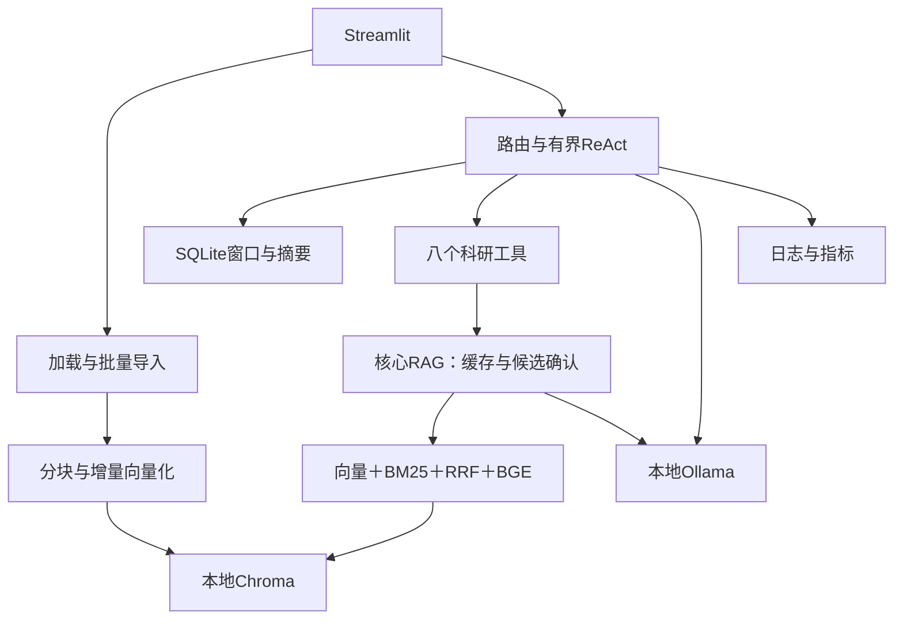

# 智能科研助理技术设计文档

本文统一维护本科课程项目的技术方案、需求与验收，不再另设需求清单。更新：2026-10-07；实施细节见[QA索引](QA/README.md)，使用见[手册](用户使用手册.md)，测量与原始证据见[报告索引](../reports/README.md)。

模块一至四已实现主要业务链路，2026-10-07最新756项自动回归通过。用户确认同步启动，本轮按开始时本地／远端的`98b2424`记录，未直接读取Windows Git。[现场复测](../reports/5_4_4%20端到端联调与测试/Windows修复后复测_98b2424_20261007/Windows修复后复测报告.md)中ViT首轮主设置改善，但重复轮仍混淆分类头与位置编码；对比方法改善，数据集和定量结果仍不足。本地提交`c6b0875`修复补入前文挤掉命中数据集正文的问题，新补丁真实效果待同步核验。原标签异常、整体质量和原索引完整性仍未通过。

源码回归与真实质量分别验收，正式性能基准、容器与断网测试按用户要求在问题修复后执行。此前[迁移后复测](../reports/5_4_4%20端到端联调与测试/Windows索引迁移后复测_20261006/Windows索引迁移后复测报告.md)的RAG、引用与exact缓存样例保留，不作为最新版本全面通过。[历史答案助手初评](../reports/5_5_2%20系统性能评估/历史答案助手初评报告_20261006.md)已完成180/180条，用户审核仍为0/180条；不作为当前代码的新质量成绩，成员实际贡献及最终Word／PPT仍待完成。

## 1 依据、范围与研究问题

依据[南京农业大学课程实践](南京农业大学课程实践.docx)、[项目交付模板](项目交付模板.docx)及[ai-chatbot固定版本](https://github.com/dsy1018/ai-chatbot/tree/6979d7173ed0f92910a8571dd4ca1b4a171a2c49)（提交`6979d7173ed0f92910a8571dd4ca1b4a171a2c49`）。已读取该版本41个文件，以源码实际行为为准，不把宣传介绍当成绩。

采用单个Streamlit应用直接调用Python模块，本地Chroma与SQLite；不增FastAPI、独立数据库服务或额外Agent框架。LangChain仅用于Message／Document、分块与工具等基础组件，RRF和有界ReAct手写。Agent统一决策、RAG为核心知识工具，保留混合重排、并行恢复、窗口摘要、轨迹及全部课程实验。

生成参数、Chroma集合约定、科研工具响应检查、论文ID提取和JSONL写入共用简单函数；停用的轨迹绘图代码已删除，保留七列表格及指标。关键流程增加中文注释，详见[代码精简与验证记录](../reports/5_5_4%20项目交付/代码精简记录_20261005.md)。

运行采用本地Ollama＋Qwen2.5:7b、本地M3E与BGE，权重准备后按离线方向运行，失败明确提示，不静默切云端。联网搜索额外可选，默认关闭；完整容器断网验收尚未完成。

三个研究问题：

1. 学术PDF中分块、返回K和Embedding怎样影响检索？已有模型选型与五组分块／K实验。
2. Agent相较固定每题RAG节省多少Token？144条Mac开发对照已保留，正式Windows性能待测。
3. 科研任务有哪些独立工具组合，并行能缩短多少延迟？完整对照3/12暂停，R01源码修复后尚未重跑。

课程介绍中的Hit@5 65%→85%、失败减少60%、Token节省80%、每次约0.002元、8GB内存／4GB显存等为参考目标，无本项目完整实测依据，不写成已达成绩；成本／硬件适用范围需实际测量。研究背景中的“空白”也不是已证明结论。

## 2 项目结构

```text
project/
├── README.md
├── requirements.txt
├── config.yaml
├── src/
│   ├── data_loader/              模块一：文档加载
│   │   ├── pdf_loader.py
│   │   ├── docx_loader.py
│   │   └── text_loader.py
│   ├── chunking/                 模块一：文本分块
│   │   ├── fixed_chunk.py
│   │   ├── recursive_chunk.py
│   │   └── semantic_chunk.py
│   ├── retrieval/                模块一：检索层
│   │   ├── vector_store.py
│   │   ├── bm25_retriever.py
│   │   ├── hybrid_retriever.py
│   │   └── reranker.py
│   ├── generation/               模块二：生成层
│   │   ├── prompt_template.py
│   │   ├── rag_pipeline.py
│   │   ├── streaming.py
│   │   └── cache.py
│   ├── agent/                    模块三：Agent 层
│   │   ├── react_loop.py
│   │   ├── tools.py
│   │   ├── router.py
│   │   └── memory.py
│   ├── frontend/                 模块四：前端
│   │   ├── app.py
│   │   ├── pages/
│   │   └── components/
│   └── utils/                    工具函数
│       ├── logger.py
│       └── config.py
├── tests/                        测试
│   ├── README.md / helpers.py
│   ├── 5_1_1 文档加载与批量导入/
│   ├── 5_1_2 文本分块策略/
│   ├── …                       按5.1.1～5.4.4小节组织
│   └── 5_4_4 端到端联调与测试/
├── docs/                         文档
│   ├── 技术设计文档.md
│   └── 用户使用手册.md
├── reports/                      评测报告
│   ├── 评测集.json
│   ├── 系统评测报告.md
│   ├── 性能评测数据.xlsx
│   ├── Bad_Case分析报告.md
│   └── 5_1_2 文本分块策略/ … 5_5_4 项目交付/
└── docker/
    ├── Dockerfile
    └── docker-compose.yml
```

原始课程资料保留；运行原文、模型、索引、会话和日志在Git忽略的data／logs中。tests与reports按“5_1_1 中文小节名”组织；pages／components沿用既定目录，不拆多套服务。

## 3 参考源码映射

| 已完整阅读的参考文件 | 参考的实际实现 | 本项目位置与采用方式 |
| --- | --- | --- |
| `app/core/rag.py` 的 `load_document()`、Loader 映射 | PDF/Word/TXT/Markdown 按扩展名加载 | `data_loader/` 三个文件；保留分发思路，补课程 Word 表格与来源 |
| 同文件的 `split_documents()` | 递归字符切分 | `chunking/recursive_chunk.py`；另外两种策略放指定文件 |
| 同文件的向量库初始化、入库与增量添加 | Chroma 持久化与批量向量写入 | `retrieval/vector_store.py`，不增加向量库服务 |
| 同文件的分词、BM25、手写 RRF 和两种重排 | 双路召回、排名融合、模型/关键词重排序 | 分别映射 `bm25_retriever.py`、`hybrid_retriever.py`、`reranker.py` |
| `app/core/embeddings.py` | 在线/本地 Embedding 包装 | `vector_store.py` 的本地 `get_embeddings()`，比较两个模型后仅配置选定模型，不另建管理框架 |
| `app/core/llm.py`、`rag.py` 的 `build_context()` | 兼容 LLM、工具绑定、流式生成、上下文 | `generation/rag_pipeline.py`；Prompt 和流式分别放指定文件 |
| `app/core/agent.py` | 一轮 Function Calling、注册表、ToolMessage、事件生成器 | `agent/react_loop.py`、`tools.py`、`router.py`，补课程有界循环 |
| `app/core/memory.py` | 会话隔离、内存/SQLite、Token 窗口 | `agent/memory.py`；采用 SQLite，补简单摘要 |
| `app/tools/weather.py`、`search.py` | `@tool`、HTTP 超时、结果与错误文本 | `agent/tools.py`；天气只参考写法，科研工具集中实现 |
| `app/api/chat.py`、`knowledge.py`、`tools.py`、`app/models/schemas.py` | 对话/入库/工具流程、请求校验与事件响应 | 映射模块函数和少量字典；不新增 HTTP API 或 schemas 文件 |
| `app/main.py`、`core/metrics.py`、`utils/logger.py` | 生命周期、健康状态、计数、Token 估算与日志轮转 | 初始化由前端协调；统计和日志集中在 `utils/logger.py` |
| `frontend/app.py` | 侧栏、对话区、逐步渲染、会话与开关 | `src/frontend/app.py`，用模块调用替换 HTTP 客户端 |
| `config.py`、`.env.example` | 集中配置、密钥与运行参数 | `config.yaml` + `src/utils/config.py`；密钥读环境变量，不建立第二套配置 |
| `tests/conftest.py`、五份 `test_*.py`、`pytest.ini` | mock 隔离、记忆/RAG/工具/API/集成测试 | 测试按5.1.1～5.4.4小节归类，公共样例归入 `tests/helpers.py`；不声称上游测试已经通过 |
| 两份 Dockerfile、`docker-compose.yml`、两份忽略文件 | 容器与本地数据挂载 | `docker/` 中只运行一个 Streamlit 服务，保留数据挂载方式 |
| 两份依赖清单、7 个空初始化文件、`README.md`、`docs/architecture.md`、`RESUME.md` | 依赖约束、包组织、使用与设计介绍 | 按实际使用依赖和本项目成果整理，不照搬宣传结论 |

上游PDF／Word加载、随机ID、单轮工具调用、无摘要及HTTP前端与课程需求不同，适配在既定模块内完成；来源稳定ID、真实索引删除、历史管理、模型健康和质量指标均按当前实现核验，不直接照搬上游测试数量或示例。

## 4 当前架构与数据契约



### 导入、检索与生成

多格式加载保留文件SHA-256与真实位置，按三种策略分块生成稳定chunk_id；新块计算M3E向量后加入Chroma，重复块跳过，部分失败重试只补缺项。BM25复用库中正文，长期实例增删后重建。

检索两路各候选20，手写RRF常数60，融合Top-20交本地BGE精排，最终Top-5。按同类分数排序，在6000上下文／12000 Prompt字符预算内截断，引用只映射实际入选来源。PDF用物理页、Word段落／表格、文本行号，缺位置不编造。

空检索明确无文献并纯模型降级；低于BGE sigmoid 0.1等待用户确认，复用审阅快照／原问题／过滤生成，取消不调用模型。新问题、会话切换、语料或配置变化使确认失效。核心工具语义缓存按用户／会话及语料／配置隔离，只存正常有来源无警告结果；命中跳过工具内部搜索／生成，其他Agent阶段仍可耗Token。

### 决策、工具与记忆

Thought规划、Action校验执行、Observation观察继续／结束；规则只快速处理明确任务，组合意图不遗漏，独立调用最多2个，同名不同参数允许并行。工具超时／异常有界重试或替代，相同参数重复与8轮上限终止；Python线程不能强杀。

八个本地工具为knowledge_base_search、paper_metadata、paper_compare、keyword_extract、paper_summary、current_time、calculator、paper_list；web_search为默认关闭的第九个。文件名需经真实列表唯一映射完整ID；完整简单RAG／摘要／对比报告保留，不二次改写丢来源。复杂任务仍由模型决策，结构合法不能证明科学回答正确。

SQLite固定用户归属、整轮事务保存。历史JSON用本地Qwen词表限制2000 Token；10轮触发阶段摘要、保留最近4轮、摘要最多400 Token，失败不覆盖旧摘要。摘要＋历史共享预算，原文归档保留；系统／工具／当前问题另占完整模型窗口。

### 消息、页面与指标

内部使用LangChain Message／Document和简单Context字典。`messages_to_ollama()`统一原生消息转换，`normalize_context()`统一history／summary；工具观察与恢复仅当前轮，RAG来源保持独立结果。

当前主区三标签：科研对话、文档检索、知识库。滚动消息、原生发送框、逐轮七列执行表和累计状态；知识库双栏原文、状态表与删除归档恢复。侧栏提供系统状态、上传、会话管理，ID显示前八位而内部保留完整值。

日志按request_id／call_id及阶段保存问题、证据、答案、耗时和实际模型Token；未知保留未知。运行候选命中率不等于Hit@5，工具成功不等于答案正确，Top-1 sigmoid分布不是置信概率。健康为内部函数，检查Ollama目标模型与已有Chroma，不为探针生成答案或建库。

## 5 接口与配置

| 模块 | 公共入口／结果 |
| --- | --- |
| 加载 | load_document／load_pdf／load_docx／load_text：路径→list[Document]；batch_import加载保存、batch_build_index继续索引并产进度 |
| 分块 | split_documents及三种split函数：Document→带区间／来源／稳定ID的块 |
| 存储 | get_embeddings；VectorStore.add_chunks／search／count／list_chunks／delete_document |
| 检索 | BM25Retriever.search／rebuild、rrf_fusion、HybridRetriever.search、Reranker.rerank；结果[(Document,score)] |
| 生成 | build_rag_messages、build_context／prepare_rag_context、generate_answer、resolve_citations、stream_answer；token／done／error事件 |
| 缓存 | SemanticCache.lookup／put／clear、cache_scope；工具入口按当前用户／会话绑定 |
| Agent与记忆 | run_react、run_session、MemoryManager；消息、Context和明确完成／未完成状态 |
| 配置／日志 | load_config、messages_to_ollama／normalize_context、RAG及Agent快照、健康检查 |

唯一配置为[config.yaml](../config.yaml)，路径由src/utils/config.py相对项目根解析，密钥如需使用从环境变量读取；不另设配置体系。

| 配置 | 当前关键值 |
| --- | --- |
| importing／chunking | 单份20MB；recursive、512字符、重叠64 |
| embedding／retrieval | 本地M3E 768维、CPU／32批；Chroma cosine、search_ef100、4线程；Top-5／候选20／RRF60；本地BGE批8、512Token |
| llm | 本机Ollama、qwen2.5:7b、T0.1／p0.9／k40、num_ctx8192、num_predict512 |
| generation | 字符预算6000／12000、低相关0.1、缓存相似度0.97／容量100 |
| agent | 最多8轮、并行2、工具总预算300秒、重试1、相同调用2；联网false |
| memory | 历史2000Token、摘要触发10轮／保留4／上限400；本地官方词表 |
| paths | data/raw、data/index、data/sessions/memory.sqlite3、logs |

Python3.10.10，直接依赖版本固定在requirements.txt，间接依赖按兼容范围解析，不复制其他Python版本环境。模型revision固定、推理只读local_path；换模型／索引配置需明确重建或重启，不混旧向量。Docker仅编排一个Streamlit业务应用与本地Ollama运行时，验收状态单列。

## 6 课程需求与验收

以下保留全部30项M1～M5编号、需求和验收方式；详细实现／实验链接由QA索引提供，原始结果由reports提供。

### 模块1：文档处理与检索

| 编号 | 课程要求 | 验收方式 | 当前状态 |
| --- | --- | --- | --- |
| M1-01 | PDF、Word、TXT/Markdown 加载；批量导入、进度和失败重试 | 各格式真实样本文档，检查正文、表格、来源与导入状态 | 已实现；多格式、进度、失败项重试，见5.1.1。 |
| M1-02 | 比较 PyPDF2、pdfplumber、PyMuPDF；处理双栏、跨页表格和公式 | 同一论文的解析对比，记录损失、性能和限制 | 常见场景已实现；三库只做官方资料对比，按用户范围仅实现PyMuPDF；复杂排版有边界。 |
| M1-03 | 至少三种分块：固定、递归、语义；仅固定大小比较 256/512/1024，递归/语义使用默认参数 | 同一文献和评测问题，比较五组设置的召回，提交分块实验报告 | 五组真实分块实验已完成；固定三档、递归／句段默认参数，见分块报告。 |
| M1-04 | 比较 bge-large-zh、m3e-base；Chroma 与 FAISS 选型 | 记录效果、速度、资源占用和选型理由 | 双语开发基准与数据库对照已完成，选M3E／Chroma；跨语言质量仍有限。 |
| M1-05 | 批量向量化、持久化索引、增量更新、Top-K 检索 | 重启可检索；新增文档无需全量重建 | 已实现；Windows98b2424限定查询临时恢复可用，来源与限制可见；原Label异常仍在，完整性未通过。本次对比68.981秒仅为单次观察，不作正式性能或单因素归因。 |
| M1-06 | BM25 + 向量检索；手写 RRF；接入 Reranker | 核验融合与重排；三档对比 Hit@5、MRR | 已实现；真实BGE与三档开发实验完成；后续60题指标见系统评测报告。 |

### 模块2：RAG生成

| 编号 | 课程要求 | 验收方式 | 当前状态 |
| --- | --- | --- | --- |
| M2-01 | 专用 Prompt；按相关性拼接与动态截断；比较生成参数 | 保存 Prompt 版本、Temperature/Top-p/Top-k 和实验结果 | 已实现；当前rag-v6与完整请求预算；历史v2八组160条对照选择0.1／0.9／40，后续未重跑完整参数实验。v6首轮主设置改善，重复轮仍把分类头线性层归给位置编码，语义质量不稳定。邻块遮蔽修复本地通过，真实效果待同步核验。 |
| M2-02 | 引用文档名和页码，回答可追溯 | 用真实原文逐项核验引用；无物理页码格式记录段落位置 | 映射与原文查看已实现；98b2424首轮ViT第3／18页引用编号有效，重复轮第3页原文明确支持分类头而非位置编码变化，仍发生对象混淆。编号有效不等于语义正确，3份助手初评待用户审核。 |
| M2-03 | 流式答案与动态引用标记 | 界面可逐步输出，引用指向实际来源 | 模块二及Agent正文流式已接通；此前Windows ViT已观察正文逐步更新，本次终态有有效引用，但不代表语义质量通过。断流保留有本地受控证据。 |
| M2-04 | 基于 Embedding 相似度的语义缓存 | 比较重复、近似问题的命中和响应耗时 | 核心RAG已接缓存；2026-10-06真实KB原样重复显示exact命中，来源保留、工具内部零Token。本轮重复ViT用户问题重新检索生成，但两轮工具question不同，不能单独证明原生警告排除规则；该规则有本地回归，近似语义及范围失效仍待专项。 |
| M2-05 | 无结果、低相关性、模型调用失败三类降级 | 空库有明确提示；低相关性可查看来源；失败可重试 | 三类降级已实现；Windows正常对比恢复警告、低相关、截断与不足说明保留，任务未完成；低相关确认、服务故障与断流保留仍以本地受控证据为准。 |
| M2-06 | 记录问题、Top-K 文档、答案、耗时、Token 和 Top-1 分数 | 实际请求的日志字段完整，统计基于真实数据 | 完整JSONL及按模型版本Top-1分布已实现；缓存／确认复用排除新检索。 |

### 模块3：Agent决策与记忆

| 编号 | 课程要求 | 验收方式 | 当前状态 |
| --- | --- | --- | --- |
| M3-01 | 手写 ReAct 核心循环与 System Prompt | 有工具选择、执行和返回记录；任务完成或达到迭代上限时终止 | 有界三阶段及Prompt已实现；此前Windows TXT列表→限定回答正确。本轮ViT程序完成不代表人工语义通过，对比不足保持未完成；失败恢复仍需故障原生复测。 |
| M3-02 | 开发并注册工具集；目标 8 个可调用工具 | 每个工具有输入、输出、真实调用记录；数量差异见下文 | 八个本地工具已注册／调用，搜索另作默认关闭的第九个；98b2424对比方法证据改善，数据集和数值仍不足。本地c6b0875修复邻块遮蔽命中正文，实际选择和定量召回待复测。 |
| M3-03 | 工具选择路由与独立工具并行执行 | 验证检索、对比、计算等问题的路由；比较并行耗时 | 规则＋模型路由、同名独立参数并行已实现；R01回归通过，完整串并行实际实验待补。 |
| M3-04 | 超时重试/跳过、异常恢复、死循环强制终止 | 构造对应失败，核验有界恢复和用户提示 | 超时有界等待／重试／替代／重复和上限终止已验证；线程不能强杀。 |
| M3-05 | 会话隔离、Token 滑动窗口、阶段性摘要 | 两个会话互不干扰；长历史可截断与压缩 | 会话归属、2000Token窗口、阶段性摘要已接页面；长历史功能通过，摘要有损。 |

### 模块4：系统集成与前端

| 编号 | 课程要求 | 验收方式 | 当前状态 |
| --- | --- | --- | --- |
| M4-01 | RAG核心工具接入Agent及本地/联网来源路由，接入记忆，统一Message/Context | 上传到问答全链路使用真实数据，跨模块来源不丢失；区分本地文献与最新外部信息 | Agent调度RAG、本地／联网规则、会话与统一消息已接通；多步科学质量待评。 |
| M4-02 | 统计 Token、检索指标/延迟、工具成功率/耗时；展示决策轨迹 | 记录可核查的工具决策与执行结果，不要求披露模型私有思维过程 | 公开阶段／分工具Token／检索和调用指标已记录；页面逐轮表＋累计状态，可展开已有计划、参数、结果与完成判断。 |
| M4-03 | 健康检查模型服务与向量数据库 | 分别模拟服务可用与不可用，返回真实状态 | 连接／读取检查已实现；Windows f5b26c7明确显示推理／检索未验证，不再把可连接／可读取称为服务全面正常。实际推理与索引完整性需独立验收。 |
| M4-04 | 上传、进度、文档列表/删除、向量化状态 | 批量文档操作和索引状态保持一致 | 上传、管理、真实索引状态、删除归档与恢复已实现；最新布局见手册。 |
| M4-05 | 流式对话、Markdown、引用、会话新建/切换/删除 | 实际会话操作、引用跳转和输出可演示 | 科研对话流式／Markdown／引用及会话管理已实现；独立单轮RAG标签按用户要求删除。 |
| M4-06 | 端到端联调；空库、大文档、长对话；并发如适用 | 保存测试记录；交付 3–5 张真实界面截图 | 最新98b2424现场报告保存4张原生截图及1张单独标注的本地PDF渲染；3份助手初评待审核，语义质量及完整比较仍未通过。本地c6b0875待同步原生复测；部署、离线和正式性能延后。 |

### 模块5：评测与交付

| 编号 | 课程要求 | 验收方式 | 当前状态 |
| --- | --- | --- | --- |
| M5-01 | 选定研究方向，收集 10–20 篇论文 | 保存论文清单、版本和可定位的原文 | 12篇公开论文、179页及版本／哈希／来源齐备。 |
| M5-02 | 至少 50 条问答，覆盖事实、对比、归纳、推理四类 | 每题有参考答案与依据；统计总量及四类覆盖 | 60题初版四类各15，中英各30，依据定位通过；独立人工复核待做。 |
| M5-03 | Hit@5、MRR、Recall、工具调用准确率、平均轮次、延迟和 Token | 同一评测集跑配置对比，保留原始结果和图表 | 五组检索／两组Agent基线／优化后60题数据与图表齐备；Mac耗时不作最终性能，Windows待测。 |
| M5-04 | 正确性、完整性、引用准确性人工评分 | 统一评分标准，逐题记录评分和理由 | 三项0～4分标准齐备；助手逐条初评180/180、分数与理由另存，用户审核0/180。各轮现场答复另存定性初评，本次2条待审核；历史初评不代表当前代码新质量成绩，独立终审未完成。 |
| M5-05 | 检索/生成/引用/Agent 四类 Bad Case；至少一轮优化 | 保存失败证据、根因、改动及优化前后对比 | 四类案例及至少一轮同输入真实优化完成；退化与残留保留，后续源码修复未新增模型成绩。 |
| M5-06 | 完整代码、环境说明、Git 历史、Docker 部署 | 在干净环境复现；检查实际运行记录 | 代码／依赖／Git／Docker文件与构建记录已有；完整容器、离线与重开验收未完成。 |
| M5-07 | 评测报告、技术设计、用户手册、演示 PPT | 检查完整文档、真实截图/图表、演示与踩坑/优化记录 | 报告／设计／手册和Word／PPT初稿已有；真实成员、人评与最终验收后定稿。 |

## 7 实验证据、质量边界与交付

[系统评测报告](../reports/系统评测报告.md)区分早期6篇／96配对查询的块级开发基准与12篇／60题的页级评测，保存检索、Agent、优化及图表；[Bad Case报告](../reports/Bad_Case分析报告.md)保留改善、退化及根因。Mac耗时仅历史开发观察，不作为Windows最终性能。

最新756项回归和逐项修复见[测试说明](../tests/README.md)及[独立审查修复记录](../reports/5_5_4%20项目交付/独立审查问题修复记录_20261006.md)。[本次逐项结果](../reports/模块完整性验证/Windows邻块遮蔽修复回归_20261007.json)失败／错误／跳过均为0，历史失败记录保留。[Windows现场报告](../reports/5_4_4%20端到端联调与测试/Windows修复后复测_98b2424_20261007/Windows修复后复测报告.md)含4张原生截图和3份待审核初评：ViT首轮主设置改善，重复轮仍混淆分类头；对比方法改善，数据集／定量结果不足，68.981秒仅为单次观察。同指纹PDF核验及新增用例复现前置邻块挤掉数据集正文，c6b0875保持预算、优先保留命中正文，30项对比及756项全量通过，真实效果待同步验证。DETR节选缺失指标不能编造，ViT上下文缺数值不等于全文无数据。重复用户问题的工具参数不同，缓存专项不能据此完整验收；原标签异常、完整串并行／容器、用户质量审核及成员资料仍待完成。

### 交付模板约束

- 保留课程考核表与报告封面：学院、课程、学分、考核方式、题目、四位成员的班级/学号/姓名。个人信息与成绩不代填。
- 原模板为 2026–2027 学年第 1 学期，表中时间为 2026 年 12 月 30 日；该日期为模板字段，是否为实际截止日期待课程安排确认。
- 项目背景不超过 200 字。
- 团队分工包括角色、成员、职责、模块、贡献比例；四人的实际贡献比例合计 100%。
- 每个模块各有一张完成情况表，区分已实现、未实现、部分实现。
- 报告包括项目概述、团队分工、模块交付清单、技术实现记录、技术设计、总结展望、附录。
- 附录包含真实代码目录和可复现的环境配置步骤。
- 最终 Word 格式按原模板：目录黑体二号加粗；一级标题黑体三号加粗；正文按仿宋四号、1.5 倍行距处理。Markdown 骨架不能替代最终排版检查。

### 原文差异与处理

1. **工具数量**：模块三产出要求 8 个工具，具体工具清单只列知识库检索、论文元信息、论文对比、关键词提取、摘要生成、当前时间、联网搜索，共 7 类；联网搜索被标为可选。背景中另有计算器示例。本设计用原文六个必需工具，加背景中的计算器，再将已有文献管理的列表函数封装为第八个本地工具；联网搜索另作第九个可选工具，默认关闭。文献列表只复用现有功能，不增加业务子系统。该补足为本项目设计选择，不能误写为原文已列出的清单；八个本地工具均须实际可调用。
2. **引用精度**：交付模板写文档名，课程正文要求文档名和页码。按正文保留更完整的来源；Word/TXT 等没有可靠物理页码时使用段落或行位置，不伪造页码。
3. **模板示例状态**：原表格中的“已实现/未实现/部分实现”是填写示例，不是本项目现状。此清单按当前代码重新标注。
4. **模型下载示例**：模板的 `ollama pull bge-large-zh` 不直接作为执行依据；当前 Embedding 由 HuggingFace 本地加载选定的 M3E，Ollama 负责 Qwen 生成，不照搬该示例下载命令。
5. **报告编号**：模板的“技术实现记录”未显式带一级序号；报告骨架整理为第四章，保持后续第五到第七章内容。
6. **PDF 比较范围**：用户明确指定选择 PyMuPDF、另外两种无需实现。保留课程原始要求与编号，实际以三库官方资料对比完成选型，不新增另外两套加载器，也不声称完成三库同论文性能实验。


## 2026-10-06 独立审查修复

实现记录见[逐项修复报告](../reports/5_5_4%20项目交付/独立审查问题修复记录_20261006.md)。导入／删除／恢复按文档串行，拒绝已删除原文的旧任务补写；递归重复片段的来源区间持续向前推进。新增三个缺陷用例先复现失败，修复后相关 80 项通过。原索引保留，旧分块来源不自动改写；Windows 真实验收状态继续保留未通过。

完整请求预算与截断状态已修复：本地Qwen词表覆盖RAG／Agent最终消息和工具结构，预留输出；裁剪同步来源，只改发送副本。length终止工具／日志统一未完成且不缓存。相关237项验证通过，词表估计不替代服务实际Token指标。

### 2026-10-06 检索与工具确认修复

限定文档检索采用持久化向量精确余弦排序；中文常用学术术语扩展用于BM25和BGE。论文对比低相关候选支持会话绑定确认，复用原证据、索引或配置变化失效；单篇摘要不能代替两篇对比完成。关键词文件名预检、原生ToolMessage JSON预算补齐。Agent核心60、科研工具93、混合检索44项回归通过；Windows W13/W17/W18仍待真实复测，详见[修复记录](../reports/5_5_4%20项目交付/独立审查问题修复记录_20261006.md)。

### 2026-10-06 并发与超时资源修复

M3E/BGE首次加载加互斥且保留失败重试；工具使用跨请求的进程共享执行额度，迟到函数退出前不释放，容量不足明确拒绝启动。仍不声称底层函数已被取消；多进程不在本约束范围。决策优化48、存储34、混合检索45项通过，真实模型并发负载待验收。

### 2026-10-06 RAG流式与前端状态修复

核心知识库回答接通NDJSON增量事件，有界快照队列，断流保留部分正文且未完成；最终会话只保存整轮。按持久化预期块ID区分部分／完整入库，重开页面重新核验，旧索引明确完整性未核验。公开执行过程可展开查看，长ID仅展示副本缩略；健康提示区分连接检查与推理／检索。旧RAG正文和来源记录兼容回放，缺失状态与指标仍为未知；标题使用首条查询。详细验证及原失败证据见逐项修复报告，Windows真实验收待完成。

### 2026-10-06 重复计算与布局精简

同次RAG请求复用起始范围且结束复核；BM25复用最多4份正文相同的评分索引，仍读取当前来源，新增／删除及同数量替换不沿用旧正文。原文每次验证指纹，最多缓存8份解析结果并复制返回。块布局保留相交完整行坐标，未定位布局保留首块并附指针；旧索引不覆盖。中间Agent日志改为当前公开步骤，结束保存完整轨迹。分块／检索／缓存／原文／指标167项通过，最终全量回归另记录。

### 2026-10-06 Windows标签读取异常

用户确认`f5b26c7`同步重启后，[真实复测](../reports/5_4_4%20端到端联调与测试/Windows修复后复测_f5b26c7_20261006/Windows修复后复测报告.md)中全库向量及TXT的BM25可用，TXT与ViT限定持久化向量均报`Label not found`。本地仅对该异常临时重算指定文档的同版本本地向量，保留来源和恢复提示，不改写原索引；健康限定查询仍复用持久化向量。新增6项受控回归通过，其他读取与编码故障仍如实上报。底层索引完整性及Windows新补丁效果待核验，不视为原索引已修复。

Agent明确单一知识库任务失败且无可用替代证据时，保留真实错误及未完成状态，不允许元字段缺失改写为空库；后续成功检索的真实空结果仍可报告。低相关确认说明保留向量恢复限制，断流正文按工具调用ID保留。本轮再补3项回归；初轮749项暴露部分正文被覆盖，修正后最终749项全部通过。模型HTTP受控、实际索引隔离，不增加Windows新质量或性能成绩。

### 2026-10-06 Windows真实问答问题修复

`8909c56`现场限定向量恢复可用，TXT问答及PDF物理页引用预览通过本次样例；ViT真实回答与对比仍未通过。句末明确的语言／引用要求只从检索输入移除，原生成问题保留；`rag-v5`强化事实对象、条件和严格编号，不放宽引用校验或猜测来源。对比引用与低相关确认保留恢复警告，同实例只复用最近一篇正文和块ID相同的临时向量，每次读取当前来源，健康标签优先用持久化向量。

新增5项先复现后验证；混合检索文件19项、对比文件28项、存储文件22项通过。初轮754项中1项旧预算样例因提示变长报错，改为当前完整模板另留500字符，原有160字符挤占断言和完整请求预算断言继续保留，产品预算未放宽。最终754项全部通过，45.796秒仅为本地测试运行时间。现场报告、初轮错误与最终日志均保留，真实模型质量、对比证据选择、Windows用时及原索引完整性仍需后续验证。

### 2026-10-07 Windows维度证据预算修复

`bda7d3c`现场ViT引用格式与物理页映射有效，仍未说明相对位置编码是消融替代；对比保留恢复限制与未完成状态。新受控用例复现数据集／结果分数混排挤掉方法候选，修复后摘要预算保持独立、正文按去重后的非空维度组均分，原始来源、实际分数、相关性阈值与总请求预算保持。提示升至`rag-v6`，缺少设置归属时不能自行补成主方法。代码与测试提交`21b2ec0`。

新增1项先失败后通过，对比文件29项通过；全量755项、18小节、48文件通过，49.731秒仅为本地测试运行时间。4张现场截图与2个助手初评保留，新补丁效果及索引完整性待原生核验，正式部署验收、离线与性能测试继续延后。

### 2026-10-07 Windows邻块遮蔽命中正文修复

`98b2424`现场对比方法证据改善，但ViT数据集仍未选出。相同SHA-256的本地ViT全文第4页存在ImageNet、ImageNet-21k和JFT；双侧邻块扩展让前文占满维度预算，实际送入模型的文字丢掉已命中的Datasets段。保持原预算，按实际保留区间判断：前置补充挤掉命中正文时仅移除该候选前文，保留命中正文与连续后文；摘要候选也保留已提取的摘要正文。原文、来源、阈值与定量结果完整性检查不变，提交`c6b0875`。

新增1项先复现后修复，实际HTTP模型输入、连续原文、行号、截断标志和未修改输入均核验；30项对比及756项全量回归通过，失败／错误／跳过均为0，51.474秒仅为本地运行时间。初次测试使用已过滤的字符元数据、初次修复误用未裁剪end_index的失败证据均保留，最终改为实际保留字符末端。新补丁需同步后原生验证，不能把受控测试当成真实模型已选对数据集或定量指标。

ViT首轮已正确陈述默认1D及无显著2D收益，但同用户问题重复后又把分类头微调线性层归给位置编码，语义质量仍不稳定。重复轮重新检索生成；两轮工具question不同，不能单独证明缓存警告排除规则的原生效果，仍需专项。3份现场答复的助手初评待用户审核；原标签异常、量化召回及整体质量未通过，部署验收、容器、离线与正式性能继续延后。
