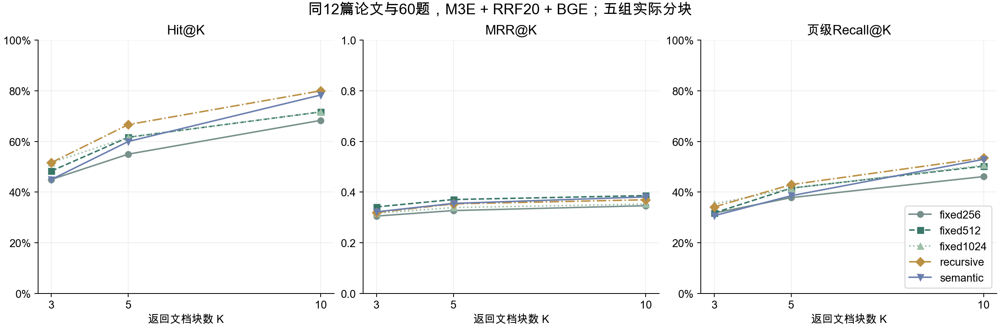

# 五组分块检索对比（2026年10月4日）

同一12篇视觉Transformer论文、60题（中文/英文各30题；事实、对比、归纳、推理各15题），原文均英文。只改变分块策略，统一M3E、Chroma、BM25＋手写RRF候选20、BGE重排。固定256/512/1024；递归和语义均保留512字符、64字符重叠默认值。语义切分按句子/段落边界，不是额外Embedding模型切分。

## 完整结果

每题获取一次Top-20排名，再按K=3/5/10复算。相关性为论文SHA-256与物理页匹配；同页多块不重复增加Recall。Hit表示至少命中一个金标准页，MRR使用首个相关块的排名。

| 分块策略 | 块数 | K | Hit@K | MRR@K | 页级Recall@K |
|---|---:|---:|---:|---:|---:|
| fixed256 | 3746 | 3 | 45.00% | 0.3056 | 31.72% |
| fixed256 | 3746 | 5 | 55.00% | 0.3272 | 37.83% |
| fixed256 | 3746 | 10 | 68.33% | 0.3464 | 46.14% |
| fixed512 | 1698 | 3 | 48.33% | 0.3417 | 31.81% |
| fixed512 | 1698 | 5 | 61.67% | 0.3708 | 41.58% |
| fixed512 | 1698 | 10 | 71.67% | 0.3863 | 50.25% |
| fixed1024 | 870 | 3 | 51.67% | 0.3167 | 35.33% |
| fixed1024 | 870 | 5 | 61.67% | 0.3392 | 41.50% |
| fixed1024 | 870 | 10 | 71.67% | 0.3530 | 50.64% |
| recursive | 1694 | 3 | 51.67% | 0.3194 | 34.17% |
| recursive | 1694 | 5 | 66.67% | 0.3536 | 42.97% |
| recursive | 1694 | 10 | 80.00% | 0.3699 | 53.50% |
| semantic | 1737 | 3 | 45.00% | 0.3222 | 30.69% |
| semantic | 1737 | 5 | 60.00% | 0.3556 | 38.58% |
| semantic | 1737 | 10 | 78.33% | 0.3811 | 52.94% |



## 选择与限制

保留递归512/64、返回Top-5、候选20作为默认：Hit@5最高66.67%，Recall@5最高42.97%；固定512的MRR@5更高0.3708，不能宣称递归在全部指标最优。返回10块使递归Hit@10达到80%、Recall@10为53.50%，但增加生成上下文和引用数量，因此不直接替换当前预算。固定1024字符块存在模型512 Token输入截断风险，减少块数不等于保留全部语义。中文查询下语义切分Hit@5为70%，英文为50%，不能据单个分组认定其跨语言更好。

三档检索基线使用同一递归默认时Hit@5同为66.67%，本实验补的是分块与返回K维度，不把重排候选10/20/40当作返回K对比。当前未达到课程宣传的85%目标，保留实际结果。

## 时间与中断记录

| 策略 | 索引构建 / 秒 | 平均Top-20查询 / 毫秒 |
|---|---:|---:|
| fixed256 | 122.488 | 1069.11 |
| fixed512 | 109.121 | 2843.84 |
| fixed1024 | 未知（断点未记录） | 6501.57 |
| recursive | 155.529 | 1993.79 |
| semantic | 141.633 | 2593.44 |

耗时为真实单遍记录，K共用一次Top-20查询，不能称各K单独的端到端耗时。最初与Agent评测及6GB Colima虚拟机共享资源；15:17停止本次虚拟机释放内存。第159条后发现报告重复复制全文字符坐标导致文件约468MB，保留完整题目排名与来源字段，去除报告冗余坐标后约3.6MB，核对输入/config与索引稳定块ID后续跑，原PDF和完整索引元数据未修改。fixed1024首次构建耗时没有在断点中写入，因此明确未知。重启加载/预热未计入正式查询；各组不是隔离负载的速度公平竞赛，不据此给出绝对速度结论。

## 证据与复现

[300条原始排名](五组分块检索对比_20261004.json)、[900组独立数值复核](五组分块检索对比_20261004_独立复核.json)、[日志](五组分块检索对比_20261004.log)、[实验脚本](evaluate_chunking.py)。来源SHA-256和配置保存在JSON；前端等后续源码有更新，结果对应记录日的源码快照。

```bash
.venv/bin/python "reports/5_1_2 文本分块策略/evaluate_chunking.py" --root /tmp/rag-chunks-new --output /tmp/rag-chunks-new.json
.venv/bin/python "reports/5_5_4 项目交付/verify_experiments.py" chunking
```

索引与输出使用新目录，禁止覆盖用户知识库或旧结果；续跑使用原参数加`--resume`。
