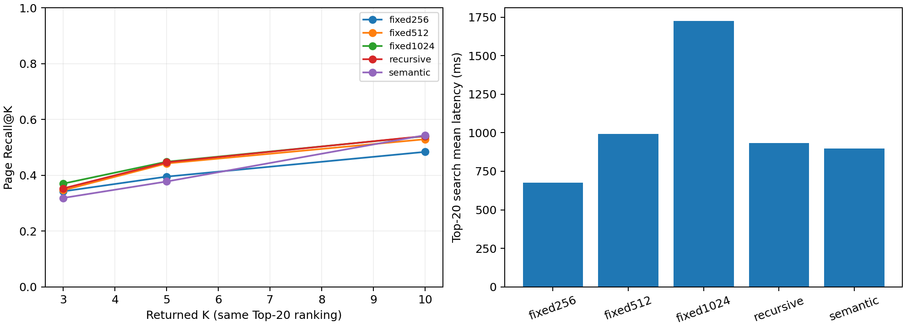

# 分块策略对比实验报告

实验日期：2026-10-10，Mac Python3.10.10、CPU4线程。当前加载器与分块源码，固定12篇PDF、60题、同一M3E、Chroma、BM25/RRF候选20和BGE精排。原始逐题排名与配置、源码SHA见[分块检索结果](最终验收_20261010/分块检索结果.json)；复现入口为[evaluate_chunking.py](evaluate_chunking.py)。前120条完整结果保留，在同输入/配置下断点续跑，不重复记入分母。

固定分块分别为256、512、1024字，重叠64；递归和句段边界分块为512/64。代码名 `semantic` 表示按句子/段落边界切分，未使用额外语义向量聚类模型。

| 策略 | 块数 | Hit@5 | MRR@5 | Recall@5 | Top-20平均检索/毫秒 |
| --- | ---: | ---: | ---: | ---: | ---: |
| fixed256 | 3738 | 56.67% | 0.3497 | 39.50% | 676.0 |
| fixed512 | 1696 | 66.67% | 0.3922 | 44.22% | 992.9 |
| fixed1024 | 869 | 65.00% | 0.3906 | 44.83% | 1724.6 |
| recursive | 1692 | 68.33% | 0.3828 | 44.64% | 933.4 |
| semantic | 1733 | 58.33% | 0.3786 | 37.75% | 898.9 |

| 策略 | Recall@3 | Recall@5 | Recall@10 |
| --- | ---: | ---: | ---: |
| fixed256 | 34.22% | 39.50% | 48.36% |
| fixed512 | 34.64% | 44.22% | 52.89% |
| fixed1024 | 37.00% | 44.83% | 53.97% |
| recursive | 35.28% | 44.64% | 54.06% |
| semantic | 31.86% | 37.75% | 54.33% |

指标：每题至少命中一个标注物理页计Hit；首次命中倒数计MRR；已命中的去重标注页数/该题全部标注页数计Recall。块可跨页，同页重复块不重复增加召回。K=3/5/10共用同次Top-20精排，耗时列是Top-20检索耗时，不能解释为各K的生成延迟。

在当前60题及K=5下，递归512命中率最高（68.33%）；固定512的MRR略高（0.3922），固定1024的Recall略高（44.83%）。没有单一策略同时赢得所有指标，继续使用递归512/64可兼顾命中、边界可读性和索引规模。增加K至10会提升页级召回，同时引入更多上下文；是否提升答案质量需与生成预算一同衡量。

范围：页级金标准较粗，同一页命中不保证选中完整答案句；英文论文、中文/英文各30题，与开发材料有重叠。五组按固定顺序执行、每组60题，仅提供本机观察结果，不推断总体显著性。Embedding对比是另一冻结块基准，不把它与本实验拼成完整联合参数搜索。
