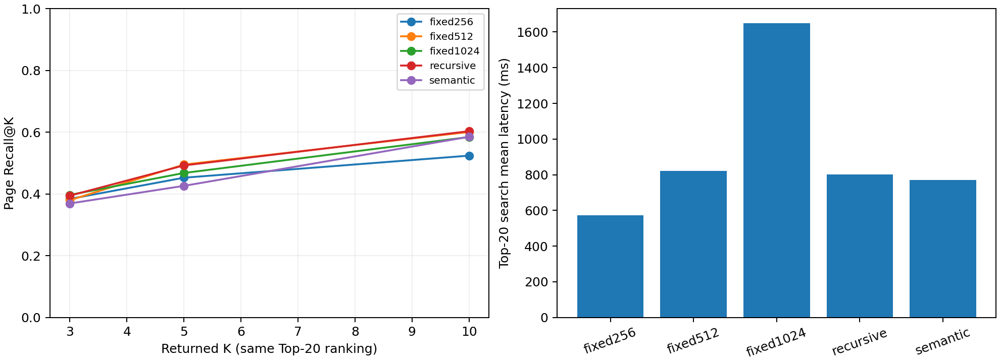

# 分块策略对比实验报告

实验日期：2026-10-11，Mac Python3.10.10、CPU4线程。当前加载器与分块源码，固定12篇PDF、60题、同一M3E、Chroma、BM25/RRF候选20和BGE精排。原始逐题排名与配置、源码SHA见[分块检索结果](最终验收_20261011/分块检索结果.json)；复现入口为[evaluate_chunking.py](evaluate_chunking.py)。本轮按同语言规则重新运行五组，每组60题；不混入此前的跨语言结果。

固定分块分别为256、512、1024字，重叠64；递归和句段边界分块为512/64。代码名 `semantic` 表示按句子/段落边界切分，未使用额外语义向量聚类模型。

| 策略 | 块数 | Hit@5 | MRR@5 | Recall@5 | Top-20平均检索/毫秒 |
| --- | ---: | ---: | ---: | ---: | ---: |
| fixed256 | 3738 | 63.33% | 0.3908 | 45.25% | 571.8 |
| fixed512 | 1696 | 68.33% | 0.4428 | 49.50% | 821.0 |
| fixed1024 | 869 | 66.67% | 0.3989 | 46.78% | 1648.8 |
| recursive | 1692 | 71.67% | 0.4114 | 49.22% | 800.8 |
| semantic | 1733 | 63.33% | 0.4197 | 42.61% | 771.4 |

| 策略 | Recall@3 | Recall@5 | Recall@10 |
| --- | ---: | ---: | ---: |
| fixed256 | 38.39% | 45.25% | 52.39% |
| fixed512 | 37.97% | 49.50% | 60.06% |
| fixed1024 | 39.69% | 46.78% | 58.42% |
| recursive | 39.44% | 49.22% | 60.31% |
| semantic | 36.92% | 42.61% | 58.50% |

指标：每题至少命中一个标注物理页计Hit；首次命中倒数计MRR；已命中的去重标注页数/该题全部标注页数计Recall。块可跨页，同页重复块不重复增加召回。K=3/5/10共用同次Top-20精排，耗时列是Top-20检索耗时，不能解释为各K的生成延迟。

在当前60题及K=5下，Hit最高为 recursive（71.67%），MRR最高为 fixed512（0.4428），Recall最高为 fixed512（49.50%）。结果只反映本题库的页级排名表现；正文边界可读性和答案质量需结合其他实验判断。返回更多候选可增加证据覆盖，也会增加上下文。

范围：页级金标准较粗，同一页命中不保证选中完整答案句；12篇论文均为英文，60道题均用英文提问，与开发材料有重叠。五组按固定顺序执行、每组60题，仅提供本机观察结果，不推断总体显著性。Embedding对比是另一冻结块基准，不把它与本实验拼成完整联合参数搜索。
