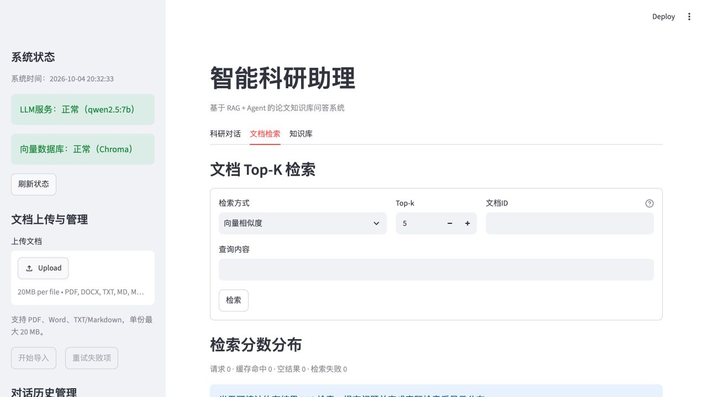
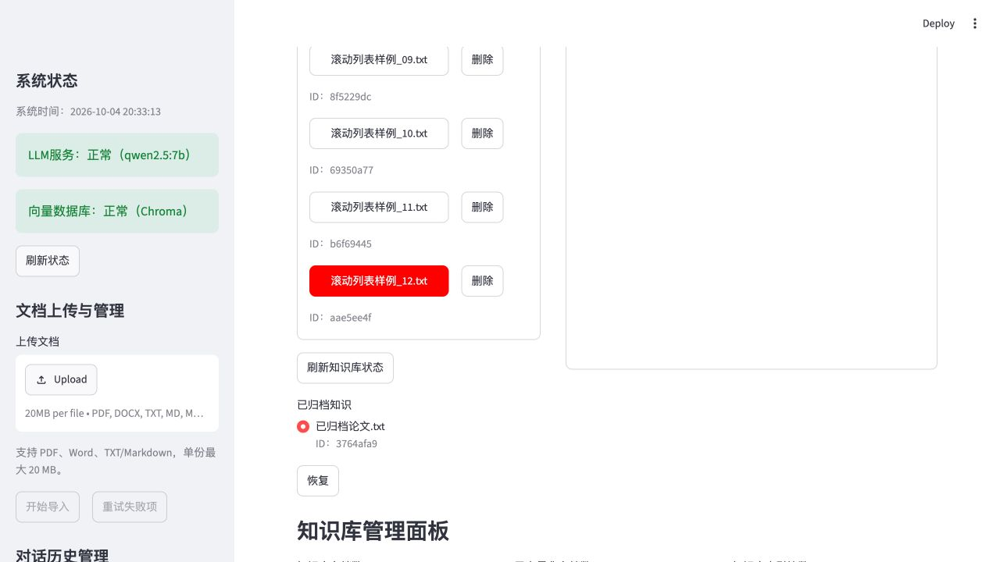
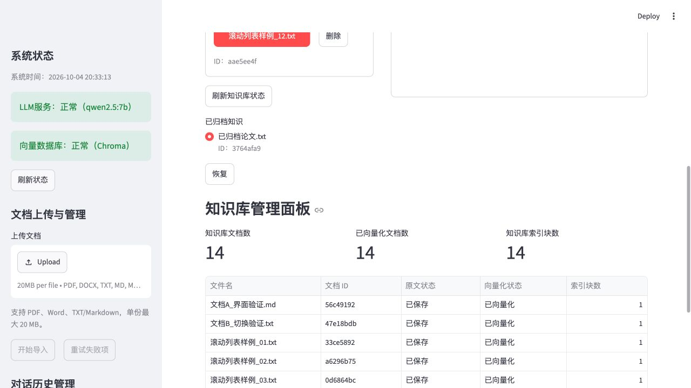

# 检索与知识库显示验证（2026-10-04）

修改和需求依据见[QA](../../../docs/QA/5.4.3%20检索与知识库精简.md)。

[回归.log](回归.log)：34项文档流程测试全部通过，覆盖检索四方式、ID缩写、索引增量、失败重试、部分写入、原文与索引状态、删除/恢复及五列表格。

[预览包装器.py](预览包装器.py)沿用上轮模拟配置，新增12份区分内容的临时列表样例，加上原2份活动原文，共14份，另有1份归档原文；路径 `/private/tmp/rag-library-preview-20261004`，使用SmallEmbeddings及独立Chroma/SQLite，不修改项目业务data、Windows部署，不启动实际模型。LLM健康状态为mock。

[浏览器核验.json](浏览器核验.json)：检索方式/Top-k/文档ID顶部相同；查询框下移84像素。文件列表height600、clientHeight598、scrollHeight1337、overflow=auto，点击末尾文件后scrollTop=738.5，右侧原文随之切换。[最终页面快照](最终页面快照.txt)记录直接显示的面板和五列管理表。

临时8523服务与浏览器页已关闭；py_compile与git diff --check通过。Windows同步代码并完整重启Streamlit后再刷新页面。
