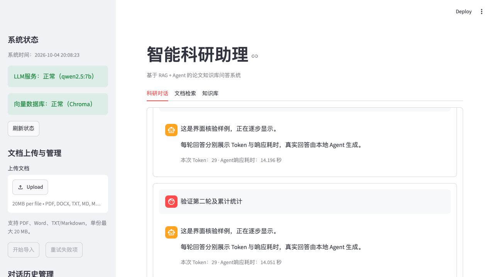
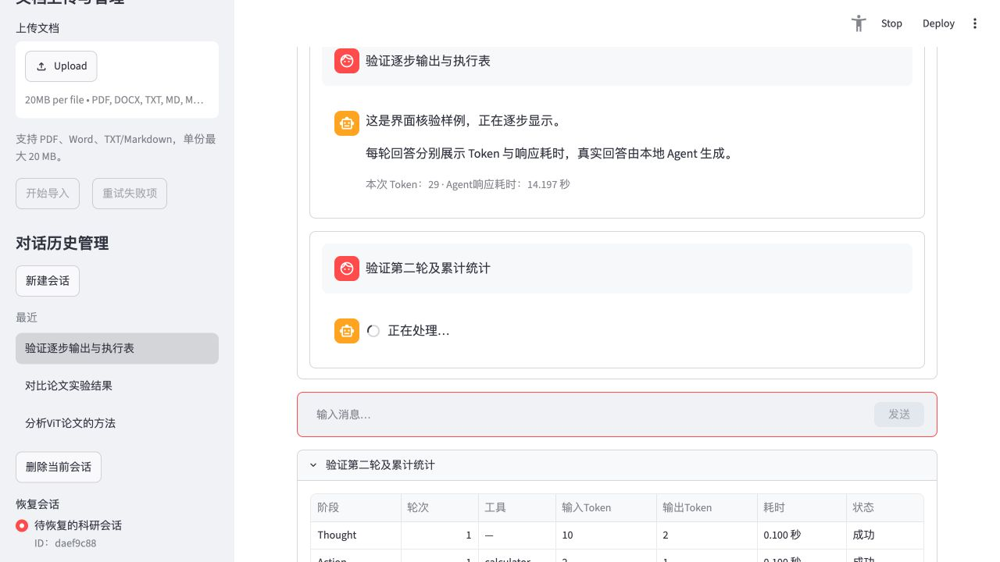
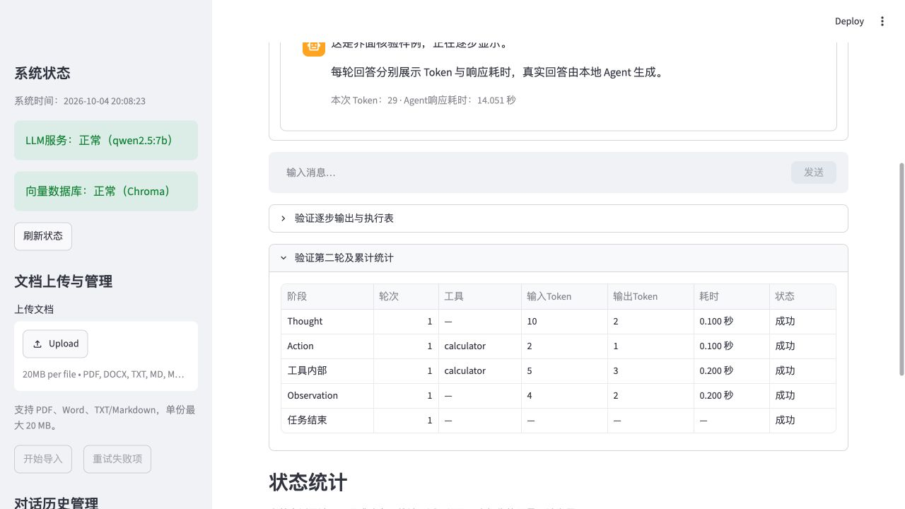
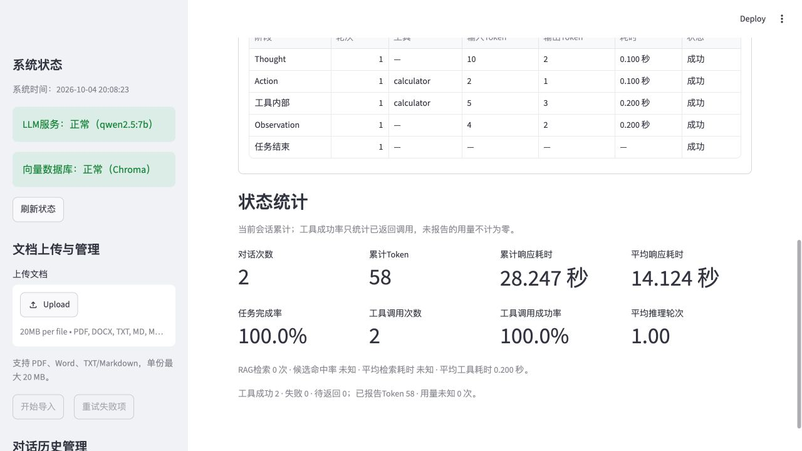

# 科研对话改版验证（2026-10-04）

实现范围和统计口径见[QA](../../../docs/QA/5.4.3%20科研对话改版.md)。使用Python3.10.10、项目现有依赖，不启动Ollama/M3E/BGE真实模型、不测试Mac性能、不修改Windows主机。

## 自动测试

- [回归.log](回归.log)：92项，文档流程、Agent指标、健康检查。
- [对话专项.log](对话专项.log)：35项，5.4.3目录全部测试。
- [生成层保留能力回归.log](生成层保留能力回归.log)：45项，模块二流式/缓存/降级/日志。
- [最终状态补充回归.log](最终状态补充回归.log)：上述中的47项重跑，通过，不重复计数。

共172项不同测试通过。初次旧UI断言失败记录和错误命令日志保留；最终源码py_compile与git diff --check通过。

## 浏览器核验

[预览包装器.py](预览包装器.py)使用临时路径 `/private/tmp/rag-chat-preview-20261004`、SmallEmbeddings、模拟健康状态及带人工延时的Agent公开事件，通过真实Streamlit页面验证UI。原项目data不改写。事件中的工具结果/用量来自fixture，不代表真实工具或模型执行；响应耗时包含模拟等待。

[浏览器布局核验.json](浏览器布局核验.json)保存测量；[最终页面快照.txt](最终页面快照.txt)保存刷新后的页面内容。两轮用量均29，总计58；每轮执行表、来源入口和状态数据从各轮最终快照恢复。内部滚动scrollTop由85变为0，消息区高度保持460。

临时浏览器页和8522预览服务已关闭。Windows同步后需完整重启Streamlit，避免旧Python导入缓存继续使用旧字段。
