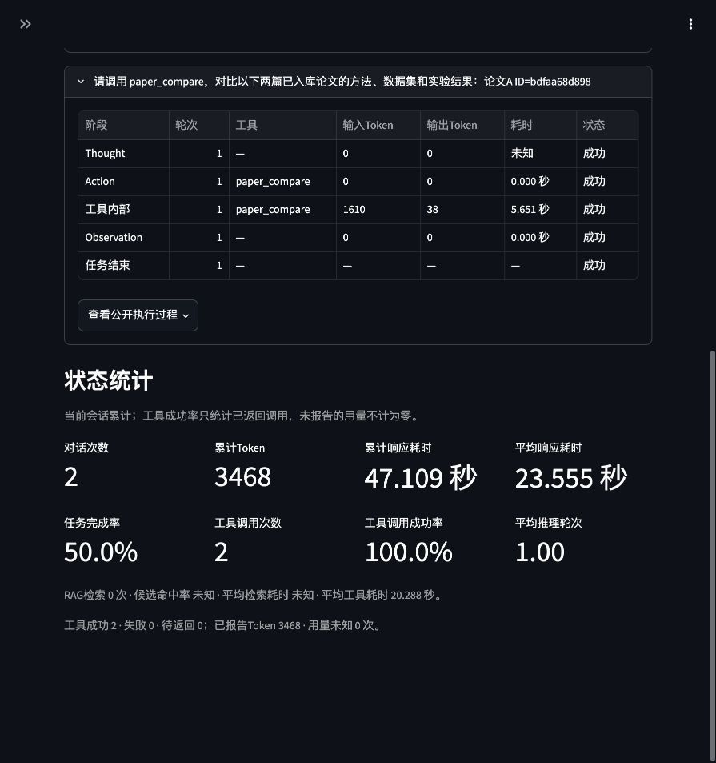

# Windows SSH集中复测与修复

> 状态口径（2026-10-09）：当前实现与验收以[技术设计](../../../docs/%E6%8A%80%E6%9C%AF%E8%AE%BE%E8%AE%A1%E6%96%87%E6%A1%A3.md)为准。带日期的实验数值、截图和“本轮／待完成”描述属于对应历史阶段；自动回归、真实链路、助手初评与用户审核分别记录，局部复测不替代完整题集。Word／PPT保留10月7日快照，按用户安排待结论确定后重建。

2026-10-07，用户授权通过SSH自行迭代。项目为`E:\工作\RAG-Agent`，测试基线`71d0bb9bd52e93c70e00f2ee2459d0b801dda070`加修复提交`043cf29a55e6ba774d7e454370846a6fc282223e`；回归发生在提交前的同一份源码。中文查询英文论文的排名按用户要求暂不处理。

本轮修复Windows旧索引入口拒绝访问和论文对比确认后超预算，Mac与Windows各777项回归通过。真实模型、缓存及页面确认链路另有证据。当前结论为这些功能样例通过；正式容器部署、物理断网、Windows性能基准和全量答案终审仍待完成。

## 环境与数据保护

Windows版本10.0.26300.9457、Python 3.10.10、Ollama 0.35.1；使用本地`qwen2.5:7b`、M3E和BGE权重，生成参数保持原配置。

原库实际为278块／6份文档，包括增量加入的完整Attention论文。此前维护时的184块／5篇是历史快照。测试把真实原文与索引复制到英文临时目录，只在副本改来源路径、执行缓存失效写入及保存独立SQLite会话，不改写原文或原库块内容。复制过程核验278×768向量全部有限且非零，原生HNSW自身查询距离约`-3.58e-7`，见[副本准备记录](真实索引副本.json)。

测试结束后独立进程再次读取原库，278块／6份、正文与来源指纹`a72c99fdf44a68c1f84bcb40c43f2f4193424b43bad13b8ec32c87451e52df5d`一致，6份原文件SHA-256均一致，见[原库核验](原库最终核验.json)。这证明块正文、元信息及原文保持一致，不声称Chroma内部数据库每个字节不变。原有索引备份及`data/index/.gitkeep`的用户工作区状态保留。

## 发现、修复与失败证据

| 问题 | 实际现象与处理 | 验证 |
| --- | --- | --- |
| 旧英文junction不能遍历 | Windows抛`WinError 448`，提示不受信任挂载点。旧入口的readlink目标核验为原索引；同目录新建入口可读取。仅针对448核验目标后建立当前进程的新入口，保留旧入口和原索引；目标不符或其他错误仍报错。没有关闭Windows保护或重建原库，系统层唯一成因未证明。 | [修复前](路径448_修复前.log)、[最终8项专项](路径448_最终验证.log)，真实278块读取及独立进程复核通过。新增3项回归。 |
| Windows回归资源生命周期 | 初轮772项产生129个错误：跨C／E盘相对路径样例及持久Chroma句柄导致临时目录无法删除。运行器在Windows把样例工作目录放TEMP；清理前只停止属于该测试临时目录的Chroma实例，随后正常删除，不忽略错误、不停止其他索引。 | [初轮JSON](Windows初轮回归.json)及[日志](Windows初轮回归.log)保留。第二轮775项剩1个测试夹具的`\\?\`前缀比较失败；改为文件身份核验，未修改产品路径校验。 |
| 对比确认后生成超预算 | 工具已选齐方法／数据／结果且`answered`，Agent却再次请求模型总结，输入预算12204超过7680。路由`用.*结果`把“调**用** paper_compare…实验**结果**”误认为依赖任务，绕开已有结构化报告直返。改为排除“调用”中的“用”，真正依赖前一步结果的任务仍走Agent。 | [页面失败](05_确认后超预算_AX.txt)、[路由修复前](路由调用结果_修复前.log)、[报告保留修复前](确认报告保留_修复前.log)保留。新增2项回归，确认报告保留完整引用与警告，不再多发Observation模型请求；未放宽预算或完成条件。 |

修改前读取固定参考版本的`app/core/rag.py`／`app/core/agent.py`及对应RAG、工具、集成测试；仍沿用本项目单Streamlit、Chroma和手写ReAct结构。

## 全量回归

| 环境 | 用例 | 失败／错误／跳过 | 运行器耗时 | 原始证据 |
| --- | ---: | --- | ---: | --- |
| Mac最终 | 777 | 0／0／0 | 54.917秒 | [JSON](本地最终777项回归.json)、[日志](本地最终777项回归.log) |
| Windows最终 | 777 | 0／0／0 | 225.496秒 | [JSON](Windows最终777项回归.json)、[日志](Windows最终777项回归.log) |

运行器耗时不是模型性能指标。775项中间轮、本地与Windows失败轮均保留；777项由772项加3项路径、1项路由、1项完整报告回归组成。自动回归使用受控模型HTTP；下面的真实权重与页面验证独立记录。

Windows在项目根目录使用已有入口，输出路径必须不存在：

```powershell
.\.venv\Scripts\python.exe reports\模块完整性验证\verify_completeness_tests.py --scope all --output "$env:TEMP\rag-regression-新时间.json"
```

## 真实模型与缓存

[原始JSON](真实模型与缓存.json)及[日志](真实模型与缓存.log)记录：

- 真实M3E、BGE各3线程同时首次加载，构造次数各1且共用同一实例；只包裹真实构造函数计数，没有替换权重。
- 9对缓存协议样例：7对相反条件／符号／单位全部拒绝，2对同义问题semantic命中。固定协议答案不作为质量生成成绩。
- TXT限定问答经真实Qwen生成`WINCHECK20261005`，引用`Windows复测_说明.txt`行1–3。原样重复exact命中、近似问题semantic命中（相似度0.995705），三次调用中实际生成总次数为1，后两次新增模型用量为0。
- 文档范围、配置变更和同数量正文替换均使缓存失效；正文变更只在独立副本进行。

首次复核脚本未在副本更新正文时传已有向量，触发Chroma缺少默认Embedding函数；修正脚本后复测，保留[首次JSON](真实运行_脚本首次结果.json)与[日志](真实运行_脚本首次.log)。这属于验证脚本问题，不通过改产品或跳过断言解决。

## 原生页面确认、取消与刷新

使用真实产品页面和模型，路径配置指向副本与独立会话。问题明确指定完整Attention和ViT的ID，并要求方法、数据集、实验结果三个维度。

首次低分暂停：工具内部生成用量为0，页面展示可定位的候选原文；Agent参数决策本身用了1820Token，不能把整个请求称为零模型调用。取消后没有新增消息轮次。物理页预览可打开，见[预览截图](04_物理页预览.png)。

修复路由后，同输入再次暂停；确认复用原问题、参数和两篇论文证据快照。真实Qwen分别选择A的7／3／1、B的8／4／6号证据，方法／数据／结果齐全，选ViT自己的88.55%等结果而非同页背景iGPT的72%。确认请求1648Token；结构化报告完整保留引用、截断和方法低分提示，Agent终态完成。没有再调用模型压缩原报告。

[页面会话核验](页面会话核验.json)的8项检查全部通过，见[确认后公开页面](07_确认后完成_AX.txt)和[刷新后页面](08_刷新后_AX.txt)。刷新后依然有两轮消息及3468累计Token，未重新生成。页面累计任务完成率50%包含第一轮故意暂停的未完成请求，并不表示确认后的请求失败。



## 质量初评与未完成事项

助手检查实际原文的Attention物理第1／7页及ViT物理第1／2／4页，独立提取事实、渲染并目视核对，21项原文事实／指纹检查通过，见[原文核验](原文事实核验.json)。这些PNG为本地原文渲染，区别于浏览器截图。

[本轮2份助手初评](助手质量初评.md)：TXT正确性／完整性／引用准确性4／4／4；确认后的论文对比4／3／4。对比事实与数字对应正确，但主要并列英文摘要／正文摘录，缺少方法细节及中文综合说明，完整性不评满分。用户审核0／2，独立于历史180条及此前各轮样例，不新增课程质量达标结论。

后续集中执行正式容器／干净环境部署、物理断网、Windows性能及完整串并行对照；同步完成用户质量审核、真实成员资料和最终Word／PPT。尚未覆盖的真实故障注入不能用777项受控回归代替。中文查英文排名保持暂缓。

## 复核脚本

- [prepare_probe.py](prepare_probe.py)：从原库复制真实资料、核验向量及内容一致性。
- [verify_runtime.py](verify_runtime.py)：真实模型并发初始化、RAG和缓存失效，只改副本。
- [verify_original.py](verify_original.py)：独立进程核对原库及文件指纹。
- [verify_page_evidence.py](verify_page_evidence.py)：以只读SQLite连接核对指定测试会话。
- [verify_sources.py](verify_sources.py)：直接读取原文事实并渲染物理页。

所有脚本拒绝覆盖输出。页面包装沿用上轮`verify_full_flow_app.py`，不增加产品服务层。正常应用恢复记录与运行版本以[服务恢复记录](服务恢复记录.json)为准。

收尾通过Git快进同步修复提交`043cf29`，只停止本轮隔离应用的两个Python进程，恢复`src/frontend/app.py`的8501端口服务；健康端点200／`ok`，正常页面可读取原库6份文档／278块，见[公开页面](09_正常入口原库_AX.txt)及[截图](09_正常入口原库.png)。正常会话不导入测试副本历史，原有索引备份与Git工作区的`.gitkeep`状态保留。健康标签继续区分可连接／可读取与实际推理／检索验证。
