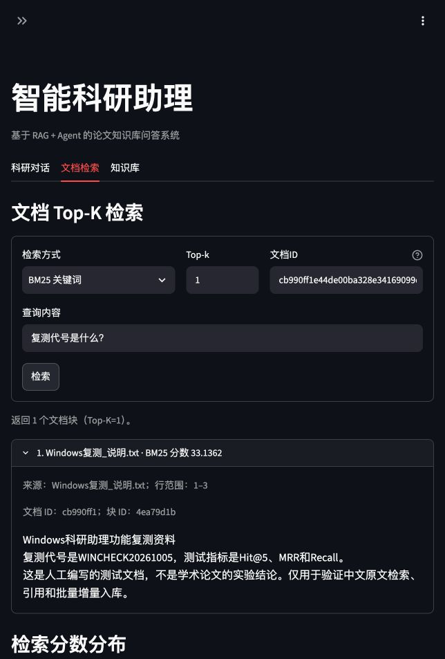

# Windows 修复后复测（f5b26c7，2026-10-06）

> 状态口径（2026-10-09）：当前实现与验收以[技术设计](../../../docs/%E6%8A%80%E6%9C%AF%E8%AE%BE%E8%AE%A1%E6%96%87%E6%A1%A3.md)为准。带日期的实验数值、截图和“本轮／待完成”描述属于对应历史阶段；自动回归、真实链路、助手初评与用户审核分别记录，局部复测不替代完整题集。Word／PPT保留10月7日快照，按用户安排待结论确定后重建。

用户确认 Windows 已通过 Git 同步至 `f5b26c7` 并重启。通过现有浏览器访问 `http://192.168.1.12:8501/`，使用新会话 `98eca3f6c34f4fe3904ac7f431acee5a`，保留旧会话、原文和索引。本轮为真实功能复测，未执行部署、断网、容器或正式性能基准。

## 1 现场结果

| 场景 | 实际结果 | 证据 |
| --- | --- | --- |
| TXT 限定向量 Top-1；问题“复测代号是什么？” | 失败：`RuntimeError: Label not found`，此前中文目录头文件访问错误本轮未出现 | [页面](01_TXT限定Top1.png)、[完整可访问文本](01_TXT限定Top1_AX.txt) |
| 同问题全库向量 Top-1 | 成功返回 `Windows复测_说明.md`，余弦相似度 0.7270、行 1–6；其 Markdown 标记为 `WINMD20261005`，不能替代指定 TXT 的代号 | [页面](02_全库Top1.png)、[完整可访问文本](02_全库Top1_AX.txt) |
| 新会话：“请根据Windows复测_说明.txt回答：复测代号是什么？请注明来源。” | `paper_list` 后正确调用指定 TXT 的 `knowledge_base_search`，但标签读取失败；随后误用 `paper_metadata`，最终错误声称“当前知识库中未找到相关文档”。任务未完成标识正确，失败原因表述错误 | [回答页面](03_TXT问答.png)、[回答与统计](03_TXT问答_AX.txt)、[公开执行过程](04_TXT公开过程_AX.txt) |
| TXT 限定 BM25 Top-1 | 成功返回真实 TXT，分数 33.1362、行 1–3。正文代号为 `WINCHECK20261005`，说明原文仍存在且可读 | [页面](05_TXT关键词检索.png)、[完整可访问文本](05_TXT关键词检索_AX.txt) |
| ViT 限定向量 Top-1；问题“位置编码的作用是什么？” | 同样失败：`RuntimeError: Label not found`，异常不限于 TXT | [页面](06_ViT限定向量检索.png)、[完整可访问文本](06_ViT限定向量检索_AX.txt) |

TXT 文档 ID 为 `cb990ff1e44de00ba328e34169099d3f4704470d7d34fa9b71a586471d715baa`；ViT 为 `8ce7b83971a14508ca711a27c875c9b6914c4f6767cf3150fb1ca6c07aa056d6`。均使用真实列表/页面中的完整 ID，不由短 ID 猜测。页面健康状态为“可读取，检索未验证”，已不把连接检查表述为检索正常。

问答单次响应显示 38.854 秒，总 Token 未知；已知部分与未知调用另列。单次现场观察不作为正式性能成绩。此前其他版本的 RAG、引用和缓存成功样例不计作本版本通过。

## 2 本地修复：限定向量读取

读取已安装 Chroma 的持久化 HNSW 实现及固定参考仓库的检索源码/测试后，仅为明确的 `Label not found` 增加只读恢复：重新读取同一 `doc_id` 的正文和来源，使用集合已核验版本的本地 Embedding 临时计算这一篇的向量，沿用精确余弦排名。正常持久化向量路径不重编码；其他读取或编码异常继续上报，不伪装为空结果。

恢复提示随返回片段、引用和知识库工具结果保留；文档检索页显示限制。低相关候选仍须用户确认，不因此启动生成。原索引不写入、不删除、不重建、不扩大文档范围，也不转云端。异常路径每次需重算该篇正文，实际 Windows 耗时尚未测量。

新增 6 项受控回归覆盖标签异常、其他读取异常、编码失败、引用提示、正常/低相关工具提示和实际 AppTest 页面。存储、引用、科研工具各 20/18/26 项及新增页面用例通过；采用真实临时 Chroma/来源文件、二维替身向量和受控 HTTP，不能代替 Windows 新补丁验收。修复前的[标签异常](../../模块完整性验证/Windows向量标签异常_修复前_20261006.log)、[引用提示](../../模块完整性验证/Windows向量恢复提示_引用修复前_20261006.log)、[工具提示](../../模块完整性验证/Windows向量恢复提示_工具修复前_20261006.log)失败日志保留。

## 3 本地修复：Agent失败原因与断流

明确单一知识库内容任务执行失败、尚无可用替代证据时，直接保留真实工具错误并说明内容未核验、任务未完成；元信息提取成功或字段为空不能证明没有相关文档。保留既有有界恢复流程，后续真正成功的检索空结果仍可如实报告；有引用的替代报告也不被一概阻断。低相关候选的固定确认答复保留恢复限制。

新增3项回归覆盖本次“标签失败→元字段缺失→误报无文档”、后续成功检索的真实空结果及确认提示。最初新增失败证据见[日志](../../模块完整性验证/Windows检索失败误述_修复前_20261006.log)。第一轮全量749项中748项通过，原有断流测试发现新失败说明覆盖了已收到的部分正文，见[初轮JSON](../../模块完整性验证/Windows标签读取与失败表述修复回归_20261006.json)、[初轮日志](../../模块完整性验证/Windows标签读取与失败表述修复回归_20261006.log)。按工具调用ID保存真实流式前缀后，该旧用例与23项Observation测试通过；最终全量749项全部通过，无失败、错误或跳过，见[最终JSON](../../模块完整性验证/Windows标签读取与失败表述修复回归_20261006_最终.json)、[最终日志](../../模块完整性验证/Windows标签读取与失败表述修复回归_20261006_最终.log)。最终45.701秒仅为本地测试时间，不是模型性能测量。

## 4 未验收边界

全库查询成功只能证明这一查询返回了片段；不能证明全部持久化向量可读。原索引中标签读取异常的唯一根因及完整性尚未核验；只读临时恢复不等于修好了底层索引。本轮新补丁尚未在 Windows 运行，整体仍未通过。需更新后复测 TXT、ViT 限定检索与真实回答、中文召回、论文对比恢复、流式及缓存，再决定原索引后续处理。部署、离线与正式性能测试继续按用户要求延后。
