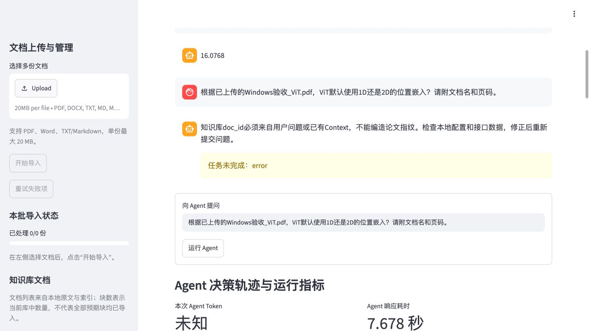

# Windows部署浏览器验收报告

> 状态口径（2026-10-09）：当前实现与验收以[技术设计](../../../docs/%E6%8A%80%E6%9C%AF%E8%AE%BE%E8%AE%A1%E6%96%87%E6%A1%A3.md)为准。带日期的实验数值、截图和“本轮／待完成”描述属于对应历史阶段；自动回归、真实链路、助手初评与用户审核分别记录，局部复测不替代完整题集。Word／PPT保留10月7日快照，按用户安排待结论确定后重建。

测试日期：2026年10月4日。结论：Windows部署可用，文档导入、检索、直接RAG、引用原文与管理流程已实际运行；Agent仍存在真实功能和答案质量缺陷，不能判定整体验收通过。本轮只测试和记录问题，没有修改业务代码或更新Windows部署。

## 1 测试环境和范围

- 地址：用户提供的 `http://192.168.1.12:8501/`，通过浏览器操作实际Streamlit页面。
- 硬件由用户提供：AMD 7940HS、32GB内存、RTX4060 8GB。用户提供的`ollama ps`显示Qwen2.5:7b、模型ID `845dbda0ea48`、5.1GB、100% GPU、上下文8192；没有直接登录Windows验证系统信息。
- 健康检查实际显示Ollama可访问、Qwen已安装、Chroma可读。初始知识库为空；既有请求日志中的一次空库请求不属于本轮。
- Mac仅用于浏览器客户端、保存证据及核对原论文，没有恢复Mac模型、部署或性能实验。表内时间来自Windows页面的服务器指标；上传工具耗时单列。
- Windows的Git提交、Python及依赖实际版本、Ollama版本、模型进程整个测试期间的GPU利用率尚未直接核验。

环境原始记录见[Windows环境.json](Windows环境.json)。步骤结果见[执行记录.json](执行记录.json)；`提交/进度/当前`文件可能是旧状态或中间状态，应以明确完成的结果和展开字段为准。时间戳为观察时刻，不代表服务器开始时刻。

## 2 测试输入

所有文件以“Windows验收”命名，仅用于验收。

| 文件 | 输入来源与用途 | 索引结果 |
| --- | --- | --- |
| Windows验收_ViT.pdf | 已有公开ViT论文，22页，3,743,814字节，原文件逐字节复制 | 167块 |
| Windows验收_DETR节选.pdf | 已有公开DETR论文的前两页节选，533,907字节；不是完整论文 | 13块 |
| Windows验收_说明.docx | 人工生成两段中文，含WINDOCX20261004标记 | 2块 |
| Windows验收_说明.txt | 人工中文加载样例，含WINRAG20261004标记 | 1块 |
| Windows验收_说明.md | 人工Markdown加载样例，含WINMD20261004标记 | 1块 |
| Windows验收_损坏.pdf | 故意写入非PDF文本，验证失败与重试 | 预期失败，不计入知识库 |

文件哈希和预期用途见[测试输入完整清单.json](测试输入完整清单.json)。TXT中的“验收文档数量为三个”是样例正文，不能当作当前知识库数量。Word通过ZIP/所有XML完整性检查及python-docx逐段回读；技能附带验证器因本地缺少defusedxml未运行成功，此限制不代表Windows加载失败。原始论文未覆盖。

## 3 功能结果

| 范围 | 本轮实际结果 | 主要证据 |
| --- | --- | --- |
| 服务健康 | Ollama/Qwen及Chroma正常 | [初始页面](01_初始页面.txt) |
| 空库降级 | 明确提示无知识库依据，不伪造引用 | [空库结果](02_空库_结果.txt) |
| PDF上传、解析、分块、索引 | ViT导入167块，SHA-256 ID与原文件一致 | [PDF导入](04_PDF导入_后续.txt) |
| PDF/Word/TXT/Markdown批量增量导入 | 新批4成功、1预期失败；原ViT167块保留，全库5份184块 | [批量结果](17_批量文档导入_结果.txt) |
| 失败项单独重试 | 四份成功文件尝试次数仍1；损坏PDF变2，重试批次1/1，仍正确失败 | [重试表格AX](19_损坏PDF重试_AX.txt) |
| 向量/BM25/RRF/模型重排 | 四种方式均返回5条、分数递减、来源可见；BGE重排前三条来自ViT第3页 | [向量](10_向量检索_提交.txt)、[BM25](11_BM25检索.txt)、[RRF](12_RRF混合检索_结果.txt)、[BGE](14_模型重排_结果.txt) |
| 论文直接RAG与引用 | 返回patch线性嵌入及位置编码回答；存在分块/证据选择质量观察，见缺陷部分 | [RAG结果](06_RAG论文问题_结果.txt) |
| 引用原文物理页 | 弹窗显示ViT第18页及位置编码消融图，与原文一致 | [原文弹窗](08_引用原文_结果.jpg) |
| 相同问题缓存 | exact命中，0 Token，0检索，0.18秒；未重新生成 | [缓存结果](09_相同问题缓存_结果.txt) |
| 中文TXT问答 | 返回WINRAG20261004，引用实际文件行1–2 | [TXT回答](29_中文TXT问答_结果.txt) |
| 低相关降级 | 最高BGE分数约0，低于0.1，展示候选并等待确认；取消后下一次重绘移除待确认区 | [低相关](24_低相关问题_结果.txt)、[取消提示](24_低相关取消_结果.txt) |
| 计算器与追问记忆 | 3.14×2.56=8.0384；“刚才结果×2”得到16.0768 | [计算器](05_访客B计算器_进度.txt)、[追问](07_访客B记忆追问_结果.txt) |
| 关键词与时间组合 | 两个工具实际执行，最终两项完成；两轮串行，不计为并行通过 | [组合结果](15_组合工具路由_结果.txt) |
| 真实论文ID的Agent核心RAG工具 | knowledge_base_search实际成功，1D位置嵌入及第3页引用正确 | [真实ID结果](18_Agent真实ID问答_进度.txt) |
| 文件名的Agent核心RAG工具 | **失败**：Action传入未确认doc_id，参数校验拦截，实际工具0次 | [首次失败](16_Agent知识库工具_进度.txt) |
| 双论文并行元信息 | 两轮各有两个parallel实际调用，执行机制通过；最终DETR摘要遗漏，重复调用不必要 | [并行轨迹](21_并行论文元信息_结果.txt)、[逐工具用量](21_并行论文元信息_AX.txt) |
| DETR摘要字段单独复核 | **质量失败**：真实工具返回abstract=null，input_truncated=false，原文第1页却有完整摘要 | [原始字段](32_DETR摘要字段复核_展开.txt)、[论文原文](DETR节选原文核对.txt) |
| 文献列表 | paper_list实际一次成功，列出5份文件、真实ID和索引块数 | [列表结果](25_文献列表_结果.txt) |
| 结构化论文摘要 | **失败**：工具已生成四栏带引用答案，Observation继续后第二轮Action调用数量错误 | [展开工具返回](28_论文摘要_工具返回_展开.txt)、[失败终态](28_论文摘要_第二轮.txt) |
| 论文对比 | 工具成功，Agent任务标为完成，但最终概述遗漏请求维度和缺失数字说明，质量验收失败 | [工具返回](30_论文对比_工具返回_展开.txt)、[最终答案](30_论文对比_结果.txt) |
| 可选联网关闭 | 明确不能核验最新信息，任务incomplete；0 Token，未静默转云或编造搜索结果 | [联网关闭](31_联网关闭_结果.txt) |
| 刷新与访客隔离 | A历史恢复，B计算历史不出现在A；不同访客URL和会话分别保存 | [A历史](22_A刷新后RAG历史.txt)、[B历史](23_B历史切换_结果.txt) |
| 会话新建/切换/回收/恢复 | 新会话初始为空；恢复同一会话ID、答案、保存轨迹，没有重新执行模型 | [新会话](20_新会话_结果.txt)、[恢复](26_会话恢复_结果.txt) |
| 文档回收/恢复与管理面板 | MD回收后4份183块；仅恢复该1块后5份184块，ViT167块未变 | [回收](27_文档回收_结果.txt)、[恢复](27_文档恢复_结果.txt) |

八个本地工具均已有Windows实际调用；其中摘要和对比“工具执行成功”不等于Agent完成用户任务。网页显示候选命中率和工具成功率也不能代替Hit@5或人工答案评分。

## 4 缺陷与修复建议

### W01：按论文文件名询问时，知识库工具参数被拒绝

- 复现：在已有计算历史的Agent会话中询问“根据已上传的Windows验收_ViT.pdf，ViT默认使用1D还是2D的位置嵌入？”。
- 实际：`知识库doc_id必须来自用户问题或已有Context，不能编造论文指纹`，任务error，工具实际未执行。
- 真实ID重测成功只能算绕过，缺陷没有修复。普通用户按已上传文件名提问应能可靠定位文件。
- 本地源码排查：`src/agent/react_loop.py`的别名转换目前覆盖metadata/summary/compare，没有覆盖knowledge_base_search；KB仅接受已确认ID。规则单RAG路径能不传可选ID，但含历史时模型路径仍可能传错误ID。
- 建议保留指纹验证，先用真实文献列表唯一匹配文件名、将真实ID加入Context；不能通过放松校验或丢弃文档过滤掩盖问题。修复后重测“有历史+文件名”及同名/不存在文件。

### W02：DETR有摘要，元信息最终回答却称缺失

- DETR节选物理第1页包含完整`Abstract. We present...`，已逐页核对；不是上传节选缺少摘要。
- 双论文元信息最终回答称DETR缺少摘要与DOI，并重复提取一次：四次工具调用、三轮决策、64.528秒、38203 Token。
- 本地`paper_metadata`摘要标题正则接受独立`Abstract`和冒号形式，不接受`Abstract.`同一行正文，属于可定位的解析覆盖缺口。DOI在所选原文缺失应保留null，不能补造。
- 单论文字段复核实际返回`abstract=null`、`doi=null`、`input_truncated=false`，1次工具调用后18.928秒结束；最终如实说明未提取到，但不代表提取质量合格。见[展开字段](32_DETR摘要字段复核_展开.txt)和[原文摘要](DETR节选原文核对.txt)。
- 建议兼容真实论文的点号/同行摘要标题，保存逐字段原文证据；已明确缺字段时应结束并提示，不能反复调用相同原文。

### W03：摘要工具已有完整答案，Agent错误继续后失败

- 工具返回`status=answered`、`missing_fields=[]`，实际含背景、方法、结果、结论四栏及有效来源。
- Observation却给出与工具四栏结果不一致的英文概述并决定continue；第二轮Action报`Action调用数量错误`，任务error，用户未收到摘要。
- 本地`_observe_events`当前只对满足条件的单次核心RAG保留完整来源文本，摘要仍依赖模型判断/改写。这里是结果判断和交付链路问题，不是摘要工具未实现。
- 建议按任务所需四栏、工具完成状态和引用共同校验结束条件，保持已验证的工具答案；对合法资料不足继续明确提示，避免将所有成功工具无条件判为任务成功。

### W04：论文对比最终回答遗漏关键信息

- paper_compare工具返回方法/数据集/实验结果三维表及来源；DETR节选含COCO和定性结果，未含完整实验数字。
- Agent最终仅返回概述：ViT方法未交代，DETR数据集COCO遗漏，没有明确说明具体实验数字资料不足。任务却标记complete。
- 原文查看按钮保留，不能说全部来源丢失；正文没有保留字段与引用的对应关系。工具原文表本身也存在ViT方法选到背景、表格数字截断等质量问题。
- 建议先核验每篇每维是否回答，再完整保留已校验字段和来源，明确节选缺失；不要把模型complete或仅有原文按钮当作完整回答。

### 其他观察

- 组合“当前时间+关键词”的规则初始只选关键词，ReAct补时间后完成，耗时20.843秒、12278 Token；需要进一步减少无效规划轮次。
- 直接RAG位置编码答案引用第1/18页；主方法第3页未作为本题答案引用。送模片段在句中截止，存在依据不完整和结论表述过强的风险。本轮不据此自动判定所有引用错误，需人工逐项评分。
- 取消低相关回答后，当次仍显示旧确认按钮和候选；下一次页面重绘才消失。取消状态实际生效，界面及时性可以改善。
- 3.74MB ViT第一次浏览器文件选择/传输操作耗时663.37秒。该时间含浏览器桥接操作，未定位原因，不能归因于Windows索引速度。其后约543KB批量上传可完成。大文件上传性能需要Windows本机浏览器另测。
- CSV下载自动化等待超时，没有取得下载文件；没有证据证明应用下载功能失败。导入尝试次数改由浏览器原生AX表格读取确认。

以上均未在本轮修复，远端Windows代码也未更新。源码排查基于本地当前提交，Windows实际提交一致性需要后续核验。

## 5 Windows页面耗时观察

单次功能观察，不是同集、预热、重复运行的正式性能实验；不同请求的Token不能直接比较算法效率，未知用量不填0。

| 请求 | 页面响应秒 | Token | 说明 |
| --- | ---: | ---: | --- |
| 空库解释Transformer | 3.10 | 481 | 输入440/输出41 |
| ViT直接RAG | 11.99 | 1393 | 检索4.43秒，输入1184/输出209 |
| 相同问题缓存 | 0.18 | 0 | exact命中，无检索/生成 |
| 计算器 | 13.557 | 6482 | 工具自身约0.002秒，大部分为Agent模型阶段 |
| 计算追问 | 9.771 | 6641 | 1轮，记忆正确 |
| 时间+关键词 | 20.843 | 12278 | 两轮串行 |
| Agent文件名KB失败 | 7.678 | 未知 | 已报告2475，1项用量未完整报告 |
| Agent真实ID KB | 24.901 | 11815 | 检索3.606秒；历史快照保存24.884秒，为不同刷新时点 |
| 双论文元信息 | 64.528 | 38203 | 3轮，4次工具调用，存在提取与重复调用问题 |
| 文献列表 | 20.575 | 9040 | 实际工具约0.133秒 |
| 论文摘要失败 | 47.632 | 未知 | 已报告15339，1项用量未完整报告 |
| 中文TXT RAG | 9.85 | 1148 | 检索3.42秒，输入1102/输出46 |
| 论文对比 | 64.246 | 18971 | 2轮，工具约29.631秒，最终答案不完整 |
| 联网禁用提示 | 0.288 | 0 | 无外部调用 |
| DETR摘要字段单独复核 | 18.928 | 12007 | 工具执行成功，但有原文的摘要未提取 |

逐工具Token表可从并行元信息AX证据读取，例如第一轮共享Action输入1622/输出155，两个metadata内部请求分别1895/156与1575/78；共享Action没有为两工具重复累计。这仅核验前端已显示字段，未读取Windows原始HTTP日志独立对账。

## 6 本轮没有完成的验收

- 目前只提供了Web地址，没有Windows终端连接，因此没有运行Windows自动化全量测试、正式60题基准、Docker验收、主机重启/断网恢复或模型服务故障注入。
- 两个访客分别操作，A的TXT请求在B摘要执行期间提交，观察到运行时段重叠和记录隔离；B最终有上述业务错误，不算所有并发任务通过，未测压力、吞吐及平均并发延迟。
- 相同问题缓存已测；高度相似问题的语义命中、知识库变更后缓存失效本轮未专项核验。
- 最终Markdown/引用及原文页已测；本轮尚未保存“正文部分输出→后续追加”的完整证据，不能仅凭页面流式标签判定流式验收通过。
- 20MiB超大文件、数十轮窗口/摘要压缩、自动重试/替代工具/循环上限没有在Windows完整重测。旧Mac证据仍为开发记录。
- 人工180条评分仍待评阅人回传；本轮不填虚构评分，不计算正式Hit@5/MRR/Recall或模型优劣结论。

本轮保留5份“Windows验收”文档和测试会话供复现；回收测试的MD与会话已恢复，知识库仍5份184块。修复W01–W04后需Windows复测，之后再进入正式评测和交付验收。
