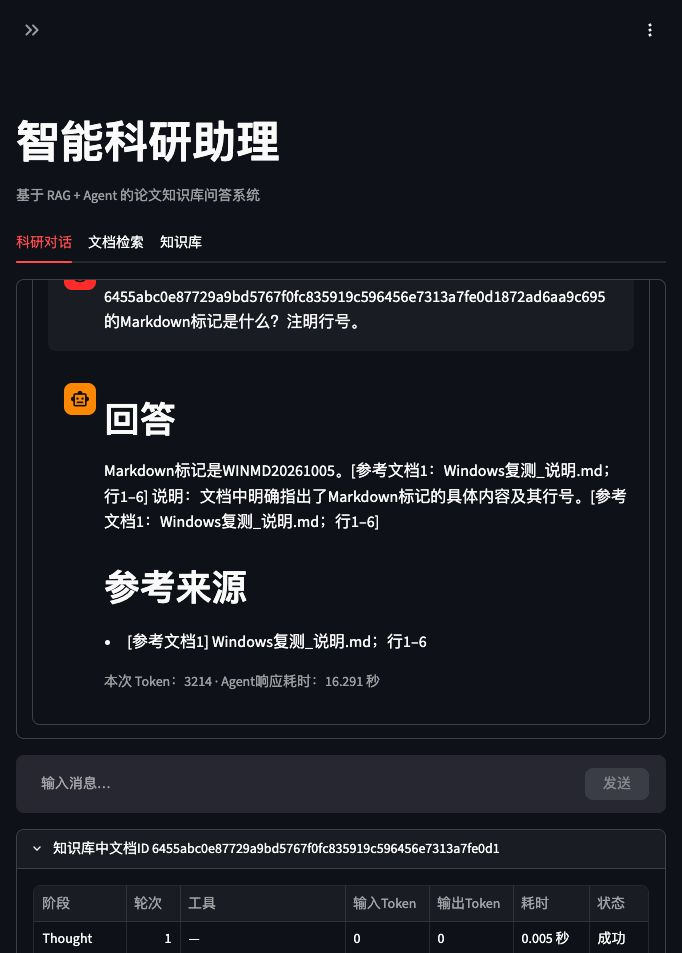

# Windows 精简部署与预算调优（2026-10-09）

本轮按用户要求先部署、测试并修复问题，Word／PPT暂不修改。历史课程实验不重写，本轮少量样例不替代120条正式质量评测，助手初评与用户审核分别记录。

本轮已修复：事实问答补全同页连续证据并重新BGE评分；论文对比不把相关工作中的前人数字当作本篇实验；明确标为原文依据的无引号引句也校验编号对应原文；带引用的万／亿数量与所引原文核对；校验失败保留原报文和已定位原句，工具标为资料不足并拒绝缓存；实时页、会话落盘与日志共用一次响应计时。仅加提示不能保证303M的解释正确。

默认配置为总窗口16384 Token、输出最多1024 Token、证据9000字符、完整Prompt18000字符；发送前仍使用本地Qwen词表校验输入和预留输出。字符预算不是Token窗口，历史预算仍为2000 Token。

## 已保留的失败

- `regression-initial.json`：Windows首轮818项有3项测试写死localhost，与真实127.0.0.1配置不一致；改为核验测试配置地址，生产连接行为未修改。
- `local-repair-full.json`：新增作答提醒后5项测试仍按旧模板计算；修正测试预算与实际模板一致。
- `regression-repair.json`：上述修复后822项Windows回归通过；最终参数和引句校验的823项回归另存。
- `fact-1024-9000.json`：旧事实问答漏读跨块的1.3M／303M，并将JFT类别数误当图像数；旧答案保留。
- `fact-repair-1024-9000.json`：原文引句为303M，但中文解释写成30.3亿。输出仅214 Token、自然结束，因此不是输出上限问题；后续真实v11／v12提示仍出现同样错误，窄范围程序校验暂停错误结论，不自动修补模型原答案。
- `local-final.json`：提高默认预算后2个紧预算测试样例不再触发裁剪；将测试窗口与字符上限明确固定为小预算，保留实际裁剪和来源断言。
- `引句校验修复前.log`：无引号引句把303M改成304M时3个标签分支漏校验；`引句校验修复后.log`保留修复结果。
- `budget-repair.log`尾部为测试PowerShell参数展开错误，未执行的比较由`budget-compare.log`重新串行运行；不将调度错误记为项目问答失败。

- `fact-final.json`和`fact-unit-prompt-replay.json`：增加作答约束后仍将303M写成30.3亿，未计为质量通过。
- `native-final-cases.log`尾部为审计脚本未序列化LangChain消息的错误；多工具实际模型报文保留为calls，部分JSON另存为partial文本，不视为有效结果。记录器已改为保留消息类型和内容，最新完整案例另跑。
- `deployed-unit.json`只在测试README指纹不一致：预期文件误取本地待提交文档，源码正确。新清单从Git已提交内容计算，119项复核另存。

- `会话计时修复前.log`：真实SQLite重开用例复现2.019／2.0秒差异，修复后24项会话测试通过；真实网页首次刷新17.242／17.223秒差异另存。
- `native-history-start-failure.log`与`重启未生效_`网页证据：停止计划任务后旧Streamlit子进程仍占8501，新服务未启动。核对本轮PID后停止、等待端口释放再启动，新进程37228完成最终网页复测。`restart-release-race.log`保留端口释放尚未完成的第一次启动检查。
- `container-history-checker-failure.log`：检查脚本误把构建用Dockerfile与Compose当成镜像运行文件，产生FileNotFound。调整为镜像实际运行文件后41项指纹和24项会话回归通过，没有因此修改业务代码。

## 验证范围

`run_budget_cases.py`只替换副本路径、预算配置和记录真实HTTP，不替换M3E、BGE、Ollama或工具。预算对照固定seed42，初始失败样例没有固定seed，不构成纯参数配对实验。每个案例独立进程，检索/初始化及模型生成耗时分别记录；不能由一次快慢断言1024输出更快。

低相关论文对比首先暂停；测试脚本仅在显式`--confirm-candidates`时复用候选继续。测试确认不是用户质量审核，提示仍保留。

容器采用本轮独立项目、端口、数据与日志目录，不替换原生8501服务。公网IP不可达测试针对容器内部网络；宿主机未物理断网。容器CPU推理与原生GPU耗时不能作性能配对。

## 最终回归、部署与性能

- 代码修复提交`e0155e1`、`0b40116`、`7b5ee2b`、`1d41c63`均已推送并部署；最终源码在本地与Windows各829项回归通过，耗时56.273秒／275.458秒，失败、错误、跳过、预期失败及意外成功均0。逐项结果见`local-history-final.json`与`regression-history.json`；此前828项阶段证据保持原值。
- Windows119个文件按Git已提交内容指纹核验一致（`deployed-history.json`）；最终`1d41c63`镜像构建通过（`build-history/`），镜像41个运行文件指纹一致，容器内24项真实SQLite会话测试通过（`container-history.json`）。该次会话测试的模型HTTP为mock、网络为none，不能当作新的真实模型成绩。部署指纹、逐项测试和构建日志均保留。
- 默认16384总窗口、1024输出Token、9000／18000字符预算保留。数量修复版本`7b5ee2b`原生单次事实／双计算／Markdown全流程分别27.296／9.582／21.709秒，模型实际耗时与用量见`原生最终样例汇总.json`。整卡采样峰值6698MiB／8188MiB；单次耗时含检索和初始化，不能视为总体并发性能基准，也不能由样例证明加大输出使速度提高。
- 512／1024输出、6000／9000证据预算的六个旧配对样例见`预算对照汇总.json`。其中事实1024样例单位换算错误，后续事实样例也被程序拦截，均不计质量通过。摘要仅可见原文，比较保留低分确认与裁剪提示；比较单次约52–53秒。
- 实际M3E／BGE各三个并发线程只构造一次并共享实例；九对缓存条件核对通过，真实TXT问答exact／semantic命中后没有新增生成，文档范围、配置、同数量正文替换均使缓存失效。
- 数量修复版本`7b5ee2b`的独立CPU容器pip检查、源码指纹、业务／模型公网IP阻断、真实M3E／BGE／Qwen及重启后Chroma一块／SQLite会话恢复通过；单次完整验证80.119秒。容器CPU不作为原生GPU性能证据。测试容器随后停止，保留独立探针数据和日志；原生8501服务继续运行。

## 网页与原有资料保留

最终新进程的真实Markdown回答为WINMD20261005，引用`Windows复测_说明.md`行1–6，公开轨迹没有引句／数量校验错误。实时与刷新恢复均3214 Token／16.291秒；SQLite与日志保存完全相同的16.290971999998874秒。见`网页最终实时回答.txt`、`网页最终历史恢复.txt`、`网页最终执行过程.txt`与`browser-final.json`。页面侧栏健康探针只验证服务连接与索引读取，不将其文案当作实际推理或检索结论。

`preserve-final.json`核对原文文件指纹、6份文档／276块及全部块正文摘要未变；原有数据行完整保留，仅增加本轮独立网页测试会话与消息。用户旧会话正文的私有备份只在Windows保留，没有下载或提交。

| 数据 | 测试前 | 测试后 | 原有行保留 |
|---|---:|---:|---|
| 会话 | 66 | 71 | 全部 |
| 消息 | 206 | 212 | 全部 |
| 摘要 | 1 | 1 | 全部 |
| RAG历史 | 5 | 5 | 全部 |

本轮完成的回归／镜像构建临时计划任务已移除；测试容器已停止，独立数据和日志保留。原生Streamlit及Ollama继续运行，健康HTTP200，具体进程与状态见`closeout.json`。

最终文档与证据提交`20d6cd4`已通过Git同步Windows；`source-delivery.json`与`deployed-delivery.json`核对119个文件一致，`delivery-health.json`确认仍为已复测的新Streamlit进程37228，HTTP200、Ollama0.40.1。此次仅同步文档和证据，不改变`1d41c63`已测试的业务代码、预算或镜像。

## 答案质量与交付边界

`助手质量核验.json`按实际报文和所引原文列出初评，用户审核0。数量核对仅比较带引用的万／亿与所引英文数量，不证明对象、条件、其他单位或完整解释正确。已定位的原文可以展示，但错误模型解释仍是失败样例。120条正式质量初评、160条采样实验和完整12篇／60题评测没有因本轮小样例而改分或重跑。

中文查英文论文排名按用户要求暂缓；成员资料仍待提供。Word／PPT本轮未修改，待结论确定和审核后编写。
