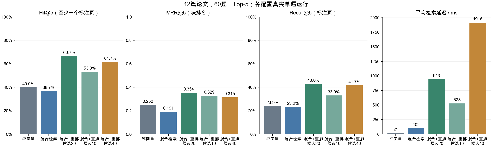
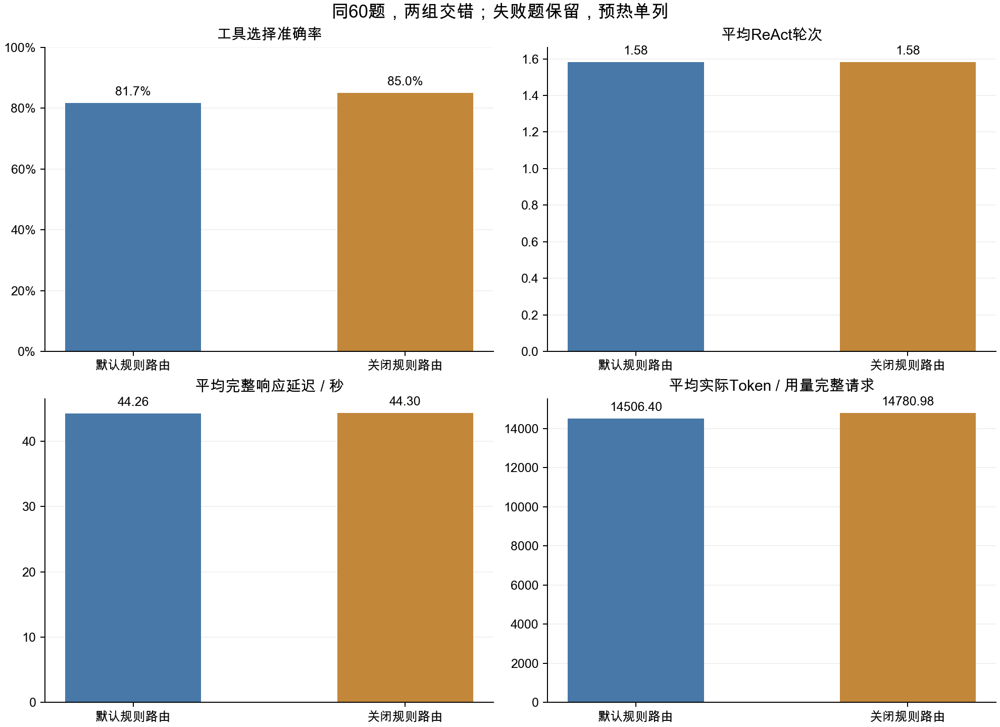
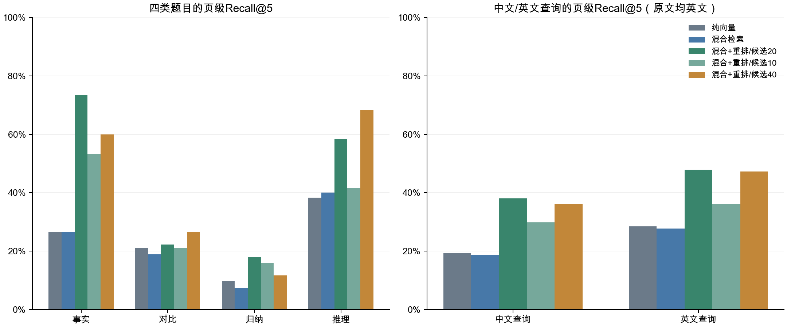

# 5.5.2 系统性能评估

本节使用5.5.1锁定的12篇视觉Transformer论文、60题四类问答和1694块原文，在本机真实运行检索与Agent。问题、答案、证据和业务配置不按测试结果调整，既有业务索引、会话库和日志不被评测数据污染。

## 方案与指标

完整配置和人工评分量表见[评测方案](评测方案.json)。方案在正式运行前固定，输入和源码哈希写入实际报告。

- 检索：纯向量、混合、混合＋重排候选20，以及重排候选10/40，均返回Top-5。其余保持递归512/64、M3E、Chroma、RRF常数60和BGE重排模型。
  候选数同时控制向量/BM25各路召回数量与RRF后送入重排的数量，按现有业务接口执行；不是固定召回池只改变重排截断。纯向量直接返回5块。
- Agent：同60题对比默认规则路由和关闭规则路由，其余工具/模型配置一致；实际模型请求统一seed=20261003。两组逐题交错，独立请求，不继承上题的历史或答案。
- Hit@5：前5块至少覆盖一个标注物理页。MRR@5：首个命中在原始块排序中的倒数，前5未命中记0。Recall@5：不同命中标注页数除以不同标注页总数，同页去重。没有计算全库不截断MRR/Recall。
- 多论文问题另记论文覆盖率与全部标注论文命中率，避免仅命中一个来源就认为证据完整。相关性单位为论文指纹＋物理页，跨页块按实际page_number～page_end判断；同页匹配不能自动证明片段支持全部陈述，未穷尽标注可能漏掉有效替代来源。
- 工具调用指标按预先定义的可接受工具路径计算，报告标为“工具选择准确率”：RAG可用于全部题，对比题也可调用覆盖正确论文ID的paper_compare，paper_list可作前置步骤。无工具、只列文献或调用无关工具不算正确。此项不等于参数语义或答案正确性，执行状态另在逐题事件中保留。
- 一轮指一个Thought/Action/Observation循环。失败题仍进入工具选择、平均轮次和平均延迟的分母；模型自报完成不作为答案正确性。
- 延迟从用户问题进入run_react至done，含检索、推理、工具和日志，不含上传/索引构建/服务启动及预热；不冒充浏览器网络延迟或多轮对话性能。
- Token使用每次真实Ollama响应的prompt_eval_count和eval_count，按请求汇总。缺失用量保持未知，只有确定未调用模型才为0，不按字符估算，不重复累加每个事件的指标快照。

每组只运行一遍全部题目。均值反映本机这些问题的观测结果，不给出虚构的重复实验方差或统计显著性。全部原文英文；中文题为中文查询英文论文，ViT来源曾用于开发，不是完全独立来源盲测。

## 已完成的检索结果

| 配置 | Hit@5 | MRR@5 | Recall@5（页） | 平均检索延迟(ms) |
| --- | ---: | ---: | ---: | ---: |
| 纯向量 | 40.00% | 0.2503 | 23.94% | 20.64 |
| 混合 | 36.67% | 0.1911 | 23.25% | 102.43 |
| 混合＋重排，候选20 | 66.67% | 0.3536 | 42.97% | 943.19 |
| 混合＋重排，候选10 | 53.33% | 0.3289 | 33.03% | 528.19 |
| 混合＋重排，候选40 | 61.67% | 0.3150 | 41.67% | 1916.39 |

300条逐题Top-5原文、分数、来源、物理页与耗时保存在[检索五组结果](检索五组结果_20261003.json)。重排候选20的全部标注论文命中率为38.33%，所以66.67%的“至少一页命中”不能当成多论文回答完整率。候选40更慢且没有提高本集表现；保持原有候选20，不改业务YAML。

## Agent、图表与人工评分

两组各60题，共120条实际答案和626次模型调用，已全部完成。原始结果见[Agent两组结果](Agent两组结果_20261003.json)，实际HTTP用量见[逐次响应](Agent两组结果_20261003.calls.jsonl)。

| 配置 | 工具选择准确率 | 平均轮次 | 平均完整响应(s) | 平均实际Token | 自报完成数 |
| --- | ---: | ---: | ---: | ---: | ---: |
| 默认规则路由 | 81.67% | 1.5833 | 44.264 | 14506.40 | 25/60 |
| 关闭规则路由 | 85.00% | 1.5833 | 44.297 | 14780.98 | 22/60 |

默认组终止原因：完成25、信息不足29、重复调用5、错误1；关闭规则组为22、35、2、1。全部120条用量完整；两组输入/输出Token分别为845721/24663和861474/25385，合计870384和886859。默认组Token减少约1.86%，延迟仅减少约0.08%，本次单遍观察不能支持大幅节省或显著提速。工具选择与自报完成均不等于答案正确。

[性能表](系统性能评测数据.xlsx)以逐题公式复算；[人工评分表](答案质量人工评分表.xlsx)含60题×两组的120条答案、参考答案、要点及物理页。按用户安排，由用户或评阅人填写三项分数、理由、评阅人和日期后回传。表中default/no_rules分别对应上述两组，不调整题号和配置列。

人工评分为0～4整数，分别评价正确性、完整性、引用准确性。所有待填项保持空白，空白不是0分。助手审阅、页级匹配和模型自报完成均不写成人工成绩；只有评阅人实际填写的记录才汇总。

[待填回读核验](人工评分待填核验_20261003.json)确认0/120条已评、三项均值为null。[数值复核](评测数值复核_20261003.json)通过全部300条排名、120条轨迹和626次实际用量；10项边界测试通过，六个工作表预览已检查。图表如下：

[交付文件核验](交付文件核验_20261003.json)记录工作簿/图表哈希、公式检查，以及导出的120条实际答案与原始结果逐条一致。







## 复现

先准备本地12篇固定原文、M3E、BGE、Qwen与Ollama服务。使用新工作目录和新结果文件，保留首次失败及已有原始结果。

```bash
# 模块一准备与证据核验（新文件名）。
.venv/bin/python "reports/5_5_1 评测集构建/verify_dataset.py" --output "reports/5_5_1 评测集构建/核验_新时间.json"

# 构建隔离索引，跑五组检索；root必须不存在。
.venv/bin/python "reports/5_5_2 系统性能评估/evaluate_system.py" --stage retrieval --root /private/tmp/rag-eval-新时间 --output "reports/5_5_2 系统性能评估/检索_新时间.json"

# 复用同一隔离索引和完全相同的输入/源码，跑同60题的两组Agent。
.venv/bin/python "reports/5_5_2 系统性能评估/evaluate_system.py" --stage agent --root /private/tmp/rag-eval-新时间 --output "reports/5_5_2 系统性能评估/Agent_新时间.json"

# 只验证指标边界，不调用模型，不算作真实系统评测样本。
.venv/bin/python -m unittest discover -s "tests/5_5_2 系统性能评估" -p 'test_*.py' -v
```

`--limit`只用于先行验证，正式数据为60题。评测期间不要同时运行其它模型或回归任务，以免干扰延迟；原始报告记录实际运行环境。工作目录保存原文复制件、Chroma与隔离业务日志，后续可以定位真实工具结果。

`plot_system.py`读取完成的检索/Agent JSON生成三幅PNG，不重新调用模型。`build_workbooks.mjs`使用Codex内置Artifact Tool生成可复算性能表和人工评阅表，`summarize_human_scores.mjs`只汇总评阅人填回的xlsx；报告脚本不是业务依赖，不修改requirements.txt。

人工表回传后，用内置Node及其`node_modules`依赖执行`summarize_human_scores.mjs 人工评分表.xlsx Agent结果.json 新人工汇总.json`。未填写的记录保持待评分；部分填写或越界分数会报出题号供修正。无需重新调用模型，也不覆盖原始空白表。内置运行时不在仓库依赖中；普通环境可按表中相同规则人工汇总。

## 首次失败保留

单题先行检索只有中文，初次汇总错误要求英文组非空，保留[失败日志](先行检索验证_20261003.log)及原始5组结果；修正按实际语言组汇总后，[数值复核](先行检索数值复核_20261003.json)通过。没有改变60题正式标注。

首次沙箱内Ollama无法创建Metal上下文，Agent预热返回HTTP500，保留[失败日志](先行Agent验证_20261003.log)。之后在获准的本地环境中启用Metal，[先行两组验证](先行Agent修正后验证_20261003.json)通过。先行数据只用于检查调用链，不计入正式120次请求。

首次绘图找不到PingFang字体，缺字图片保存在`首次图表字体缺失/`；改用本机Arial Unicode后重新生成上述三图，[修正日志](图表字体修正_20261003.log)无缺字警告。正式评测结束后已关闭本次自行启动的Ollama，保留[服务日志](Ollama正式运行_20261003.log)。业务源码、YAML和既有开发集性能表未修改。
